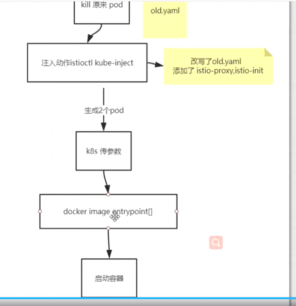

[TOC]

> author：编程界的小学生
>
> date：2021/02/10

# 一、什么是istio？有什么用？

istio：之前业务出错我们需要重试，后来出了断路器等组件，但是是冗余到业务系统代码里的，istio就是要将这些断路器、重试、鉴权等东西抽离出来下沉成单独服务，让业务系统不在关心。也就是说在create pod的时候被人拦截下来，然后在pod里部署一个sidecar的容器，这步骤是无需业务代码感知的，是自动的。业务只需要关心业务就行，这些重试鉴权等东西自动沉淀下去。

# 二、istio的两大组件是什么？

- data plane：通过边车进行调用，类似代理。
- control plane

# 三、说说istio的注入？
将原来的pod停止，在新启动两个pod：原pod+istio proxy，准确的说启动三个pod，还有一个是istio-init，这个pod负责搭建网络环境，搭建完就消亡了，所以他是雷锋，铺好通信的道路就走了，所以到最后就两个pod，一个原来的pod，还一个是istio proxy代理。这些过程全自动。

