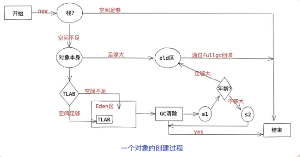

### 一个对象创建的流程1

1. 在栈中分配一个空间
2. 在堆中创建一个对象
3. 调用这个对象的构造方法
4. 将栈中的空间指向堆中的对象

### 一个对象的创建流程2

1. new
2. 可以分配到栈就放到栈上
3. 太大直接放到OLD区
4. TLAB空间足够就分配到TLAB
5. TLAB空间不足就放到eden

### 赋值操作是原子的吗

### 进入safepoint如何让线程阻塞的

### Java内存模型

java内存模型分为主内存和工作内存。

主内存：类的实例所在区域，所有线程共享。

工作内存：各个线程独享，存有main mem中部分拷贝，称之为工作拷贝。

