[TOC]

# Java超神之路-JVM

> author：编程界的小学生
>
> date：2021/01/08

# 一、ClassLoader类加载器

## 1、类加载过程

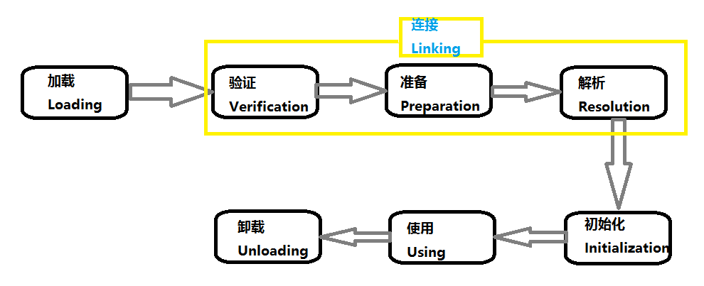

- 加载

> 将类的.class文件中的二进制数据读入到内存中，将其放在运行时数据区的方法区内，然后在内存上创建一个`java.lang.Class`对象用来封装类在方法区内的数据结构作为这个类的各种数据的访问入口。

- 验证

> 主要是为了确保class文件中的字节流包含的信息是否符合当前JVM的要求，且不会危害JVM自身安全，比如校验文件格式、是否是cafe baby魔数、字节码验证等等。

- 准备

> 为类变量分配内存并设置类变量（是被static修饰的变量，变量不是常量，所以不是final的，就是static的）初始值的阶段。这些变量所使用的内存在方法区中进行分配。比如
>
> ```
> private static int age = 26;
> ```
>
> 类变量age会在准备阶段过后为 其分配四个（int四个字节）字节的空间，并且设置初始值为0，而不是26。
>
> 若是final的，则在编译期就会设置上最终值。

- 解析

> JVM会在此阶段把类的二进制数据中的符号引用替换为直接引用。

- 初始化

> 初始化阶段是执行类构造器`<clinit>()`方法的过程，到了初始化阶段，才真正开始执行类定义的Java程序代码（或者说字节码 ）。比如准备阶段的那个age初始值是0，到这一步就设置为26。

- 使用

> 对象都出来了，业务系统直接调用阶段。

- 卸载

> 用完了，可以被GC回收了。

## 2、类加载器种类以及加载范围

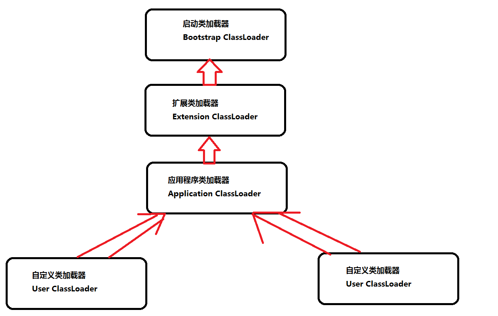

- 启动类加载器（Bootstrap ClassLoader）

> 最顶层类加载器，他的父类加载器是个null，也就是没有父类加载器。负责加载jvm的核心类库，比如`java.lang.*`等，从系统属性中的`sun.boot.class.path`所指定的目录中加载类库。他的具体实现由Java虚拟机底层C++代码实现。

- 扩展类加载器（Extension ClassLoader）

> 父类加载器是Bootstrap ClassLoader。从`java.ext.dirs`系统属性所指定的目录中加载类库，或者从JDK的安装目录的`jre/lib/ext`子目录（扩展目录）下加载类库，如果把用户的jar文件放在这个目录下，也会自动由扩展类加载器加载。继承自`java.lang.ClassLoader`。

- 应用程序类加载器（Application ClassLoader）

>  父类加载器是Extension ClassLoader。从环境变量classpath或者系统属性`java.class.path`所指定的目录中加载类。继承自`java.lang.ClassLoader`。

- 自定义类加载器（User ClassLoader）

> 除了上面三个自带的以外，用户还能制定自己的类加载器，但是所有自定义的类加载器都应该继承自`java.lang.ClassLoader`。比如热部署、tomcat都会用到自定义类加载器。

- 补充：不同ClassLoader加载的文件路径配置在如下源码里写的：

```java
// sun.misc.Launcher

public class Launcher {
    // Bootstrap类加载器的加载路径，在static静态代码块里用的
    private static String bootClassPath = System.getProperty("sun.boot.class.path");
    
    // AppClassLoader 继承 ClassLoader
    static class AppClassLoader extends URLClassLoader {
        public static ClassLoader getAppClassLoader(final ClassLoader var0) throws IOException {
            // java.class.path
            final String var1 = System.getProperty("java.class.path");
        }
    }
    
    // ExtClassLoader 继承 ClassLoader
    static class ExtClassLoader extends URLClassLoader {
        public static Launcher.ExtClassLoader getExtClassLoader() throws IOException {
            // java.ext.dirs
            String var0 = System.getProperty("java.ext.dirs");
        }
    }   
}
```

## 3、双亲委派是什么

如果一个类加载器收到了类加载的请求，他首先会从自己缓存里查找是否之前加载过这个class，加载过直接返回，没加载过的话他不会自己亲自去加载，他会把这个请求委派给父类加载器去完成，每一层都是如此，类似递归，一直递归到顶层父类，也就是`Bootstrap ClassLoader`，只要加载完成就会返回结果，如果顶层父类加载器无法加载此class，则会返回去交给子类加载器去尝试加载，若最底层的子类加载器也没找到，则会抛出`ClassNotFoundException`。

源码在`java.lang.ClassLoader#loadClass(java.lang.String, boolean)`

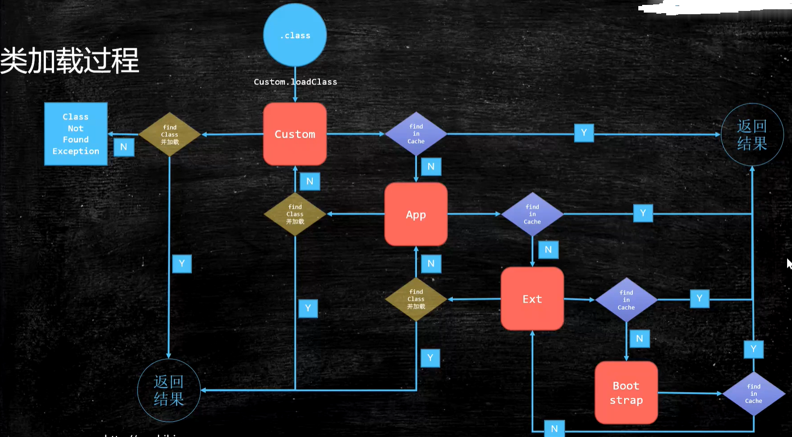

## 4、为啥要有双亲委派

防止内存中出现多份同样的字节码，安全。

比如自己重写个`java.lang.Object`并放到Classpath中，没有双亲委派的话直接自己执行了，那不安全。双亲委派可以保证这个类只能被顶层`Bootstrap Classloader`类加载器加载，从而确保只有JVM中有且仅有一份正常的java核心类。如果有多个的话，那么就乱套了。比如相同的类`instance of`可能返回false，因为可能父类不是同一个类加载器加载的Object。

## 5、为什么需要破坏双亲委派模型

- Jdbc

> Jdbc为什么要破坏双亲委派模型？
>
>以前的用法是未破坏双亲委派模型的，比如`Class.forName("com.mysql.cj.jdbc.Driver");`
>
>而在JDBC4.0以后，开始支持使用spi的方式来注册这个Driver，具体做法就是在mysql的jar包中的`META-INF/services/java.sql.Driver`文件中指明当前使用的Driver是哪个，然后使用的时候就不需要我们手动的去加载驱动了，我们只需要直接获取连接就可以了。`Connection con = DriverManager.getConnection(url, username, password ); `
>
>首先，理解一下为什么JDBC需要破坏双亲委派模式，原因是原生的JDBC中Driver驱动本身只是一个接口，并没有具体的实现，具体的实现是由不同数据库类型去实现的。例如，MySQL的`mysql-connector-*.jar`中的Driver类具体实现的。 原生的JDBC中的类是放在`rt.jar`包的，是由Bootstrap加载器进行类加载的，在JDBC中的Driver类中需要动态去加载不同数据库类型的Driver类，而`mysql-connector-*.jar`中的Driver类是用户自己写的代码，那Bootstrap类加载器肯定是不能进行加载的，既然是自己编写的代码，那就需要由Application类加载器去进行类加载。这个时候就引入线程上下文件类加载器(`Thread Context ClassLoader`)，通过这个东西程序就可以把原本需要由Bootstrap类加载器进行加载的类由Application类加载器去进行加载了。

- Tomcat

>  Tomcat为什么要破坏双亲委派模型？
>
> 因为一个Tomcat可以部署N个web应用，但是每个web应用都有自己的classloader，互不干扰。比如web1里面有`com.test.A.class`，web2里面也有`com.test.A.class`，如果没打破双亲委派模型的话，那么web1加载完后，web2在加载的话会冲突。因为只有一套classloader，却出现了两个重复的类路径，所以tomcat打破了，他是线程级别的，不同web应用是不同的classloader。

- Java spi 方式，比如jdbc4.0开始就是其中之一。

- 热部署的场景会破坏，否则实现不了热部署。

## 6、如何破坏双亲委派模型

重写`loadClass`方法，别重写`findClass`方法，因为`loadClass`是核心入口，将其重写成自定义逻辑即可破坏双亲委派模型。

## 7、如何自定义一个类加载器

只需要继承`java.lang.Classloader`类，然后覆盖他的`findClass(String name)`方法即可，该方法根据参数指定的类名称，返回对应 的Class对象的引用。

## 8、热部署原理

采取破坏双亲委派模型的手段来实现热部署，默认的`loadClass()`方法先找缓存，你改了class字节码也不会热加载，所以自定义ClassLoader，去掉找缓存那部分，直接就去加载，也就是每次都重新加载。

## 9、如何对“.class”文件处理保证不被人拿到以后反编译获取公司源代码？
首先你编译时，就可以采用一些小工具对字节码加密，或者做混淆等处理。
现在有很多第三方公司，都是专门做商业级的字节码文件加密的，所以可以付费购买他们的产品。
然后在类加载的时候，对加密的类，考虑采用自定义的类加载器来解密文件即可，这样就可以保证你的源代码不被人窃取，网上也有很多成熟的开源插件进行加解密。

## 10、包含main方法的类会优先加载，如果一个项目中有多个类中都有main方法，都会加载么？

不会的，你启动一个jar包，需要指定某个main主类，优先就是加载他，其他类里的main方法不会被加载，所以没有规定说不建议写多个main。

## 11、类加载器是把jar包里的所有类一次性全部加载进去吗？

不是的，首先加载包含main方法的主类，接着是运行你写的代码的时候，遇到你用了什么类，再加载什么类。

## 12、常见笔试题

问题：输出结果是什么？

答案：编译报错。

原因：因为静态语句块中只能访问定义在静态语句块之前的变量，定义在他之后的 变量在前面的静态语句块中可以赋值，但是不能访问。

```java
/**
 * Description: 编译报错
 *
 * @author TongWei.Chen 2021-01-08 17:37:44
 */
public class Test1 {
    static {
        // 编译没报错
        i = 2;
        // 编译报错Illegal forward reference
        System.out.println(i);
    }
    private static int i =1;
}
```

问题：输出结果是什么？

答案 ：1、3

原因：因为类加载过程中会先准备类变量（也就是静态变量），准备阶段是赋初始值阶段，也就是`test2=null，value1=0，value2=0`，然后进入初始化阶段的时候`test2=new Test2()`，会执行构造器，结果是`value1 = 1，value2 = 4`，然后执行value1和value2这两句，value1没变化，value2被重新赋值成了3，所以结果1和3。

```java
public class Test2 {
    private static Test2 test2 = new Test2();
    private static int value1;
    private static int value2 = 3;

    private Test2() {
        value1 ++;
        value2 ++;
    }

    public static void main(String[] args) {
        // 1
        System.out.println(test2.value1);
        // 3
        System.out.println(test2.value2);
    }
}
```

那如果把`private static Test2 test2 = new Test2();`放到`private static int value2 = 3;`下面的话结果就是1和4了。

```java
public class Test3 {
    private static int value1;
    private static int value2 = 3;
    private static Test3 test3 = new Test3();
    
    private Test3() {
        value1 ++;
        value2 ++;
    }
    
    public static void main(String[] args) {
        // 1
        System.out.println(test3.value1);
        // 4
        System.out.println(test3.value2);
    }
}
```

# 二、Java内存区域

## 1、Java内存结构

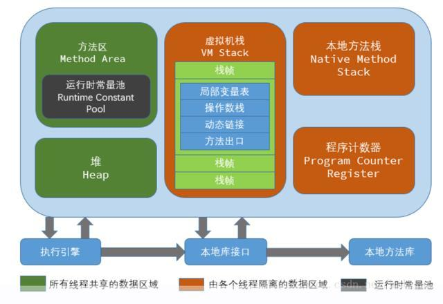

- 程序计数器

> 当前线程所执行字节码的行号指示器。若当前方法是native的，那么程序计数器的值就是undefined。
>
> 线程私有，Java内存区域中唯一一块不会发生OOM或StackOverflow的区域。

- 虚拟机栈

> 就是常说的Java栈，存放栈帧，栈帧里存放局部变量表等信息，方法执行到结束对应着一个栈帧的入栈到出栈。
>
> 线程私有，会发生StackOverflow。

- 本地方法栈

> 与虚拟机栈的作用是一样的，只不过虚拟机栈是服务 Java 方法的，而本地方法栈是为虚拟机调用 Native 方法服务的。
>
> 线程私有，会发生StackOverflow。

- 堆

> Java 虚拟机中内存最大的一块，几乎所有的对象实例都在这里分配内存。
>
> 是被所有线程共享的，会发生OOM。

- 方法区

> 也称非堆，用于存储已被虚拟机加载的类信息、常量、静态变量、即时编译后的代码等数据。
>
> 是被所有线程共享的，会发生OOM。

- 运行时常量

> 是方法区的一部分，存常量（比如static final修饰的，比如String 一个字符串）和符号引用。
>
> 是被所有线程共享的，会发生OOM。


## 2、对象创建时堆内存分配算法

- 指针碰撞

> 前提要求堆内存的绝对工整的。
>
> 所有用过的内存放一边，没用过的放另一边，中间放一个分界点的指示器，当有对象新生时就已经知道大小了，指示器只需要像没用过的内存那边移动与对象等大小的内存区域即可。

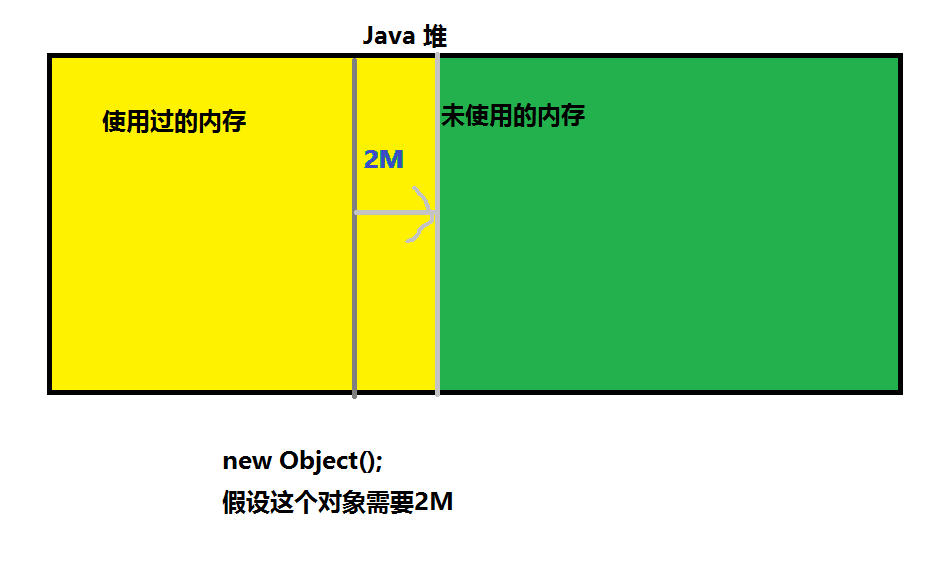

- 空闲列表

> 假设堆内存并不工整，那么空闲列表最合适。
>
> JVM维护一个列表 ，记录哪些内存块是可用的，当对象创建时从列表中找到一块足够大的空间划分给新生对象，并将这块内存标记为已用内存。

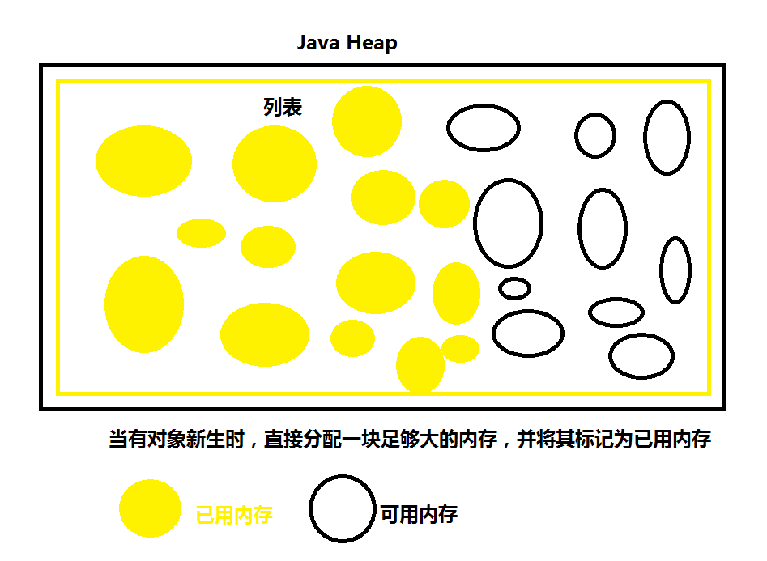

## 3、对象在内存中的存储布局

分为三部分：

- 对象头

>包含两部分：自身运行时数据和类型指针。
>
>自身运行时数据包含：hashcode、gc分代年龄、锁状态标识、线程持有的锁、偏向线程ID、偏向时间戳等
>
>对象指针就是对象指向它的类元数据的指针，虚拟机通过这个指针来确定对象是哪个类的实例

- 实例数据

>用来存储对象真正的有效信息（包括父类继承下来的和自己定义的）

- 对齐填充

>JVM要求对象起始地址必须是8字节的整数倍（8字节对齐），所以不够8字节就由这部分来补充。

## 4、对象怎么定位

如下两种，具体用哪种有JVM来选择，hotspot虚拟机采取的直接指针方式来定位对象。

- 直接指针

> 栈上的引用直接指向堆中的对象。好处就是速度快。没额外开销。

- 句柄

> Java堆中会单独划分出一块内存空间作为句柄池，这么一来栈上的引用存储的就是句柄地址，而不是真实对象地址，而句柄中包含了对象的实例数据等信息。好处就是即使对象在堆中的位置发生移动，栈上的引用也无需变化。因为中间有个句柄。

## 5、判断对象是否能被回收的算法

- 引用计数法

> 给对象添加一个引用计数器，每当有一个地方引用他的时候该计数器的值就+1，当引用失效的时候该计数器的值就-1；当计数器的值为0的时候，jvm判定此对象为垃圾对象。存在内存泄漏的bug，比如循环引用的时候，所以jvm虚拟机采取的是可达性分析法。

- 可达性分析法

> 有一些根节点GC Roots作为对象起始点，从这些节点开始向下搜索，搜索所走过的路径称为引用链，当一个对象到GC Roots没有任何引用链相连的时候，则证明此对象为垃圾对象。
>
> 补充：哪些可作为GC Roots？
>
> - 虚拟机栈中的引用的对象
> - 方法区中的类静态属性引用的对象
> - 方法区中常量引用的对象
> - 本地方法栈中JNI（native方法）引用的对象

## 6、如何判断对象是否能被回收

- 该对象没有与GC Roots相连

- 该对象没有重写finalize()方法或finalize()已经被执行过则直接回收（第一次标记）、否则将对象加入到F-Queue队列中（优先级很低的队列）在这里finalize()方法被执行，之后进行第二次标记，如果对象仍然应该被GC则GC，否则移除队列。 （在finalize方法中，对象很可能和其他 GC Roots中的某一个对象建立了关联，那就自救了，就不会被GC掉了，finalize方法只会被调用一次，且不推荐使用finalize方法）

## 7、Java堆内存组成部分

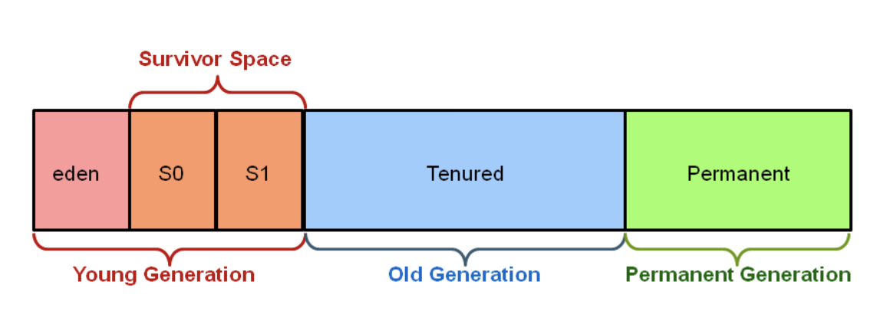

堆大小 = 新生代 + 老年代。如果是Java8则没有Permanent Generation，Java8将此区域换成了Metaspace。

其中新生代(Young) 被分为 Eden和S0（from)和S1(to)。

默认情况下Edem : from : to = 8 : 1 : 1，此比例可以通过 –XX:SurvivorRatio 来设定 

## 8、什么时候抛出StackOverflowError

方法运行的时候栈的深度超过了虚拟机容许的最大深度的时候，所以不推荐递归的原因之一也是因为这个，效率低，死归的话很容易就StackOverflowError了。

## 9、Java中会存在内存泄漏吗，请简单描述。

虽然Java会自动GC，但是使用不当的话还是存在内存泄漏的，比如ThreadLocal忘记remove的情况。（ThreadLocal篇幅过长，不适合放到这里，懂者自懂，不懂Google）

## 10、栈帧是什么？包含哪些东西

栈帧中存放的是局部变量、操作数栈、动态链接、方法出口等信息，栈帧中的局部变量表存放基本类型+对象引用+returnAddress，局部变量所需的内存空间在编译期间就完成分配了，因为基本类型和对象引用等都能确定占用多少slot，在运行期间也是无法改变这个大小的。

## 11、简述一个方法的执行流程

方法的执行到结束其实就是栈帧的入栈到出栈的过程，方法的局部变量会存到栈帧中的局部变量表里，递归的话会一直压栈压栈，执行完后进行出栈，所以效率较低，因为一直在压栈，栈是有深度的。

## 12、方法区会被回收吗

方法区回收价值很低，主要回收废弃的常量和无用的类。

如何判断无用的类：

- 该类所有实例都被回收（Java堆中没有该类的对象）

- 加载该类的ClassLoader已经被回收

- 该类对应的java.lang.Class对象没有在任何地方被引用，无法在任何地方利用反射访问该类

## 13、一个对象包含多少个字节

会占用16个字节。比如

`Object obj = new Object();`

因为obj引用占用栈的4个字节，new出来的对象占用堆中的8个字节，4+8=12，但是对象要求都是8的倍数，所以对象的字节对齐（Padding）部分会补齐4个字节，也就是占用16个 字节。

再比如：

```java
public class NewObj {
    int count;
    boolean flag;
    Object obj;
}
NewObj obj = new NewObj();
```

这个对象大小为：空对象8字节+int类型4字节+boolean类型1字节+对象的引用4字节=17字节，需要8的倍数，所以字节对齐需要补充7个字节，也就是这段程序占用24字节。

## 14、为什么把堆栈分成两个

- 栈代表了处理逻辑，堆代表了存储数据，分开后逻辑更清晰，面向对象模块化思想。

  栈是线程私有，堆是线程共享区，这样分开也节省了空间，比如多个栈中的地址指向同一块堆内存中的对象。
- 栈是运行时的需要，比如方法执行到结束，栈只能向上增长，因此会限制住栈存储内容的能力，而堆中的对象是可以根据需要动态增长的。

## 15、栈的起始点是哪

main函数，也是程序的起始点。

## 16、为什么基本类型不放在堆里

因为基本类型占用的空间一般都是1-8个字节（所需空间很少），而且因为是基本类型，所以不会出现动态增长的情况（长度是固定的），所以存到栈上是比较合适的。反而存到可动态增长的堆上意义不大。

## 17、Java参数传递是值传递还是引用传递

值传递。

基本类型作为参数被传递时肯定是值传递；引用类型作为参数被传递时也是值传递，只不过“值”为对应的引用。假设方法参数是个对象引用，当进入被调用方法的时候，被传递的这个引用的值会被程序解释到堆中的对象，这个时候才对应到真正的对象，若此时进行修改，修改的是引用对应的对象，而不是引用本身，也就是说修改的是堆中的数据，而不是栈中的引用。

## 18、为什么不推荐递归

因为递归一直在入栈入栈，短时间无法出栈，导致栈的压力会很大，栈也有深度的，容易爆掉，所以效率低下。

## 19、为什么参数大于2个要放到对象里

因为除了double和long类型占用局部变量表2个slot外，其他类型都占用1个slot大小，如果参数太多的话会导致这个栈帧变大，因为slot大，放个对象的引用上去的话只会占用1个slot，增加堆的压力减少栈的压力，堆自带GC，所以这点压力可以忽略。

## 20、为什么新生代要分为eden、s1、s2三块，且默认比例是8:1:1？

因为复制算法，如果不分这些的话，那么比如1G内存，将浪费500MB，因为一分为二，其中500MB浪费掉。分为这三块的话，默认8:1:1的比例来看的话就是eden800M，s1和s2各100M，这就相当于有900MB可用，大大提升了内存利用率。复制算法特性还不会产生碎片。

## 21、常见笔试题

问题：输出结果是什么？

答案：aaa、aaa、abc

原因：其实也是值传递还是引用传递的问题。具体核心原因：main函数的str引用和zcd在栈上，而其对应的值在方法区或堆上。test1、test2、test3的参数也在栈上，这个空间和main上的不是同一块，是不同的栈帧。所以你修改test方法的数据对于main函数其实是无感知的。但是对象的引用的话修改的是堆内存中的对象属性值，所以有感知，那为什么test2输出的是aaa而不是abc呢？因为test2把堆中的对象都给换了，重新生成一个全新对象，对main上的引用来讲是看不到的，具体如下三幅图：

（1）aaa

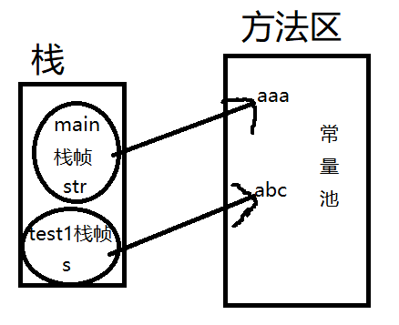

（2）aaa

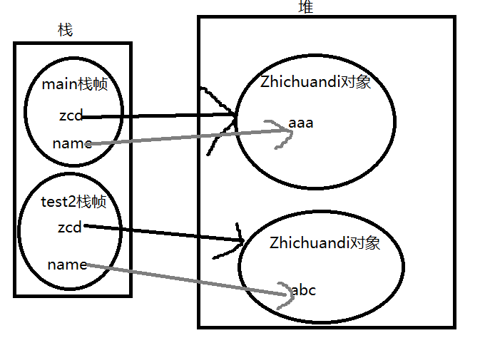

（3）abc

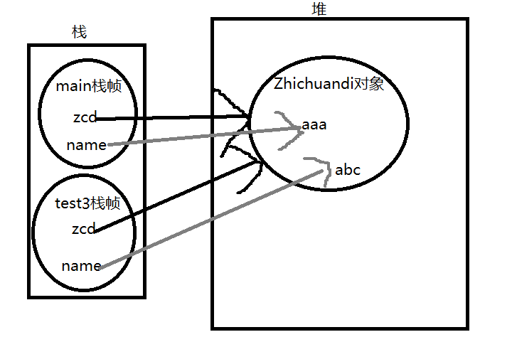

```java
public class TestChuandi {
    public static void main(String[] args) {
        String str = "aaa";
        test1(str);
        // aaa
        System.out.println(str);

        Zhichuandi zcd = new Zhichuandi();
        zcd.setName("aaa");

        // aaa
        test2(zcd);
        System.out.println(zcd.getName());

        // abc
        test3(zcd);
        System.out.println(zcd.getName());
    }

    private static void test1(String s) {
        s = "abc";
    }

    private static void test2(Zhichuandi zcd) {
        zcd = new Zhichuandi();
        zcd.setName("abc");
    }

    private static void test3(Zhichuandi zcd) {
        zcd.setName("abc");
    }
}

class Zhichuandi {
    private String name;

    public String getName() {
        return name;
    }

    public void setName(String name) {
        this.name = name;
    }
}
```

# 三、GC垃圾回收

## 1、GC是什么？为什么要GC

GC：垃圾收集，GC能帮助我们释放jvm内存，可以一定程度避免OOM问题，但是也无法完全避免。Java的GC是自动工作的，不像C++需要主动调用。当new对象的时候，GC就开始监控这个对象的地址大小和使用情况了，通过可达性分析算法寻找不可达的对象然后进行标记看看是否需要GC回收掉释放内存。

## 2、你能保证GC执行吗？

不能，我只能通过手动执行`System.gc()`方法通知GC执行，但是他是否执行的未知的。

## 3、对象的引用类型有哪几种，分别介绍下

- 强引用

> 发生GC的时候不会回收强引用所关联的对象。比如new就是强引用。

- 软引用

> 有用但非必须的对象，在OOM之前会把这些对象列进回收范围之中进行第二次回收，若第二次回收还没有足够的内存，则会抛出OOM。也就是第一次快要发生OOM的时候不会立马抛出OOM，而是会回收掉这些软引用，然后再看内存是否足够，若还不够才会抛出OOM。

- 弱引用

> 有用但非必须的对象，比软引用更弱一些，只要开始GC，不管你内存够不够，都会将 弱引用所关联的对象给回收掉。

- 虚引用

>  也叫幽灵引用/幻影引用，无法通过虚引用获得对象，他的意义在于能在这个对象被GC掉时收到一个系统通知，仅此而已。

## 4、垃圾收集算法有哪些

- 标记清除

> 分为两步：标记和清除。
>
> 首先需要标记出所有需要回收的对象，然后进行清除回收变为可用内存。
>
> 缺点：效率低，会产生垃圾碎片 。
>
> 
>
> 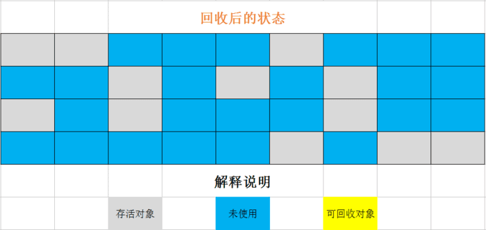

- 复制算法

> 将可用堆内存按照容量分为大小相等的两块，每次只用一块，当这块内存快用完了，就将还存活着的对象复制到另一块上面，然后再把已使用过的内存一次清理掉。
>
> 年轻代from/to（s1/s2）采取的就是此种算法。老年代一般不会采取此种算法，因为老年代都是大对象且存活的久的，空间压缩一半代价略高。
>
> 优点：效率较高、不会产生碎片。
>
> 缺点：将内存缩小为原来的一半，代价略高。
>
> 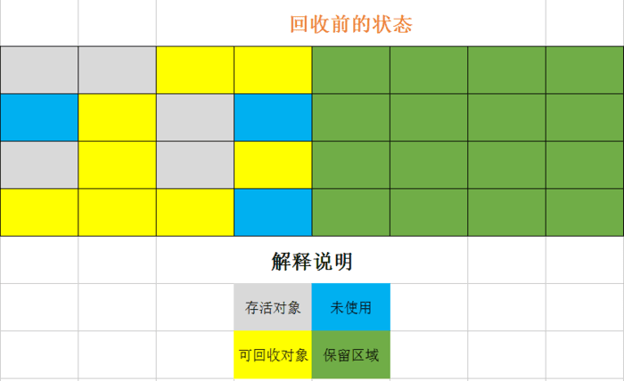
>
> 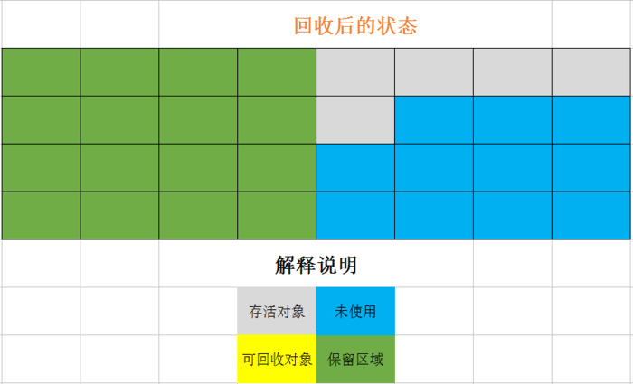

- 标记整理

> 分为两步：标记和整理。
>
> 整理其实也是两步：整理+清除。
>
> 整理让所有存活的对象都移动到一端，然后清理掉边界以外的内存。
>
> 优点：不会产生碎片问题，适合年老代的大对象存储，不像复制算法那样浪费空间。
>
> 缺点：效率赶不上复制算法。
>
> 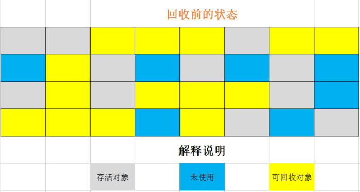
>
> 

- 分代算法

> 并不是新算法，而是根据对象存活周期的不同将内存划分为几块，一般是新生代和老年代，新生代基本采用复制算法，老年代采用标记整理算法。

## 5、为什么要分代

因为在不进行对象存活时间区分的情况下，每次垃圾回收都是对整个堆空间进行回收，花费时间会相对较长，也有很多对象完全没必要遍历，比如大对象存活的时间更长，遍历下来发现不需要回收，这样更浪费时间。所以才有了分代，分治的思想，进行区域划分，把不同生命周期的对象放在不同的区域，不同的区域采取最适合他的垃圾回收方式进行回收。

## 6、分代垃圾回收是怎么工作的

分代回收基于这样一个理念：不同的对象的生命周期是不一样的，因此根据对象存活周期的不同将内存划分为几块，一般是新生代和老年代，新生代基本采用复制算法，老年代采用标记整理算法。这样来提高回收效率。

新生代执行流程：

- 把 Eden + From Survivor（S1） 存活的对象放入 To Survivor（S2） 区；
- 清空 Eden 和S1 区；
- S1 和 S2 区交换，S1 变 S2，S2变S1。

每次在S1到S2移动时都存活的对象，年龄就 +1，当年龄到达 15（默认配置是 15）时，升级为老年代。大对象也会直接进入老年代。

老年代当空间占用到达某个值之后就会触发全局垃圾收回，一般使用标记整理的执行算法。

## 7、垃圾回收器有哪些

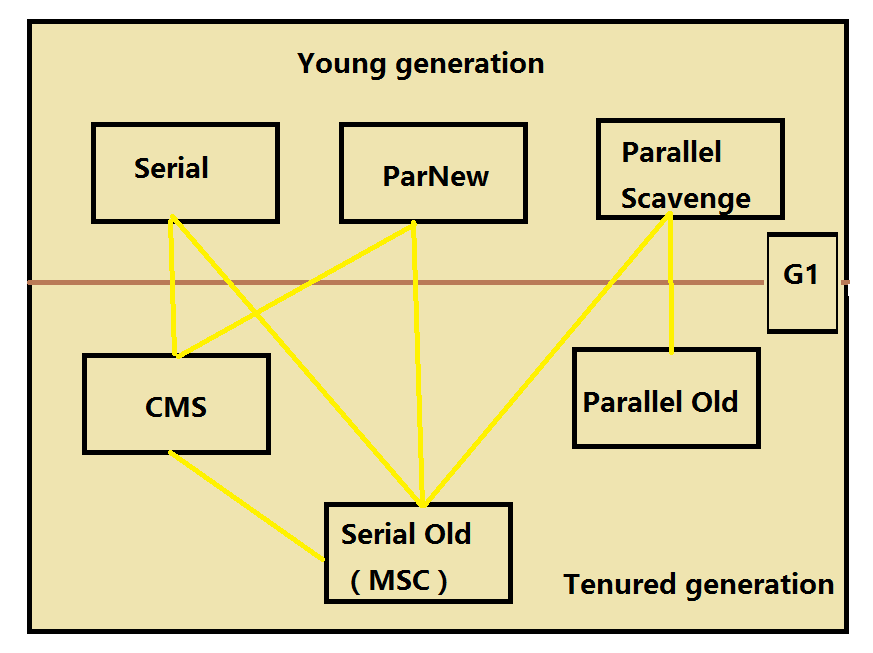

- Serial

> 采取复制算法，用于新生代，单线程收集器，所以在他工作时会产生StopTheWorld。单线程情况下效率更高，比如用于GUI小程序

- ParNew

> 采取复制算法，用于新生代，是Serial的多线程版本，多个GC线程同时工作，但是也会产生StopTheWorld，因为不能和工作线程并行。

- Parallel Scavenge

> 采取复制算法，用于新生代，和ParNew一样，所以也会产生STW，多线程收集器，他是吞吐量优先的收集器，提供了很多参数来调节吞吐量。

- Serial Old

> 采取标记整理算法，用于老年代，单线程收集器，所以在他工作时会产生StopTheWorld。单线程情况下效率更高，比如用于GUI小程序

- Parallel Old

> 采取标记整理算法，用于老年代，Parallel Scavenge收集器的老年代版本，吞吐量优先。

- CMS

> 采取标记清除算法，老年代并行收集器，号称以最短STW时间为目标的收集器，并发高、停顿低、STW时间短的优点。主流垃圾收集器之一。

- G1

> 采取标记整理算法，并行收集器。对比CMS的好处之一就是不会产生内存碎片，此外，G1收集器不同于之前的收集器的一个重要特点是：G1回收的范围是整个Java堆(包括新生代，老年代)，而前六种收集器回收的范围仅限于新生代或老年代。而且他的STW停顿时间是可以手动控制一个长度为M毫秒的时间片段（可以用JVM参数 -XX:MaxGCPauseMillis指定），设置完后垃圾收集的时长不得超过这个（近实时）。

## 8、详细介绍一下 CMS 垃圾回收器？

采取标记清除算法，老年代并行收集器，号称以最短STW时间为目标的收集器，并发高、停顿低、STW时间短的优点。主流垃圾收集器之一。

主要分为四阶段：

- 初始标记：只是标记一下 GC Roots 能直接关联的对象，速度很快，仍然需要暂停所有的工作线程。所以此阶段会STW，但时间很短。
- 并发标记：进行 GC Roots 跟踪的过程，和用户线程一起工作，不需要暂停工作线程。不会STW。
- 重新标记：为了修正在并发标记期间，因用户程序继续运行而导致标记产生变动的那一部分对象的标记记录，仍然需要暂停所有的工作线程。STW时间会比第一阶段稍微长点，但是远比并发标记短，效率也很高。
- 并发清除：清除GC Roots不可达对象，和用户线程一起工作，不需要暂停工作线程。

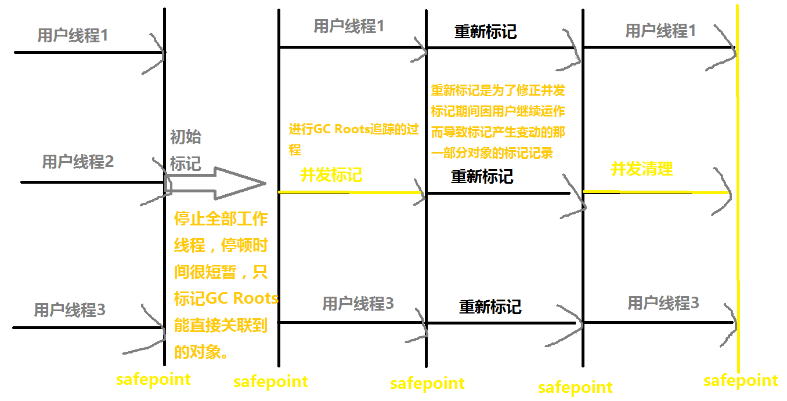

所以CMS的优点是：

- 并发高
- 停顿低
- STW时间短。

缺点：

- 对cpu资源非常敏感（并发阶段虽然不会影响用户线程，但是会一起占用CPU资源，竞争激烈的话会导致程序变慢）。

- 无法处理浮动垃圾，当剩余内存不能满足程序运行要求时，系统将会出现 Concurrent Mode Failure，失败后而导致另一次Full GC的产生，由于CMS并发清除阶段用户线程还在运行，伴随程序的运行自然会有新的垃圾产生，这一部分垃圾是出现在标记过程之后的，CMS无法在本次去处理他们，所以只好留在下一次GC时候将其清理掉。
- 内存碎片问题（因为是标记清除算法）。当剩余内存不能满足程序运行要求时，系统将会出现 Concurrent Mode Failure，临时 CMS 会采用 Serial Old 回收器进行垃圾清除，此时的性能将会被降低。

## 9、详细介绍一下 G1 垃圾回收器？

采取标记整理算法，并行收集器。

特点：

- 并行与并发执行：利用多CPU的优势来缩短STW时间，在GC工作的时候，用户线程可以并行执行。
- 分代收集：无需其他收集器配合，自己G1会进行分代收集。
- 空间整合：不会像CMS那样产生内存碎片。
- 可预测的停顿：可以手动控制一个长度为M毫秒的时间片段（可以用JVM参数 -XX:MaxGCPauseMillis指定），设置完后垃圾收集的时长不得超过这个（近实时）。

原理：

G1并不是简单的把堆内存分为新生代和老年代两部分，而是把整个堆划分为多个大小相等的独立区域（Region），新生代和老年代也是一部分不需要连续Region的集合。G1跟踪各个Region里面的垃圾堆积的价值大小，在后台维护一个优先列表，每次根据允许的收集时间，优先回收价值最大的Region。

补充：

Region不是孤立的，也就是说一个对象分配在某个Region中，他并非只能被本Region中的其他对象引用，而是整个堆中任意的对象都可以相互引用，那么在【可达性分析法】来判断对象是否存活的时候也无需扫描整个堆，Region之间的对象引用以及其他手机其中新生代和老年代之间的对象引用虚拟机都是使用Remembered Set来避免全堆扫描的。

步骤：

- 初始标记：仅仅标记GCRoots能直接关联到的对象，且修改TAMS的值让下一阶段用户程序并发运行时能正确可用的Region中创建的新对象。速度很快，会STW。
- 并发标记：进行 GC Roots 跟踪的过程，和用户线程一起工作，不需要暂停工作线程。不会STW。
- 最终标记：为了修正在并发标记期间，因用户程序继续运行而导致标记产生变动的那一部分对象的标记记录，仍然需要暂停所有的工作线程。STW时间会比第一阶段稍微长点，但是远比并发标记短，效率也很高。
- 筛选回收：首先对各个Region的回收价值和成本进行排序，根据用户所期望的GC停顿时间来制定回收计划。

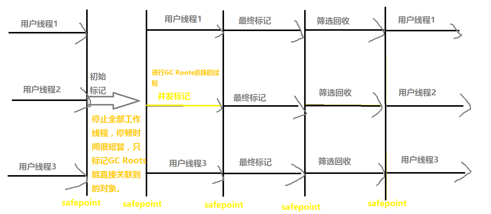

## 10、GC日志分析

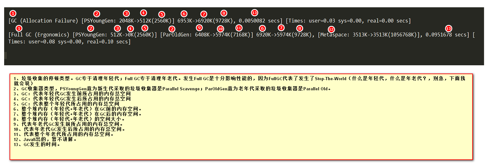

## 11、Minor GC与Full GC分别在什么时候发生

新生代内存（Eden区）不够用时候发生Minor GC也叫YGC。

Full GC发生情况：

- 老年代被写满
- 持久代被写满
- System.gc()被显示调用（只是会告诉需要GC，什么时候发生并不知道）

## 12、新生代垃圾回收器和老年代垃圾回收器都有哪些？有什么区别？

- 新生代回收器：Serial、ParNew、Parallel Scavenge
- 老年代回收器：Serial Old、Parallel Old、CMS
- 整堆回收器：G1

新生代垃圾回收器一般采用的是复制算法，复制算法的优点是效率高，缺点是内存利用率低；老年代回收器一般采用的是标记-整理的算法进行垃圾回收。标记整理很适合大对象，不会产生空间碎片。

## 13、栈上分配是什么意思

JVM允许将线程私有的对象分配在栈上，而不是分配在堆上。分配在栈上的好处是栈上分配不需要考虑垃圾回收，因为出栈的时候对象就顺带着一起出去了，没了，而不需要垃圾回收器的介入，从而提高系统性能。

> 补充1：对象逃逸。
>
> 逃逸的目的是判断对象的作用域是否有可能逃出函数体。例如下面的代码就显示了一个逃逸的对象：
>
> ```java
> private User user;
> private void hello(){
>    user = new User();
> }
> ```
>
> 对象实例 user 是类的成员变量，可以被任何线程访问，因此它属于逃逸对象。但如果我们将代码稍微改动一下，该对象就可以线程非逃逸的了。
>
> ```java
> private void hello(){
>    User user = new User();
> }
> ```
>
> 可以看到 user 实例作用域只在 hello 函数中，不会被其他线程访问到，也不会访问。所以该 user 实例对象的作用域只在该函数中，因此它并未发生逃逸。对于这样的情况，虚拟机就有可能将其分配在栈上，而不在堆上。
>
> 补充2：TLAB，自行Google。

简单点说，就是将本来应该分配在堆中的对象，让其分配在线程私有的栈上。通过这种方式，减少垃圾回收的压力，提高虚拟机的运行效率。

## 14、简述下对象的分配规则

- 对象优先分配在Eden区，如果Eden区没有足够的空间时，虚拟机执行一次YGC。并将还活着的对象放到from/to区，若本次YGC后还是没有足够的空间，则将启用分配担保机制在老年代中分配内存。
- 大对象直接进入老年代（大对象是指需要大量连续内存空间的对象）。这样做的目的是避免在Eden区和两个Survivor区之间发生大量的内存拷贝（新生代采用复制算法收集内存）。
- 长期存活的对象进入老年代。虚拟机为每个对象定义了一个年龄计数器，如果对象经过了1次YGC那么对象会进入Survivor区，之后每经过一次YGC那么对象的年龄加1，直到达到阀值对象进入老年区。默认阈值是15。可以通过`-XX:MaxTenuringThreshold`参数来设置。
- 动态判断对象的年龄。如果Survivor区中相同年龄的所有对象大小的总和大于Survivor空间的一半，年龄大于或等于该年龄的对象可以直接进入老年代。无需等到`-XX:MaxTenuringThreshold`参数要求的年龄。

> 动态年龄判断是有歧义的，要想面试加分，必看这个
>
> [https://www.jianshu.com/p/989d3b06a49d](https://www.jianshu.com/p/989d3b06a49d)

- 空间分配担保。每次进行YGC时，JVM会计算Survivor区移至老年区的对象的平均大小，如果这个值大于老年区的剩余值大小则进行一次Full GC，如果小于检查HandlePromotionFailure设置，如果true则只进行YGC，如果false则进行Full GC。

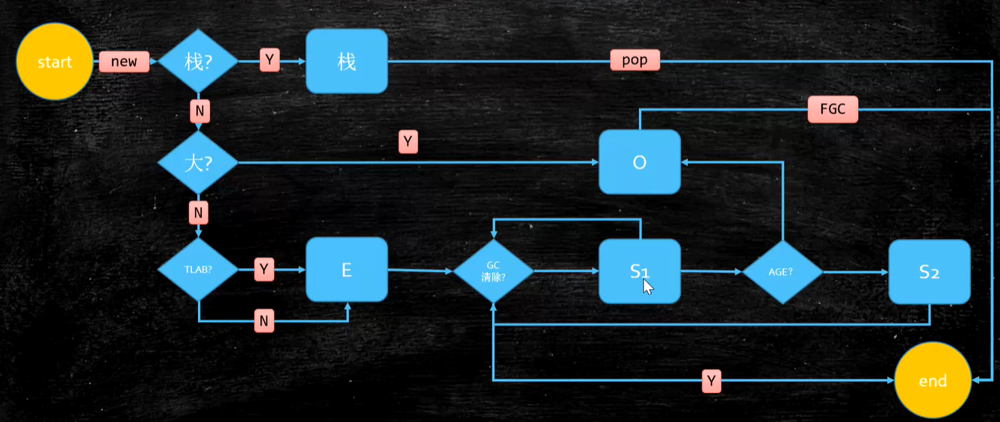

## 15、空间分配担保的作用

空间分配担保指的是老年代来进行担保的。一次minorGC会把Eden和s0/s1的有效对象移动到s1/s0区域。但是survivor区域是很小的，是有可能survivor无法装下这些对象的，这时候这些对象就要被放入Old区。

所以当老年代连续可用空间大于新生代对象总大小或大于历次晋升大小的平均值，那么minorGC之前就不需要进行一次fullGC，否则就需要。

# 四、实战调优

## 1、你在项目中都使用了哪些参数打印GC？

具体的参数名称记不清楚了，但是我一般在项目中输出详细的 GC 日志，并加上可读性强的 GC 日志的时间戳。特别情况下我还会追加一些反映对象晋升情况和堆详细信息的日志，这些会单独打到gc.log文件中用来排查问题。另外，OOM 时自动 Dump 堆栈，我一般也会进行配置。

## 2、常用的调优工具有哪些？

JDK内置的命令行：jps（查看jvm进程信息）、jstat（监视jvm运行状态的，比如gc情况、jvm内存情况、类加载情况等）、jinfo（查看jvm参数的，也可动态调整）、jmap（生成dump文件的，在dump的时候会影响线上服务）、jhat（分析dump的，但是一般都将dump导出放到mat上分析）、jstack（查看线程的）。

JDK内置的可视化界面：JConsole、VisualVM，这两个在QA环境压测的时候很有用。

阿里巴巴开源的arthas：神器，线上调优很方便，安装和显示效果都很友好。

## 3、如果有一个系统，内存一直消耗不超过10%，但是观察GC日志，发现FGC总是频繁产生，会是什么引起的？

检查下系统是否存在`System.gc() ;`

## 4、线上一个系统跑一段时间就栈溢出了，怎么办 ？

1.首先检查下是否有死归这种无限递归的程序或者递归方法太多

2.可以看下栈大小，若太小则可以指定-Xss参数设置栈大小

## 5、系统CPU经常100%，如何调优？

CPU100%，那肯定是有线程一直在占用着系统资源，所以具体方法如下:

1. 找出哪个进程cpu占用高（top命令）
2. 该进程中的哪个线程cpu占用高（`top -Hp $pid`命令）
3. 将十进制的tid转化为十六进制（`printf %x $tid`命令）
4. 导出该线程的堆栈 (`jstack $pid >$pid.log`命令)
5. 查找哪个方法（栈帧）消耗时间 (`less $pid.log`)
6. 可以确认工作线程占比高还是垃圾回收线程占比高
7. 修改代码

## 6、系统内存飙高，如何查找问题？

1. 找出哪个进程内存占用高（top命令）
2. 查看jvm进程号（jps命令）
3. 导出堆内存 (jmap命令生成dump文件，注意：线上系统，内存特别大，jmap执行期间会对进程产生很大影响，甚至卡顿，所以操作前最好先从负载均衡里摘掉。)
4. 分析dump文件 (比如mat软件)

## 7、大型项目如何进行性能瓶颈调优

1.数据库与SQL优化：一般dba负责数据库优化，比如集群主从等。研发负责SQL优化，比如索引、分库分表等。

2.集群优化：一般OP负责，让整个集群可以很容易的水平扩容，再比如tomcat/nginx的一些配置优化等。

3.硬件升级：选择最合适的硬件，充分利用资源。

4.代码优化：很多细节，可以参照阿里巴巴规范手册和安装sonar插件这种检测代码质量的工具。也可以适当的运用并行，比如CountDownLatch等工具。

5.jvm优化：内存区域大小设置、对象年龄达到次数晋升老年代参数的调整、选择合适的垃圾收集器以及合适的垃圾收集器参数、打印详细的GC日志和oom的时候自动生成dump。

6.操作系统优化

## 9、你实际遇到调优的场景

我们之前都是采取zipkin做分布式链路追踪，后来换成了skywalking，所以将zipkin相关配置和代码都移除了，但是忘记移除maven坐标了，运行一段时间后导致了频繁full gc ，最后oom了。 

因为配置了oom后自动生成dump文件，所以分析dump文件发现大对象是zipkin包里的`ConcurrentHashMap$Node`，通过观察zipkin的自动配置类`ZipkinAutoConfiguration`发现即使没有任何zipkin的配置，只要有zipkin的依赖都会创建一个异步报告者，默认的采样率是10%，所以即使不配置相关配置项，也会以默认采样率10%，发送到zipkin，这是默认的地址是`http://localhost:9411/`，此时发送到`localhost:9411`显然会连接拒绝。导致度量中的异常实例堆积，从而OOM。

```java
private float probability = 0.1f;

@ConfigurationProperties("spring.zipkin")
public class ZipkinProperties {
    private String baseUrl = "http://localhost:9411/";
}
```

# 附录

## GC常用参数

- -Xmn：年轻代  
- -Xms：最小堆 
- -Xmx ：最大堆
- -Xss：栈空间
- -XX:+UseTLAB：使用TLAB，默认打开
- -XX:+PrintTLAB：打印TLAB的使用情况
- -XX:TLABSize：设置TLAB大小
- -XX:+DisableExplictGC：禁用System.gc()不管用 ，防止FGC
- -XX:+PrintGC：打印GC日志
- -XX:+PrintGCDetails：打印GC详细日志信息
- -XX:+PrintHeapAtGC：打印GC前后的详细堆栈信息
- -XX:+PrintGCTimeStamps：打印时间戳
- -XX:+PrintGCApplicationConcurrentTime：打印应用程序时间
- -XX:+PrintGCApplicationStoppedTime：打印暂停时长
- -XX:+PrintReferenceGC：记录回收了多少种不同引用类型的引用
- -verbose:class：类加载详细过程
- -XX:+PrintVMOptions：jvm参数
- -XX:+PrintFlagsFinal：-XX:+PrintFlagsInitial 必须会用
- -Xloggc:opt/log/gc.log：gc日志的路径以及文件名称
- -XX:MaxTenuringThreshold：升代年龄，最大值15

## Parallel常用参数

- -XX:SurvivorRatio：年轻代中eden和from/to的比值。比如设置3就是eden:survivor=3:2，也就是from和to各占1，eden占用3
- -XX:PreTenureSizeThreshold：大对象到底多大
- -XX:MaxTenuringThreshold：升代年龄，最大值15
- -XX:+ParallelGCThreads：并行收集器的线程数，同样适用于CMS，一般设为和CPU核数相同
- -XX:+UseAdaptiveSizePolicy：自动选择各区大小比例

## CMS常用参数

- -XX:+UseConcMarkSweepGC：设置年老代为并发收集
- -XX:ParallelCMSThreads：CMS线程数量
- -XX:CMSInitiatingOccupancyFraction：使用多少比例的老年代后开始CMS收集，默认是68%(近似值)，如果频繁发生SerialOld卡顿，应该调小，（频繁CMS回收）
- -XX:+UseCMSCompactAtFullCollection：在FGC时进行压缩
- -XX:CMSFullGCsBeforeCompaction：多少次FGC之后进行压缩
- -XX:+CMSClassUnloadingEnabled：年老代启用CMS，但默认是不会回收永久代(Perm)的。此处对Perm区启用类回收，防止Perm区内存满。
- -XX:CMSInitiatingPermOccupancyFraction：达到什么比例时进行Perm回收
- GCTimeRatio：设置GC时间占用程序运行时间的百分比
- -XX:MaxGCPauseMillis：停顿时间，是一个建议时间，GC会尝试用各种手段达到这个时间，比如减小年轻代

## G1常用参数

- -XX:+UseG1GC：开启G1
- -XX:MaxGCPauseMillis：建议值，G1会尝试调整Young区的块数来达到这个值
- -XX:GCPauseIntervalMillis：GC的间隔时间
- -XX:+G1HeapRegionSize：分区大小，建议逐渐增大该值，1 2 4 8 16 32。 随着size增加，垃圾的存活时间更长，GC间隔更长，但每次GC的时间也会更长 ZGC做了改进（动态区块大小）
- G1NewSizePercent：新生代最小比例，默认为5%
- G1MaxNewSizePercent：新生代最大比例，默认为60%
- GCTimeRatio：GC时间建议比例，G1会根据这个值调整堆空间
- ConcGCThreads：线程数量
- InitiatingHeapOccupancyPercent：启动G1的堆空间占用比例