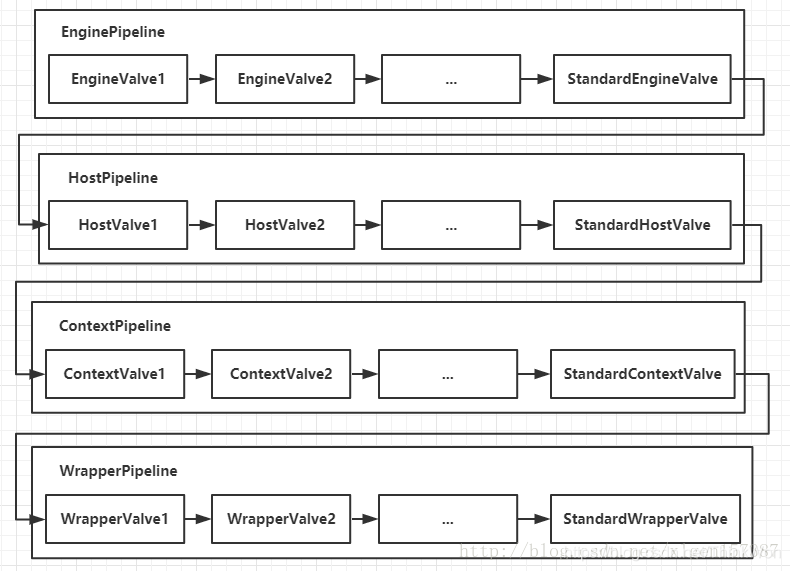

[TOC]

> author：编程界的小学生
>
> date：2021/02/15
>
> PS：以下内容均整理于网络，如有侵权，请在如下仓库提issue：
>
> [https://gitee.com/geekerdream/java-legendary](https://gitee.com/geekerdream/java-legendary)

# 一、Tomcat有哪几种部署方式？

- 直接把web项目放在webapps目录下，Tomcat会自动将其部署

- 在Tomcat主配置文件中，配置<Context>节点，设置相关的属性即可 

- 通过Catalina来进行配置：进入到conf\Catalina\localhost文件下，创建一个xml文件，该文件的名字就是站点的名字

# 二、Tomcat有哪几种Connector运行模式？

- **bio：**传统的Java I/O操作，同步且阻塞I/O，一个线程处理一个请求，并发量高时，线程数较多，浪费资源；（已经很少有人在使用）
- **nio：**JDK1.4开始支持，同步阻塞或同步非阻塞IO，可以通过少量的线程来处理大量的请求；（从Tomcat 8版本开始默认就是这种模式）
- **apr：**以JNI的形式调用Apache HTTP服务器的核心动态链接库来处理文件读取或网络传输操作，从而大大地提高Tomcat对静态文件的处理性能（企业中使用较多）

# 三、Tomcat容器是如何创建servlet类实例？什么原理？

- 当容器启动的时候会读取webapps下的所有web应用中的web.xml文件
- 然后对web.xml文件进行解析
- 读取web.xml配置的servlet的注册信息
- 将应用中注册的servlet类都进行加载并在第一次请求此类的时候通过反射机制进行实例化（若配置了`load on startup=1`则在第一次请求的时候实例化）

# 四、Tomcat的架构图

## 1、架构图描述

Tomcat中最顶层的容器是Server，代表着整个服务器，从上图中可以看出，一个Server可以包含至少一个Service，即可以包含多个Service，用于具体提供服务。

Service主要包含两个部分：Connector和Container。从上图中可以看出 Tomcat 的心脏就是这两个组件，他们的作用如下：

- Connector用于接受请求并将请求封装成Request和Response，然后交给Container进行处理，Container处理完之后在交给Connector返回给客户端。
- Container用于封装和管理Servlet，以及具体**处理Request请求**。

一个Tomcat中只有一个Server，一个Server可以包含多个Service，一个Service只有一个Container，但是可以有多个Connectors，这是因为一个服务可以有多个连接，如同时提供Http和Https链接，也可以提供向相同协议不同端口的连接，示意图如下（Engine、Host、Context下面会说到）：

多个 Connector 和一个 Container 就形成了一个 Service，有了 Service 就可以对外提供服务了，但是 Service 还要一个生存的环境，必须要有人能够给她生命、掌握其生死大权，那就非 Server 莫属了！所以整个 Tomcat 的生命周期由 Server 控制。

## 2、架构图小结

1. Tomcat中只有一个Server，一个Server可以有多个Service，一个Service可以有多个Connector和一个Container
2. Server掌管着整个Tomcat的生死大权
3. Service 是对外提供服务的
4. Connector用于接受请求并将请求封装成Request和Response来具体处理
5. Container用于封装和管理Servlet，以及具体处理request请求

# 五、Connector面试题

## 1、Connector流程图

## 2、Connector工作流程以及核心原理

Connector就是用ProtocoHandler来处理请求的，不同的ProtocoHandler代表不同的连接类型，比如：Http11Protocol使用的是普通Socket来连接的，Http11NioProtocol使用的是NioSocket来连接的。

其中ProtocoHandler包含了三个组件：Endpoint、Processor、Adapter。

- 1、Endpoint用来处理底层的Socket网络连接，Processor用于将Endpoint接收到的Socket封装成Request，Adapter用于将Request交给Container进行具体的处理。
- 2、Endpoint由于是处理底层的Socket网络连接，因此Endpoint是用来实现TCP/IP协议的，而Processor用来实现HTTP协议的，Adapter将请求适配到Servlet容器进行具体的处理。
- 3、Endpoint的抽象实现AbstractEndpoint里面定义的Acceptor和AsyncTimeout两个内部类和一个Handler接口。Acceptor用于监听请求，AsyncTimeout用于检查异步Request的超时，Handler用于处理接收到的Socket，在内部调用Processor进行处理。

## 3、Connector如何接受请求的？

通过ProtocoHandler来处理请求的，不同的ProtocoHandler代表不同的连接类型，比如：Http11Protocol使用的是普通Socket来连接的，Http11NioProtocol使用的是NioSocket来连接的。

## 4、如何将请求封装成Request和Response的？

Endpoint用来处理底层的Socket网络连接，Processor用于将Endpoint接收到的Socket封装成Request。

## 5、封装完之后的Request和Response如何交给Container进行处理的？

通过Adapter用于将Request交给Container进行具体的处理。

# 六、Container面试题

## 1、Container架构图

Container用于封装和管理Servlet，以及具体处理Request请求，在Container内部包含了4个子容器，结构图如下：

4个子容器的作用分别是：

- Engine：引擎，用来管理多个站点，一个Service最多只能有一个Engine；

- Host：代表一个站点，也可以叫虚拟主机，通过配置Host就可以添加站点；

- Context：代表一个应用程序，对应着平时开发的一套程序，或者一个WEB-INF目录以及下面的web.xml文件；

- Wrapper：每一Wrapper封装着一个Servlet；

下面找一个Tomcat的文件目录对照一下，如下图所示：

Context和Host的区别是Context表示一个应用，我们的Tomcat中默认的配置下webapps下的每一个文件夹目录都是一个Context，其中ROOT目录中存放着主应用，其他目录存放着子应用，而整个webapps就是一个Host站点。

我们访问应用Context的时候，如果是ROOT下的则直接使用域名就可以访问，例如：www.baidu.com，如果是Host（webapps）下的其他应用，则可以使用www.baidu.com/docs进行访问，当然默认指定的根应用（ROOT）是可以进行设定的，只不过Host站点下默认的主应用是ROOT目录下的。

## 2、Container如何处理请求的

Container处理请求是使用Pipeline-Valve管道来处理的！（Valve是阀门之意）

Pipeline-Valve是**责任链模式**，责任链模式是指在一个请求处理的过程中有很多处理者依次对请求进行处理，每个处理者负责做自己相应的处理，处理完之后将处理后的结果返回，再让下一个处理者继续处理。

但是Pipeline-Valve使用的责任链模式和普通的责任链模式有些不同！区别主要有以下两点：

- 每个Pipeline都有特定的Valve，**而且是在管道的最后一个执行，这个Valve叫做BaseValve，BaseValve是不可删除的；**
- 在上层容器的管道的BaseValve中会调用下层容器的管道。

我们知道Container包含四个子容器，而这四个子容器对应的BaseValve分别在：StandardEngineValve、StandardHostValve、StandardContextValve、StandardWrapperValve。

Pipeline的处理流程图如下（图D）：

- Connector在接收到请求后会首先调用最顶层容器的Pipeline来处理，这里的最顶层容器的Pipeline就是EnginePipeline（Engine的管道）；
- 在Engine的管道中依次会执行EngineValve1、EngineValve2等等，最后会执行StandardEngineValve，在StandardEngineValve中会调用Host管道，然后再依次执行Host的HostValve1、HostValve2等，最后在执行StandardHostValve，然后再依次调用Context的管道和Wrapper的管道，最后执行到StandardWrapperValve。
- 当执行到StandardWrapperValve的时候，会在StandardWrapperValve中创建FilterChain，并调用其doFilter方法来处理请求，这个FilterChain包含着我们配置的与请求相匹配的Filter和Servlet，其doFilter方法会依次调用所有的Filter的doFilter方法和Servlet的service方法，这样请求就得到了处理！
- 当所有的Pipeline-Valve都执行完之后，并且处理完了具体的请求，这个时候就可以将返回的结果交给Connector了，Connector在通过Socket的方式将结果返回给客户端。

# 七、如何对Tomcat进行优化？

- （1）关闭Manager管理页面；（默认已经关闭）
- （2）关闭host-mangent管理页面；（默认已经关闭）
- （3）对Tomcat日志进行分割；
- （4）定义 Tomcat 404错误返回的页面；
- （5）对JVM进行优化；
- （6）对Tomcat线程池进行优化；
- （7）更改Tomcat的工作的模式；