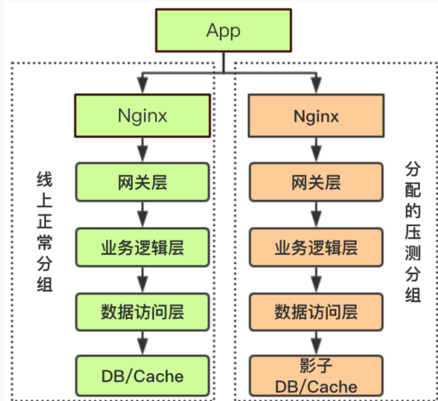
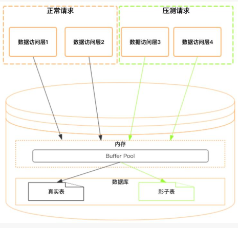

[TOC]

> author：编程界的小学生
>
> date：2021/03/09

# 一、什么是全链路压测？

基于线上真实的业务场景和系统环境来模拟大量的用户请求对整个业务系统进行压力测试。全链路压测是评估整个系统性能水平的必经之路。

# 二、全链路压测的目的？

- 验证新上线的功能稳定性
- 找到服务器性能的瓶颈并进行优化
- 对线上服务更准确的容量评估

# 三、全链路压测面对的问题

- 压测的数据构造要真实
- 压测环境要和线上真实环境一致
- 整体服务要全链路进行压测
- 压测服务要隔离，别因为压测的服务影响了线上集群
- 压测数据隔离，别因为压测的服务污染了线上数据
- 压测完要生成压测报告，便于分析系统性能

# 四、全链路压测的方案？

## 1、方案一

复用线上环境压测，在流量低峰期，比如半夜两三点，但是只能压测读请求，因为写请求会造成数据污染。

缺点：直接影响了线上集群、只能测读不能测写。

## 2、方案二

搭建一套和线上一模一样的环境进行压测。包括：服务、数据存储（MySQL、Redis、MQ等）、服务器配置等，这样读写随便搞。

缺点：成本高、过于麻烦。

## 3、方案三（最优解）

- 压测标识符

> 在数据传输过程中一般都是定长header+变长body。在定长header里添加isTest字段，这个字段代表是否是压测，普通请求进来这个字段不传，或者传0就是非压测，是正常的用户请求。压测的时候传1。

- 压测服务隔离

> 选择夜深人静低峰期的时候进行，低峰期机器基本都处于空闲状态。根据业务的需求在线上对整条链路快速创建一个压测分组，也就是隔离出一批空闲的机器用于压测。
>
> 然后正常流量和压测流量再机器级别进行隔离，从而降低压测对服务集群带来的影响。具体隔离方案如下：
>
> 判断isTest是不是1，是1的话将流量打到另一个nginx上，代表压测请求，此nginx与线上正常用户请求的nginx是隔离的。
>
> 

- 压测数据隔离

> 使用“影子表“（阿里首先提出的骚概念）。
>
> 影子表的核心思想是使用线上同一个数据库，包括共享数据中的内存资源，因为这样才能更接近真实的线上场景，只是再写入数据的时候会写到另一个影子表中，从而避免脏数据的写入。
>
> 对于Redis、MQ来讲也一样，写到其他Redis或者Redis其他库，MQ写到其他MQ或者写到新Topic。
>
> 

**实施方案**

- 网关层根据isTest字段做分发不同的服务
- rpc框架做isTest的逻辑，遇到这个字段就代表全链路压测，就服务分发的时候就进行路由到压测集群。

