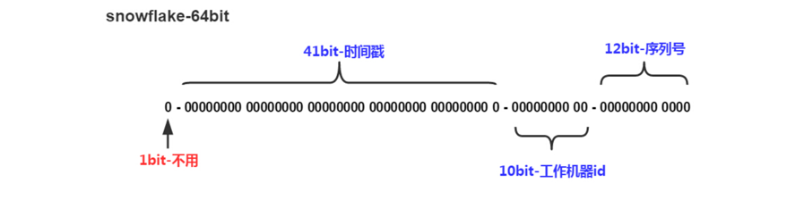

[TOC]

> author：编程界的小学生
>
> date：2021/03/10

# 一、分布式id方案

- uuid：无序性、随机字符串，导致频繁页分裂。
- redis：无法保证数据安全，Redis持久化、主从延迟得不到解决。
- 雪花：有序且完美。
- 数据库自增ID：扛不住高并发，db单点故障 。
- 数据库号段：完美。

# 二、leaf原理

支持雪花和数据库号段两种完美的算法。

## 1、号段模式

支持自定义业务key，每个业务key支持自定义号段步长。

采取双buffer进行优化来减少db压力，这样即使db挂了一段时间也能继续提供服务（只要双buffer里的号没被取完）。

动态调整步长，代码会看qps和当前步长，如果qps太高，步长太小，会动态增加步长，反之qps太小，步长太大，会动态减少步长。


## 2、雪花算法



- 第1位置为0。
- 第2-42位是相对时间戳，通过当前时间戳减去一个固定的历史时间戳生成。
- 第43-52位是机器号workerID，每个Server的机器ID不同。
- 第53-64位是自增ID。

对Zookeeper生成机器号做了弱依赖处理，即使Zookeeper有问题，也不会影响服务。Leaf在第一次从Zookeeper拿取workerID后，会在本机文件系统上缓存一个workerID文件。即使ZooKeeper出现问题，同时恰好机器也在重启，也能保证服务的正常运行。这样做到了对第三方组件的弱依赖，一定程度上提高了SLA。

## 3、美团文献

[https://tech.meituan.com/2019/03/07/open-source-project-leaf.html](https://tech.meituan.com/2019/03/07/open-source-project-leaf.html)

[https://tech.meituan.com/2017/04/21/mt-leaf.html](https://tech.meituan.com/2017/04/21/mt-leaf.html)

# 三、leaf优化

## 1、从规范角度

- Restful

```java
@RequestMapping(value = "/api/segment/get/{key}")   PathVariable("key")
```

首先你初衷是Restful风格，那你为啥不用`@GetMapping`？，为啥要`/get/{key}`，Restful风格不允许出现动词，名词接资源，完美写法：

`@GetMapping(/api/segment/{key})`

- 类架构很low

连个生命周期类都没有，SegmentService构造器里干了init该干的事情。最起码像Tomcat一样搞个Liftcycle出来。

- 代码规范

```java
public boolean init() {
    logger.info("Init ...");
    // 确保加载到kv后才初始化成功
    updateCacheFromDb();
    initOK = true;
    updateCacheFromDbAtEveryMinute();
    return initOK;
}

// 调用方
if (idGen.init()) {
    logger.info("Segment Service Init Successfully");
} else {
    throw new InitException("Segment Service Init Fail");
}
```

？？？什么玩意？返回Boolean类型，调用方判断是false直接抛出异常？？？如果是这逻辑你应该换成以下写法好不好？

```java
public void init() {
    try {
        logger.info("Init ...");
        // 确保加载到kv后才初始化成功
        updateCacheFromDb();
        initOK = true;
        updateCacheFromDbAtEveryMinute();
        logger.info("Segment Service Init Successfully");
        return initOK;
    } catch (Exception e) {
        throw new InitException("Segment Service Init Fail");
    }
}

// 调用方
idGen.init();
```

- exception打warn log，应该打error呀！

## 2、从细节优化角度

- 表设计

```sql
CREATE TABLE `leaf_alloc` (
  `biz_tag` varchar(128)  NOT NULL DEFAULT '',
  `max_id` bigint(20) NOT NULL DEFAULT '1',
  `step` int(11) NOT NULL,
  `description` varchar(256)  DEFAULT NULL,
  `update_time` timestamp NOT NULL DEFAULT CURRENT_TIMESTAMP ON UPDATE CURRENT_TIMESTAMP,
  PRIMARY KEY (`biz_tag`)
) ENGINE=InnoDB;
```

主键是biz_tag？自定义的字符串？大哥，你搞个int自增主键行不行，你这样随意瞎写的字符串当主键会频繁导致页分裂。这表设计dba能审核通过嘛。comment注释也没有！

- 其他代码细节优化

  比如`SegmentIDGenImpl.updateCacheFromDb();`方法用了三个for循环求差集，换成guava不香？以及部分代码使用位运算&替换取模运算。

## 3、适配公司

- snowflake算法新增加以MySQL为注册中心，因为公司ZK没用到

- 改造调用方式为公司自研rpc调用
- 完善后台管理系统，动态增删biz_tag和监控信息以及添加报警