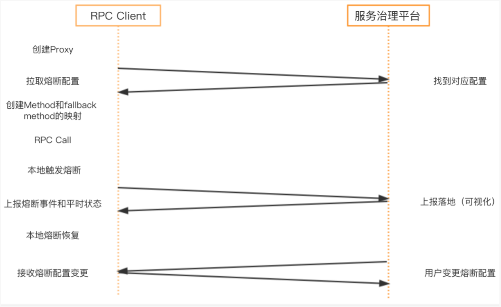
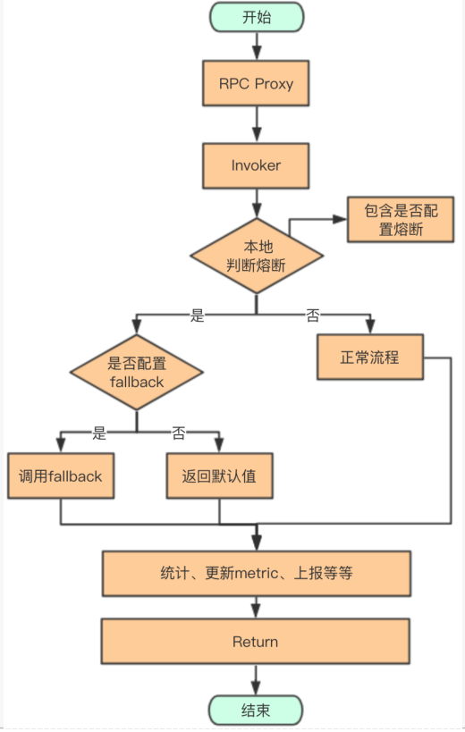
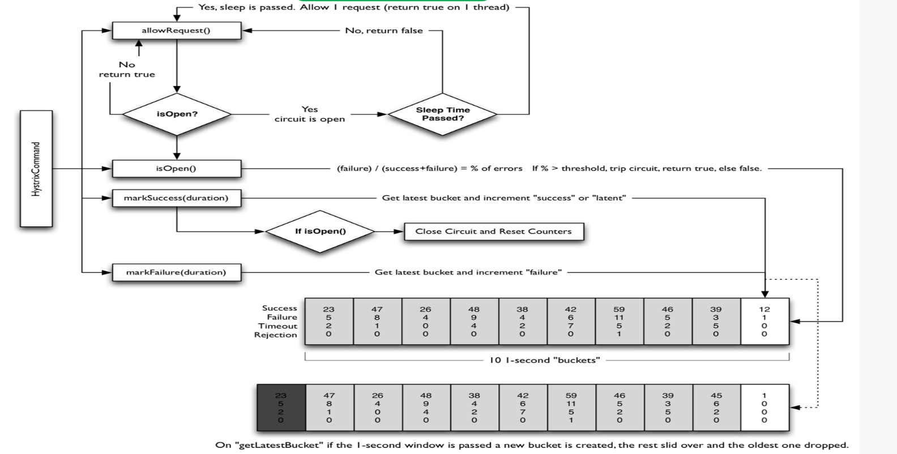

[TOC]

> author：编程界的小学生
>
> date：2021/03/10

# 一、什么是服务熔断？

当下游服务因访问压力过大而响应变慢或失败，上游服务为了保护系统整体的可用性，可以暂时切断对下游服务的调用。

这种牺牲局部，保全整体的措施就叫做**熔断**。

# 二、为什么要服务熔断？

防止服务雪崩，全链路不可用。

微服务分布式部署后，系统之间调用越来越多，整个系统发生的概率也随之增加，可能一个很底层的链路出现故障导致调用方超时，越积越多导致服务雪崩。

# 三、怎么服务熔断？

## 1、服务熔断的方案

- 大部分熔断返回自定义错误码
- 进入熔断后，打印熔断log
- 服务治理平台可以看到服务状态，是否熔断、是否限流、是否降级，可以实时下发阈值配置
- 自动报警，加上异常信息
- 接口级别的细粒度

## 2、业界的开源框架

Hystrix/Sentinel都存在问题：都是组件级别的，非平台级别的，具体如下

- 手写Hystrix command，在fallback里返回null等
- 业务侵入大，对每个需要熔断的方法都要加注解
- 需要额外引入jar包，比如Hystrix.jar
- 客户端直接引用后需要重启

## 3、平台化的实现关键点

组件级别的存在如上几个问题，需要额外引入jar包，可以将熔断放到rpc框架内来解决。客户端引用后需要重启，可以将组件级别的换成服务治理平台级别的来解决。那怎么实现平台化的熔断框架呢？

- 基于RPC Client来实现熔断
- RPC Client修改创建的Proxy（动态代理），在proxy内部由本地计算统计决定是否需要进行熔断
- 服务治理平台存储降级相关的配置，以及 他提供上报数据的可视化、报警、配置变更后下推等功能

## 4、熔断方案的思路

### 4.1、整体交互图

### 4.2、RPC Client fallback流程

### 4.3、核心实现细节

- 实现一个类似Hystrix的熔断器
- RPC Client不依赖Hystrix，Client端采集测量，决定是否需要熔断
- Hystrix内部有四个统计可以参考（成功、失败、超时、拒绝）
  - fallbackEnabled：是否开启熔断
  - requestVolumeThreshold：请求是否打到开启的阈值
  - sleepWindowInMilliseconds：熔断时间窗口，熔断多久之后开始进入测试半打开
  - errorThresholdPercetage：错误比例
  - 加上时间窗口长度配置

## 5、Hystrix熔断原理

