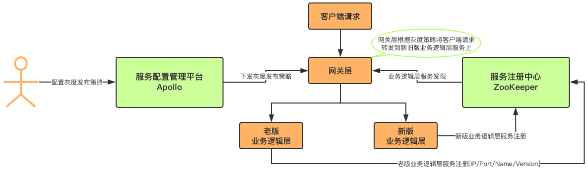

[TOC]

> author：编程界的小学生
>
> date：2021/03/10

# 一、什么是灰度发布？

也称金丝雀发布，也称A/B Test，就是产品发布者根据某种规则让一部分用户继续用原来的产品功能，另一部分用户开始逐渐启用新功能 ，在灰度过程中发现问题及时解决。

# 二、为什么做灰度发布?

新上线的功能需要线上真实用户的快速验证，一旦出现问题只会影响这小部分灰度的用户，也可以及时解决。不会全面瘫痪。

# 三、怎么做灰度发布？

## 1、代码业务层

细粒度，能控制每个接口的逻辑，在业务代码中判断xxx就走新逻辑，否则走之前的。

对代码有侵入性，不推荐。

## 2、nginx+lua

采取nginx+lua写逻辑做转发，还是挺好的。

## 3、网关层

和nginx+lua类似，只是这个交给了开发人员来做，nginx+lua是运维层。

在网关层从Apollo等配置中心获取灰度策略，然后进行逻辑判断路由到灰度业务逻辑层还是老的业务逻辑层。

**具体方案**

- 协议设计

> 数据协议：定长header+变长body。header设计初期就要添加uid、token、ip、tag字段，这些字段可用于灰度发布策略。

- 灰度策略

> 1、可以根据协议header里的uid、token、ip来进行灰度。
>
> 2、也可以根据tag来进行灰度，新版客户端打tag标签了就走新逻辑，没打的走老逻辑。
>
> 3、uid、token、ip、tag也可以组合起来多策略进行灰度。

