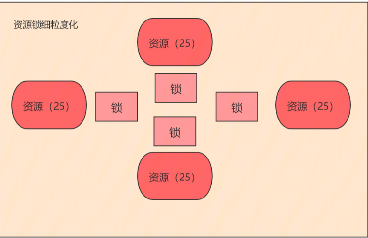
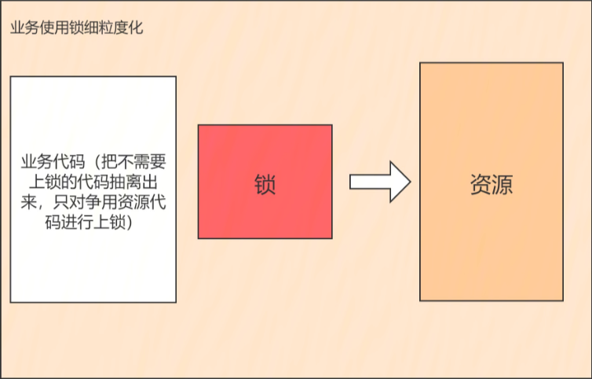

[TOC]

> author：编程界的小学生
>
> date：2021/03/11

# 一、如何把一台机器性能利用最大化？

四个维度

- 锁资源细粒度化
- 业务使用锁细粒度化
- 无锁化（真无锁和假无锁）
- 异步+线程池

## 1、锁资源细粒度化

比如需要锁一个100维度的资源，那就给他拆分成四小块，每块25细粒度资源，然后进行上锁，想想`ConcurrentHashMap`

## 2、业务使用资源细粒度化

只锁需要上锁的业务代码，不锁整个方法。

## 3、无锁化

### 3.1、真无锁

ThreadLocal真无锁。

### 3.2、假无锁

CAS假无锁。

## 4、异步+线程池

同步变异步，单线程变多个线程同时执行最后合并结果。`CompletableFuture`