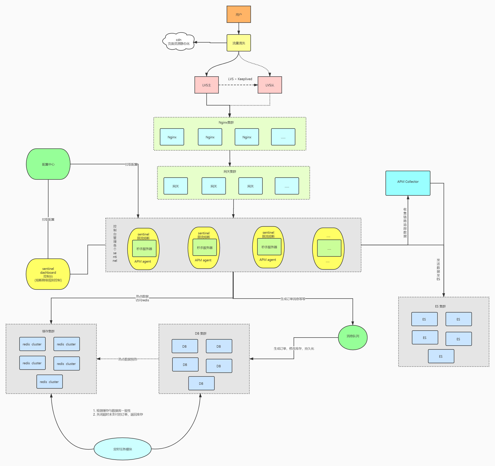

> author：编程界的小学生
>
> date：2021/03/12

# 高并发架构

1. DNS轮询

2. CDN存放静态资源

3. LVS集群四层均匀负载

4. Nginx集群七层均匀负载

5. 网关集群限流鉴权等等

6. 业务服务器（如Tomcat）集群处理业务

7. Sentinel限流降级熔断保护整体系统

8. 业务服务器和Sentinel从配置中心（如Apollo）拉取配置

9. 注册中心集群（如Eureka）对业务服务器进行负载均衡和故障转移

10. DB集群，避免单点问题，以及减少单数据库压力

11. 添加缓存集群（如Redis cluster），减少数据库访问

12. 添加消息队列集群（如RocketMQ），进行异步和消峰

13. 增加定时任务（quartz，xxl-job，elastic-job），进行定时任务逻辑操作

14. 添加ES集群，利用倒排索引，优化系统的搜索功能

15. 添加ELK，可视化日志

16. 添加链路追踪（skywalking等），可了解请求的完整路径

17. 添加监控（如Grafana）监控服务状态

