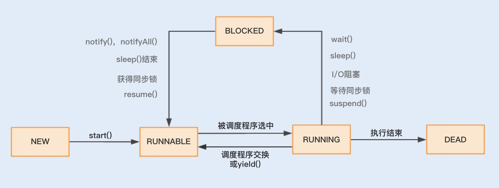
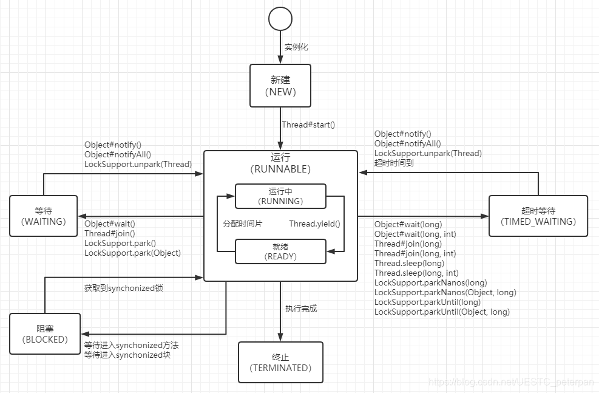
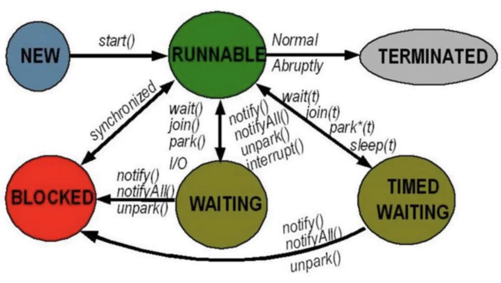
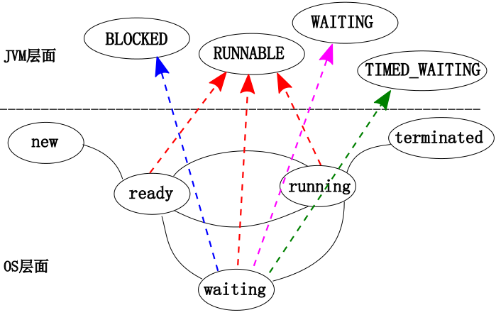
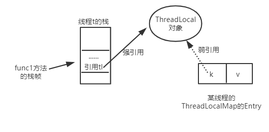
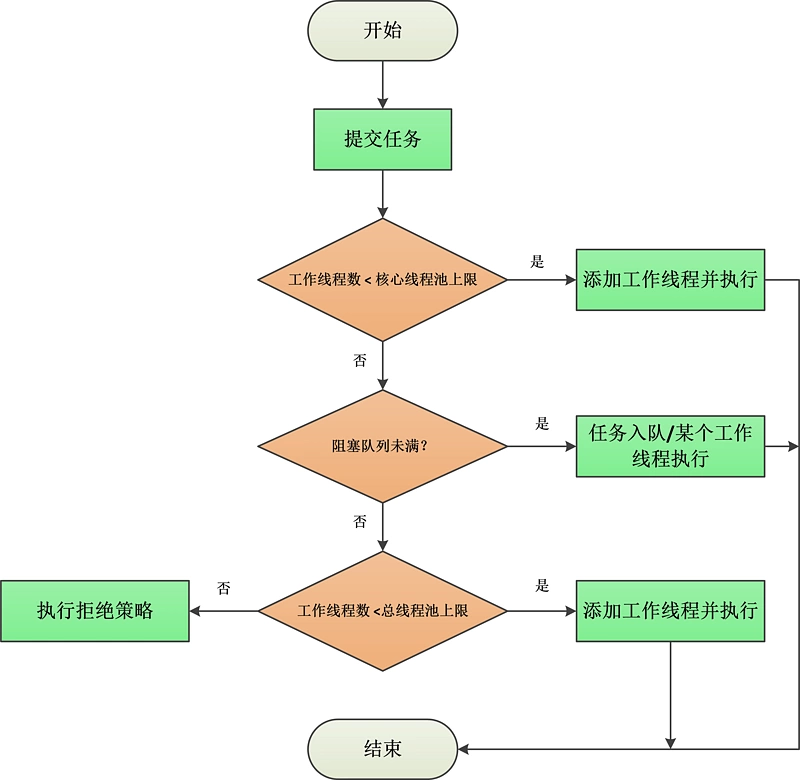
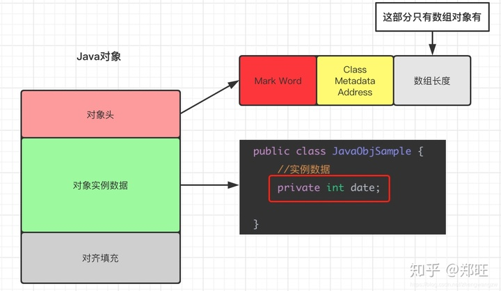
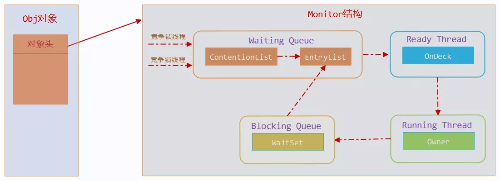
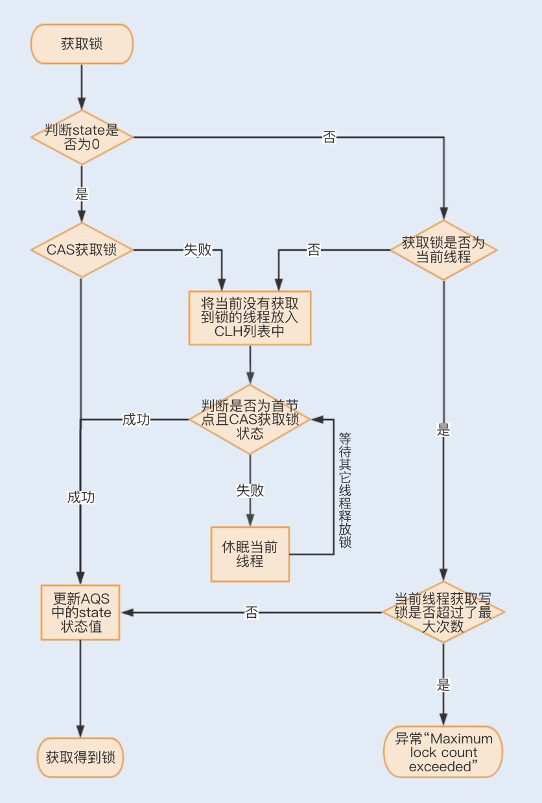

# 并发基础

## volatile

### volatile的本质

1. volatile被引用时，会发生主内存向工作内存的拷贝。
2. volatile被赋值时，工作内存立即同步到主内存。

可以实现

1. 保证可见
2. 不保证原子
3. 禁止指令重排

### volatile原理

编译为字节码后增加 Lock前缀指令：

1. 将当前缓存行的数据立即写回主内存

2. 写回主内存使其他工作内存里缓存了该共享变量地址的数据无效（缓存一致性协议eg :MESI），并且读回正确的值。

3. 内存屏障。确保指令重排序后顺序。loadload，loadstore...


### 指令重排序

指令重排序存在于单/多处理器情况下，为了充分的优化指令流水线，避免某个操作耗时过长造成阻塞，CPU可能会对机器指令进行重排序。

但是乱序可能会造成问题（eg:双检查单例）

```java
public class Single{
	private volatile static Single single;
	private Single(){}
	public static Single getInstance(){
		if(single==null){
			synchronized (Single.class) {
				if(single==null){
					single=new Single();
				}
			}
		}
		return single;
	}
}
```

JDK1.5以后，这个例子不会再出现问题。


## CAS操作

CAS的实现是lock cmpxchg指令，其用来解决volatile不具有的原子性操作。

cmpxchg 涉及一次内存读和一次写，lock 用来保证这个操作中间不会有其他cpu写这段内存。

### CPU/CAS如何实现原子操作

CPU通过**缓存锁定**实现原子操作。因为内存相对CPU速度非常慢，所以每个CPU核心内部存在L1-3级别高速缓存，频繁使用的数据会存入其中，用来加快读取效率。单核心不会出现问题，但是当多核心的情况，可能会造成不同核心的高速缓存的数据不一致。

缓存锁定机制：当某个处理器对缓存中的共享变量进行了操作，会通知其他CPU当期存储该共享资源或重新读取该共享资源。

CAS是调用CPU底层指令实现的原子操作. 在**循环内得到原始值，然后CAS**(this, old, new)

### CAS流程*

以getAndAddInt为例，先拿到内存的最新值，使用CAS尝试将该内存值加一，失败则重新获取新值，再进行CAS+1,直到修改成功。

### CAS 存在三大问题是什么

- ABA问题
- 循环时间长开销大
- 只能操作一个变量

### CAS ABA问题会造成什么影响

- 比如一个队列元素 A/B/A，如果数据没有变就修改A为C，可能造成第一个线程获取的是最后一个A，但是却以为自己获取的是第一个A，导致最后改成C。
- 比如存钱，两个A操作重复了，都是100->50,而另一个B操作是50->100。

### CAS ABA问题如何处理

1. 版本号验证，每次版本号+1：

   在循环里判断版本/时间戳 是否合法，版本号是否正常，正常再走CAS

   - （不推荐）AtomicMarkableReference，在pair内用bool标识版本进行compareAndSwapObject，感觉不靠谱。

   - AtomicStampedReference，先检查标志，相等了再CAS。

     ```java
     asr.compareAndSet("A", "B", 1, 2);
     ```

2. ~~时间戳。StampedLock：~~

### CAS的循环性能问题

CAS操作的实质是**循环重试**，如AtomicInteger，每次循环获取当前值后，尝试将当前值改为目标值。

所以当处于**写多读少**的情况下，可能会造成长时间的循环。

### CAS的循环性能问题解决

降低操作共享变量的并发数，分摊对单一共享变量压力。

如使用LongAdder，其由base和cell[]组成，单一线程仅CAS操作cell，当发生线程竞争，其余线程会将修改的值写入cell[],最后将cell[]和base累加即可。

但因为虽然最终会返回准确值，但操作后数值不一定当时准确，对实时性要求不高可用。

### 只能操作一个变量问题解决

- 用锁
- 参照rwLock，2合1
- 封装为对象，用AtomicReference进行CAS操作


## 线程基础

### JAVA线程的实现

基于native方法调用操作系统 pthread实现，和系统线程是1：1的

### 如何理解线程上下文切换

当一个线程的时间片用完或被迫暂停，另一个线程或进程的线程被操作系统选中，来占用CPU的过程就是上下文切换（Context Switch）








### 线程的状态

JAVA将 NEW/READY/RUNNING/WAITING/DEAD

系统线程状态映射JAVA线程状态：

- NEW -- NEW

- READY -- RUNNABLE

- RUNNING -- RUNNABLE

- WAITING -- BLOCKED/WAITING/TIMED_WAITING

- DEAD  -- TERMINATED



### 被notify唤醒的线程是什么状态

第一次进入同步块 sync 时要尝试获取锁对象（entry set内为blocked状态），此时blocked，获取之后 runnabled。

调用wait之后，线程状态为wait并挂起（wait set内为 waiting状态）。

当被notify后，线程试图reenter同步块以恢复执行。因为需要在当初wait的位置执行，所以还是需要获取锁。

- 如果能获取到锁，线程变为runnable;

- 如果此时锁未被释放，无法进入同步块，线程还是会进入blocked状态。

### 等待IO的线程是什么状态？

线程在进行IO操作，会导致提前释放时间片，自身“阻塞”（对于JVM并不是blocked，而是runnable状态），然后调度ready队列的另一个线程来运行。

当IO完成之后，**中断机制** 会通知CPU，同时自身状态Ready，这也会造成CPU提前切换。

处于runnable状态的线程在JVM中运行，但却可能在等待OS资源。

### 看个题目锻炼下思维，找找问题

```java
void lock(int lockval) {
	//trylock是用户级的自旋锁
	while(!trylock(lockval)) {
		wait();//**释放cpu，并将当期线程加入等待队列，是系统调用
	}
}

boolean trylock(int lockval){
	int i=0; 
	//localval=1代表上锁成功
	while(!compareAndSet(lockval,0,1)){
		if(++i>10){
			return false;
		}
	}
	return true;
}

void unlock(int lockval) {
	 compareAndSet(lockval,1,0);
	 notify();
}
```

### 不加synchronized也能运行Object.wait的话会存在什么问题？

eg：

```java
Object condObj=new Object();
voilate int flag = 0;
public void waitTest(){
	if(flag == 0){
		condObj.wait();
	}
}
public void notifyTest(){
	flag=1;
	condObj.notify();
}

```

### mutex和cond锁不同之处

`pthread_cond_timedwait`用于阻塞线程，实现线程等待，底层为futex

### 条件变量等待时传入的互斥锁，有何用意？

原子性

# 锁基础

## 锁基础

### 为什么wait, notify 和 notifyAll这些方法不在thread类里面？

java中锁的粒度是类和对象，在Thread类里面我们无法确认是要通知哪个对象唤醒，wait，notify这几个方法是放在 Object类下的native方法。


### 为什么wait和notify方法要在同步块中调用？

因为只有走进同步块，才说明该线程有对资源的持有权，而只要对资源有持有权，才有资格去进行释放锁和通知其他没有获取到锁的线程。否则就无法保证代码的原子性。

## ThreadLocal本地线程

### ThreadLocal结构

- 首先，Entry是一个K,V结构，Key是ThreadLocal对象，而value是用户传入的值。
- 其次，ThreadLocalMap内保存了一个Entry数组，存储索引的确定来自ThreadLocal的hash值，规则为开放定址法冲突+1。
- 再次，每个Thread都存在2个ThreadLocalMap，一个是普通的，一个是和父类共享的inheritableThreadLocals。所以我们就可以在ThreadLocal中拿到当前Thread的ThreadLocalMap，也就是看起来实际的操作都是操作ThreadLocalMap，ThreadLocal只是一个封装。
- 所以当我操作TL时，先是通过Thread获取了TLMap，然后通过TL的hashcode确定了TLMap中的Entry[]的Entry，就得到了entry的value。（也就是TL对象为KEY）

### ThreadLocalMap 维护的Entry不是数组可以吗？

因为一个线程Thread只有一个ThreadLocalMap对象，但是是可能有多个ThreadLocal的，也就是多个ThreadLocal都操作这一个ThreadLocalMap对象，所以这也是为什么Entry[]的下标界定是用ThreadLocalMap的hashCode，因为Entry要存多个ThreadLocal的值。

### threadLocal和ThreadLocalMap的关系？

ThreadLocalMap是threadLocal的静态内部类，调用的方法实际调用的基本都是这个map的。

同时ThreadLocalMap内Entry数组界定依赖ThreadLocal对象hashCode。

### ThreadLocalMap为什么key使用弱引用以及泄露问题

因为要防止内存泄露。

试想一个场景： 你在一个方法的代码new ThreadLocal对象，然后赋值set(A)。当出了这个方法时，这个对象就可以被GC回收了，但是因为是ThreadLocal对象，可能并不能，因为：

你在set(A)时，会有一条当前Thread 指向 ThreadLocalMap的Entry的key即ThreadLocal 的引用链路，如果是强引用，那这个线程会一直保持这个Entry->key：ThreadLocal，无法回收，就造成了内存泄露。

同时，ThreadLocal调用get/set等方法会先尝试remove null。



#### 那为什么依然存在泄露问题: 

1. 正因为只有调用get、set才删除Entry的null值，所以不能保证完全不泄露。因为这个map的实现是 开放定址法，线性探测虽然会做个meet and del但有可能把已经被GC的空Key漏过去，比如null值比较靠前。

2. 因为线程池复用，所以有可能得到其他线程的值，TL不用了一定手动删。

结论：不用了还是remove一下吧


### 让一个值被所有ThreadLocal共享

尝试重写initValue方法。

### ThreadLocal使用场景

数据线程隔离如session，高消耗对象如DataFormater，


## 线程池

### 线程池原理

**ThreadPoolExecutor**为例子

线程池分为两部分：

1. 核心线程数 corePoolSize

2. 最大线程数 maximumPoolSize

   同时我们要清楚 **非核心线程数**（maximumPoolSize-corePoolSize）

其实以上核心线程数和非核心线程数都是逻辑上的概念，实际都是ThreadPoolExecutor的**Worker线程**

- ThreadPoolExecutor 内部定义了一个AtomicInteger变量ctl，按位划分，低29位代表保存的线程数，高3为保存线程池状态。
- 工作线程会不断的从任务队列（阻塞队列）获取任务执行，如果获取不到了，会执行清理

### 线程池中的Work

表示线程池中的一个工作线程

可以有初始、无锁、加锁状态

继承AQS，实现Runnable;


### 线程池状态包括

1. RUNNING 接收新任务，且处理进入阻塞队列的任务
2. SHUTDOWN 不接收，但处理
3. STOP 不接收，不处理，并中断正在运行的任务
4. TIDING 所有任务都中止，准备调用terminated
5. TERMINATED tenminated方法已经执行完

### 线程池的调度流程

线程池用 **ThreadFactory**创建新线程，因为需要进行逻辑判断和设置。

在ThreadPoolExecutor中，execute方法表示了线程的调度规则。

1. 工作线程 < 核心线程池上限

   addWork 添加工作线程并执行

2. 若工作线程创建失败或 工作线程 >= 核心线程上限

   workQueue.offer 插入任务至队列

3. 如果插入队列失败

   - 工作线程数<总线程池上线 ----> addWork 添加工作线程
   - 工作线程数>=总线程池上线  ----> 执行拒绝策略

   


### addWorker操作

1. 自旋，对状态判断
2. 将Runnable任务包装为Worker对象，加入到workers的**HashSet**
3. 调用Thread.的start对象执行任务

### 线程池阻塞队列3种模式

1. 直接提交（默认）

   使用 SynchronousQueue，因为其没有容量

2. 无界任务队列

   LinkedTransferQueue，LinkedBlockingQueue

3. 有界任务队列

   ArrayBlockingQueue

### 线程池中的线程发生异常会怎么样？


### 

**为什么你应该在循环中检查等待条件?**


### 死锁的条件


###  有三个线程T1，T2，T3，怎么确保它们按顺序执行？


### Java线程池中submit() 和 execute()方法有什么区别？

### 手写个枚举单例


# Synchronized相关知识点

开场建议和面试官说下，后面的某些回答可能和网上的错误答案不同，如果你没看过源码就别问了（手动斜眼）

## 一、锁的综合题目

### ~~synchronized的本质~~

1. ~~进入和退出时，将当前线程的所有内容强制写入主存储器，使其对其他线程可见~~
2. ~~引用主存储器的值的线程，copy主存回工作内存~~

### 我们是否可以Synchronized(Integer)

不能，Integer具有享元模式，所以看似不同对象，实际都是同一个。

### 既然synchronized是对应monitorenter和exit，那当enter和exit之间的代码发生异常，会解锁吗？

会解锁。实际上可以通过javap -v 得到的字节码文件看出，有两个monitor exit，synchronized隐式的加了exception table，也即try catch。

### java怎么保存的哪些线程持有锁，哪些线程在等待？有没有其他实现方式？

java使用对象头的方式保存的对象锁信息。在偏向锁时对象头会保存线程ID，轻量级锁时对象头保存栈中的LockRecord，重量级锁时对象头保存   指向重量级锁的指针ObjectMonitor。



实际是要保存一个对应 对象和对象持有者的关系。可以考虑使用同步map，缺点是map可能会很大，性能也不好。

### 上锁后的对象如何保存hashCode？

本身对象头的构造是保存对象的hashCode的，而系统hashcode只能调用一次。

准备加偏向锁时，这一部分会被cas由0替换为偏向的线程ID，所以如果对象计算过hashCode之后就无法进入偏向锁了;偏向锁过程中计算hashCode也会造成锁升级为重量级锁。

轻量级锁在栈中的Lock record指向锁对象，lock record存在一个Displaced Mark Word，就是替换下来的原对象mark word。（重入时为null）

重量级锁的mark word是一个指向堆中monitor对象的指针，这个Object monitor对象中有hash code。

这个hashcode都是原始系统hashCode，并不是用户自定义的。

### 为什么Synchronized是非公平锁

在重量级锁中，线程刚刚进入ContentionList时是会自旋尝试获取锁的，这对已经进入list的线程就不公平。

### synchronized 锁重入是如何记录的？

添加一个displaced mark word 为null的 lock record记录进栈。

重量级锁的monitor记录重入次数。

### 锁能否降级？

可以理解为不行，但实际有可能。当STW阶段，仅能被 VMThread 访问而没有其他 JavaThread 访问的对象。

### synchronized和ReentrantLock区别

1. synchronized是JVM的实现，ReentrantLock是jdk的实现
2. syn是非公平的，rlock可以设置
3. syn无法设置锁条件（比如锁时间），rlock可以
4. ReentrantLock可以灵活tryLock
5. 锁释放不同 隐式/显式
6. 细微获取锁的细节（谁先获取锁的问题，见重量级锁流程）

### 锁消除

锁消除是易于逃逸分析进行的。

如果一个锁对象确定不会逃逸出线程，便可以进行锁消除。


## 二、偏向锁

### epoch是什么？

每个class都会有一个epoch字段，相应的每个对象头也有一个epoch，对象头中的初始值来自于class中的epoch值。每次发生批量重偏向，class中的epoch就+1。

一旦下次获得锁对象发现对象中的epoch值不等于class中的epoch值，就算当前该对象已经偏向其他线程，也就省了次撤销，而是CAS修改threadId。

当然，如果重偏向不成功会升级轻量级。

### 偏向锁加锁/释放流程

- 加锁
  1. 当偏向锁首次进入一个匿名可偏向对象，会在当前线程栈中找到地址**最高**的可用lock record（此处和网上大多文章不同），displaced mark word和mark word会用cas将线程ID存入，同时Lock record的obj指向锁对象。
  2. 如果是锁重入，就添加一个dmw为空的lock record，其中obj还指向对象

- 释放
  1. **释放**时，**从低到高**找一个相关的lock record施放掉

### 偏向锁的撤销（revoke是指获取锁时不满足偏向）

撤销的场景1：锁已经偏向线程A，这时B线程尝试获得锁

当其他线程进入同步块时，发现对象头有偏向的线程了，则会准备撤销偏向锁;

而当前这个竞争的线程在safepoint中会查看那个threadId是不是不存活或者不在同步快中了（遍历栈中是否有相关lock record），存活就升级持有锁的那个线程的锁为轻量级，（？如果不存活则先改mark word为无锁再升级轻量级，）


### 什么情况才会使用偏向锁

默认需全部满足：

1. 看mark word状态，没有获取过hash code且可偏向。
2. 系统开启偏向
3. 系统启动后4s时间，规避jvm启动时的大量竞争，所以不要在系统启动5秒前new对象进行测试。

### 批量重偏向和批量撤销的场景和意义

1. 批量重偏向

   每个class维护了一个偏向锁撤销计数器，当class对象发生偏向操作，该值+1,当到达阀值（20），会触发批量重偏向。epoch值+1,并会遍历jvm所有线程栈，找到所有处于加锁状态的偏向锁，修改epoch为新值。

   **下次获得锁**后，只要发现**epoch和class的epoch不相等**，就不再进入偏向锁撤销，而是直接通过CAS将其threadId改为本threadId。

   都撤销20次了说明这个对象不适合再偏向于原线程，所以撤销20次就要尝试偏向于其他线程。比如线程A新建了某个类的很多对象，然后线程B再去给对象加锁。

2. 批量撤销 

   比如有一个类的达到了批量重偏向阀值（DEF40），说明多线程竞争，会直接标记改class为不可偏向，下次进入该对象同步快直接进入轻量级锁流程。并且，撤销当前正在使用的锁对象的偏向锁。

   在对某个竞争较高的对象处理时，直接就不使用偏向锁了，都已经撤销40次了说明这个对象并不适合使用偏向锁。比如生产消费模型的那个队列对象。

### 对象使用偏向锁一次之后下次还能再偏向吗？

可以;一个对象偏向过之后，有另一个线程再次尝试获得偏向锁并且之前的线程还在占用，才会撤销升级为轻量级锁;否则只要是匿名可偏向对象，就可以修改成功。

同时还有批量重偏向机制。

### 偏向锁升级为轻量级锁过程

1. 当偏向锁 cas 匿名可偏向对象的mark word 0-> threadId失败
2. 当偏向锁发现threadId并非当前线程，则会在safe point时查看原持有对象的线程是否依然存活，存活则准备升级轻量级锁，不存活就走撤销流程。
3. 原偏向线程获得轻量级锁。在safepoint中，直接修改当前偏向的线程栈中最高位lockrecord dmw设置为无锁状态，其他所有相关lock record的dmw都设置为null。
4. **将对象头指向最高位 lock record。**
5. 当前线程？？？

## 三、轻量级锁

### 轻量级锁和其加锁、释放流程

1. 加锁

   （这里和网上不一样，没有自旋;主要为了没有线程争用时不创建monitor对象）

   在执行同步块之前，JVM会在当前线程栈帧中插入一个Lock record，其中就有一个指向锁对象的指针。

   通过CAS指令将LockRecord的地址存进对象头，失败并且非锁重入，说明发生竞争，进入 **锁膨胀** 升级重量级锁。

2. 释放

   遍历线程栈，找到所有LockRecord，并且这个lockRecord的指向是当前的对象

   CAS替换回原始mark word，否则还是要 **锁膨胀**

### 轻量级/无锁状态膨胀为重量级过程

1. 轻量级膨胀
   1. 分配 ObjectMonitor对象并初始化
   2. 设置当前状态为膨胀中
   3. displaced mark word写入objectMonitor对象头、owner为lock record;
   4. 设置对象mark word为1。的monitor对象
2. 无锁膨胀重量级类似，但是没有状态设置，且owner=null

## 四、重量级锁

### 聊聊重量级锁中，对象头的markword指向的monitor对象



Obj对象加重量级锁时，会创建一个monitor对象，Obj对象的对象头会指向这个monitor对象;

monitor对象主要内部构造是contentionList（cxq）、entryList、waitSet三个链表，还有 owner表示持有锁的线程。

### 重量级锁及其加锁/施放流程

首先，线程**自旋**尝试获取锁。

- 没有得到锁

  1. 会被封装为一个ObjectWaiter 对象放入contentionList队首，对象头中mark word CAS替换为指向这个对象的指针;

  2. park当前线程。

- 得到锁的情况：

  1. owner被设置为这个得到锁的线程
  2. 将锁对象的mark word设置为这个monitor对象，修改锁标志为10
  3. 当前线程wait时会将当前线程放入waitSet;
  4. waitSet中的元素被被notify之后又会加回到entryList

- 释放锁时

  当持有锁的线程释放锁前，正常情况下，entryList为空cxq不为空时，会将cxq的元素按原顺序加入到entryList，并唤醒第一个entryList中的线程并onDeck作为继承人。（后来的线程先获取到锁）


### 为什么要用一个contentionList和一个EntryList实现？

这里详细说一下，所有请求锁的线程都会被放入contentionList（链表list），而锁的候选线程存放进EntryList，而且只有解锁之后发现EntryList为空，才会从contentionList获取线程进入EntryList。

1. 并发情况下，contentionList会被大量并发线程访问，为了降低尾部元素竞争，需要引入entryList。

2. 唤醒waitSet也会进入EntryList而非contentionList，否则也太不公平了

当然三个list/set中的线程都处于被 mutex lock 中。


### onDeck候选的意义

保证只有一个线程正在竞争锁资源


### 偏向锁会直接变成重量级锁吗

会，偏向过程中计算hashCode可能;

调用notify wait也会


### 附录


# 重入锁相关

## ReentrantLock

### 简单介绍下 ReentrantLock


### AQS

AQS实际上封装了对一个双向队列的操作

### TryLock和Lock区别？

TryLock只是CAS设置状态然后去设置独占线程，lock设置独占线程失败可能会Park。

lock是调用try失败后才入AQS的。

### TryLock后还需要Lock吗？

不需要

### 加锁逻辑

1. tryAcquire：尝试CAS获取锁，失败 addWaiter 加入到等待队列
2. addWaiter：入队：
   1. 新建Node，包装本线程
   2. 设置节点关系，CAS设置为队尾（失败呢），头节点是一个虚节点不存储任何数据
3. acquireQueued：对排队的线程进行获取锁操作
   1. 自旋，获取刚才新建的Node的上个节点，如果是头节点就尝试获取锁，如果获取失败，判断是否应当阻塞：
      1. ws（waitStatus）=-1 则阻塞当前线程
      2. ws不为-1 且 > 0 设置前驱为-1
   2. 获取失败

### 解锁过程

解锁不区分公平非公平

1. state-1，如果为0则设置独占锁线程为null
2. 唤醒头节点的下一个节点。**为空则从后向前找**。

### ReentrantLock中阻塞线程如何被唤醒？

由其前一个节点唤醒。

在锁释放成功后，如果当头节点的下一个节点不为空，则直接唤醒这下一个节点; 否则从队尾开始向前找第一个不为空的节点去唤醒。

线程被唤醒后先尝试 tryAcquire 去尝试获取锁，但这里就要分情况讨论了：

	1. 非公平锁： 还是有可能竞争锁失败，失败则放入队尾
	2. 公平锁：一定会被唤醒

### 为什么唤醒时还得从后向前找

处理并发问题。可能有指针断开的时间间隙，所以也许不能遍历到所有节点。

### 如果处于排队等候机制中的线程一直无法获取锁，需要一直等待么？

自旋过程中，如果超时或者异常，节点状态会变为取消，取消节点会从队列中释放。

### ReentrantLock被中断线程为什么会中断两次

线程在等待中被中断，唤醒后还是要抢锁，而中断只是一个记录。

当中断线程被唤醒，并不知道唤醒的原因，所以需要再中断一次。


### 自己写个锁吧

### LOCK如何中断




## ReentrantReadWriteLock

读写锁，读锁无法获取condition对象。

### RWW 读写锁结构

- RRW由实现两个Lock接口实现：一个readLock一个writeLock组成; 

- Sync继承了AQS，将state这个32位的数据切割为2个16位的部分，高位为读，低位为写。
- 

### RRW 和 ReentrantLock 结构区别

- RRW由两个Lock接口实现了读写锁，自身为ReadWriteLock，而ReentrantLock是自身实现了Lock，**然后调用AQS**去操作那个双端队列的方法。
- status：RRW分高低位，分别代表读锁和写锁的占有量; ReentrantLock只是用来记录重入次数
- RRW 读读可同步，读写，写写都不可以


### ReentrantReadWriteLock 如何处理共享资源原子性

### RRW读状态记录的什么？

### RRW 读写锁获取流程

- 共享锁请求

  1. 根据state低16位，判断没有线程持有写锁
     - 无写锁：是重入或者CAS更新读锁占有数成功就获取到读锁同步代码块
     - 有写锁：
       1. 封装本节点为Shared Node放入AQS队尾，addWaiter
       2. 如果本节点为head后节点，尝试获取锁成功则将当前线程的本节点设置为head（？），然后唤醒后面的线程，自己也进入读锁同步代码块
       3. 否则准备挂起，设置自己的前一个节点为SIGNAL，被唤醒时还会准备去到 2

  

- 独占锁

  1. **读锁被占用**或**占有写锁的非当前线程**，addWaiter
  2. 当前节点在Head节点后，再次尝试占有写锁，失败准备Park

- 释放是会唤醒head后面的下一个SIGNAL节点

- 非公平模式下，写锁必然插队

### RRW用ThreadLocal线程本地对象干什么了？

简单说，是主要是针对读线程，判断当前线程是否有权限 compare n and swap n-1

保存当前线程的重入计数。

因为现在是**并发读**，再用state去保存重入数无法进行判断是否锁释放干净了，因为多个线程的重入数都混在一起了。

所以现在是ThreadLocal计算本线程锁数量，state记录全局。

ReentrantLock没有并发读，所以不用管，直接state搞定。

### RWW 对 ThreadLocal的优化

~~分了两层缓存，减少获取TL的机会。具体逻辑自己查查吧，面试这么难了吗？~~

### RRW的锁降级/锁升级

- 锁降级：

  是指**把持住当前拥有的写锁的同时，再获取到读锁**，**随后释放写锁**的过程。（最后释放读锁）

  主要目的为保证数据可见性，如果不获取读直接释放写，线程2获得了写锁并改变了数据，线程A是无法得到数据的最新变化的。

  RRW是可以实现当前占有写锁的线程，同时去lock读锁的;解锁是释放写锁就转换为读锁了。

- 锁升级：不支持。

  试想多个线程都要升级，会死锁。


### RRW写锁线程饥饿问题

公平模式下没有饥饿问题。

非公平模式下，因为写入线程是要无条件竞争锁的，写多读少情况下，写入线程会因迟迟无法竞争到锁而一直处于等待状态，这也是RRW的问题。

## StampedLock

### stampedLock 介绍，能解决什么问题？

1. 所有获取锁都返回stamp
2. 所有释放锁都需要stamp

- 模式：
  - 读模式
  - 写模式
  - 乐观读模式

stamp为0代表获取失败，其他表示成功。

StampedLock支持读写互转，主要为了解决RWLock的写锁饥饿问题。

乐观读锁，写锁可以共存，但是可能有数据不一致问题：也就是即使乐观读线程获取了读锁，写线程也不会阻塞。

所以对数据一致性考虑，乐观读必须校验 validate(stamp)。

### StamepedLock基本结构

类似AQS结构，也有state和CLH队列。

0-7读锁，写锁第8位。

### StampedLock对比RRW

StampedLock 无法重入，重入就死锁

StampedLock提供乐观读，不会阻塞写操作。

StampedLock对多核CPU有优化，CPU核心>1时获取锁等位置会有自旋操作。

## Future模式

### Future和FutureTask

futureTask是future的实现类，主要场景用于异步多线程获取数据，然后阻塞等待全部结果返回。

简单来说Future模式实现是：

1. Future接口内定了get方法;get方法目的是同步等待结果执行完毕。
2. FutureTask实现了Future，其内部：设立一个lock锁 和 一个类变量result作为结果值
   - get方法：拿到lock就去判断任务是否结束，没结束就lock.wait, 结束了就返回result
   - finish方法：接收传参的结果，拿到lock后把接到的传参赋值给result，任务状态结束。
3. TaskService的submit方法接收一个Callable接口（即为task）并将新建的FutureTask返回，开启线程去执行这个Callable的内容，线程结束前调用FutureTask的finish方法。
4. 这样，外部通过submit的返回值可以拿到Future，调用get方法就能等待Callable执行固定的方法完毕再返回结果了。

以上就是最小实现方案，实际JUC的实现和上面的区别在于：

1. state设定了多种任务状态
2. JUC的FutureTask同时实现了Runnable接口，核心的执行方法run在FutureTask内部修改状态，设定返回值。
3. 用AQS实现get中的阻塞操作，因为否则没法实现超时等待。比如第一次get，wait了，第二次又要wait，最后都完事了notifyAll得。没完事就凉了。


