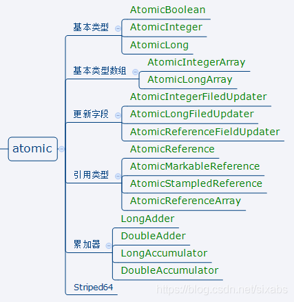
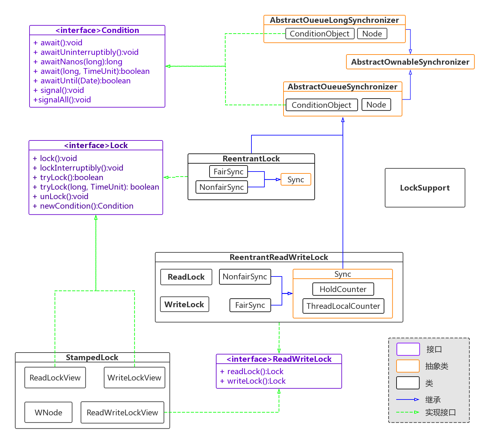
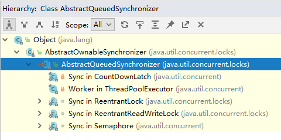
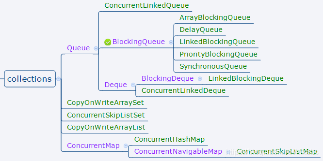
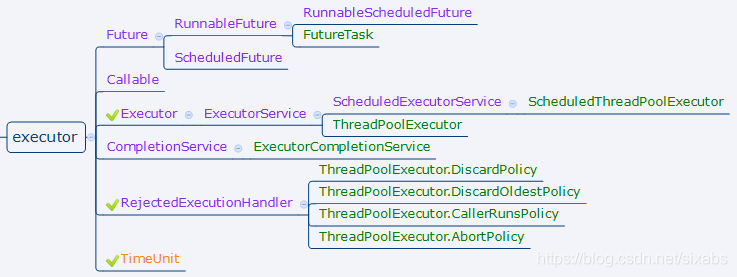
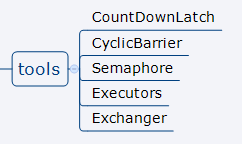

# 绪论

首先先看下JUC包下的所有内容

## atomic包

核心是CAS，主要提供一系列原子变量更新操作，提供非阻塞算法基础。



## locks包



此图ReentrantLock并不直接继承AbstractQueuedSynchronizer，而是实现Lock接口。RL内部持有的sync才直接继承AQS。

AQS相对重要，利用AQS实现的组件有：



## 并发容器



## 执行框架与线程池



## 重要的工具类



# atomic包

### AtomicStampedReference

解决ABA问题

- 使用：

  ```java
  // 初始值a，版本号1       
  AtomicStampedReference asr = new AtomicStampedReference("b", 1);
  
              // 得到版本号,若要防止ABA可以将版本号附加到数据内
              int stamp = asr.getStamp();
              boolean b = asr.compareAndSet("b", "a", stamp, stamp + 1);
  ```

- 原理

  先判断版本号和reference对象是否能对应，对应了才进行CAS操作

  ```java
          Pair<V> current = pair;
          return
              expectedReference == current.reference &&
              expectedStamp == current.stamp &&
              ((newReference == current.reference &&
                newStamp == current.stamp) ||
               casPair(current, Pair.of(newReference, newStamp)));
  ```

和AtomicMarkableReference类似，只是amr版本号为bool字段。

### AtomicReference

解决多个字段无法CAS更新问题

注意：比对两个对象，比对用的是==，也就是比对的是地址

想要CAS更新字段可看下**AtomicReferenceFieldUpdater**，对非private的volatile字段进行反射更新

### LongAdder

- 使用

  ```java
  // 线程外
  LongAdder longAdder = new LongAdder();
  // 线程内
  longAdder.add(1L);
  // 线程外
  long sum = longAdder.sum();
  ```

- 原理

  降低争抢。具体见基础文档

### Atomic(Integer/Long/Reference)FieldUpdater

可以用线程安全的方式操作非线程安全对象的某些字段。

```java
    private static final AtomicIntegerFieldUpdater<Account> updater = AtomicIntegerFieldUpdater.newUpdater(Account.class, "money");  
// 引入AtomicIntegerFieldUpdater

  public void increMoney() {
        updater.incrementAndGet(this);    // 通过AtomicIntegerFieldUpdater操作字段
    }
```

使用**AtomicXXXFieldUpdater**，不需要进行任何同步处理，单纯的使用CAS+自旋操作就可以实现同步的效果。这也是整个atomic包的设计理念之一。

- 原理

  通过偏移量**offset**获取字段的地址，然后利用Unsafe进行CAS更新。

### LongAccumulator

可以理解为可以传入回调方法的LongAdder

```java
LongAccumulator la = new LongAccumulator((x, y) -> {
            return x + y;
        }, 0);
la.accumulate(1);
la.get()
```

# locks/AQS包

### ReentrantLock

### ReentrantReadWriteLock

### StampdLock

去看基础版

### Condition

可以理解为Sync的wait，notify，notifyAll。当执行Condition:await时，当前线程会立即释放锁，并进入对象的等待区，等待其他线程唤醒或中断。

- 使用

  1. 可以由lock.newCondition，多个condition对象可以有选择的进行await(类似wait)/signal(类似notify),灵活.
  2. 必须使用在lock/unlock之中
  3. 为防止虚假唤醒，Condition一般都是在一个循环中被等待

- 原理

  condition的await和signal就是将node节点在这两个队列中转移的过程。

  condition的await会将线程node添加到condition队列，然后从AQS队列移除。在signal时，会将该线程node添加到AQS阻塞队列中。

# collections包

### ConcurrentLinkedQueue

ConcurrentLinkedQueue采用非阻塞方式。是一个基于链接节点的无界线程安全队列。

- 使用

          ConcurrentLinkedQueue clq = new ConcurrentLinkedQueue();
          clq.offer("A");
          clq.offer("B");
          // 此时 [A, B]
          // 出队
          clq.poll();
          // 看一下队头
          clq.peek();

- 原理（1.8）

  - 入队

    在这里简单说，因为我没时间了

    为什么tail节点不总是尾节点？因为clq是**懒更新**，可以降低CAS争抢。

    如果tail->next不为空，则入队节点会被设置为tail;

    如果为空，则将当前节点设置为tail->next;

    初始情况添加第一个元素后，tail和head相同，且next都是第一个元素。

  - 出队。也不是每次都更新head，head有才弹出...

#### offer 和 add 区别

offer 在越界时返回false; add抛异常;

无界队列都一样;

#### CLQ和AQS区别

clq使用cas操作更新tail和head，但是为懒更新，避免竞争激烈造成一直失败。

而aqs也是先尝试cas，失败就将线程加入等待队列，避免了极端情况cas一直失败一直空转的发生。

主要原因是clq主要适用于生产消费，对于单纯队列的操作比较快。（队头出队尾入），即使高必发也很难出现cas一直失败的情况。

而aqs是锁，加锁释放锁时间可能会很长，所以cas+park更合适。

#### 三个不变式

clq使用三个不变式来约束非阻塞算法正确性。

1. 基本不变式

2. head不变式

3. tail不变式

### BlockingQueue

#### blockingQueue的常用方法

- add 不阻塞|队满exception

- offer 不阻塞|带时间阻塞|队满返回false

- put 队满阻塞|响应中断

以上都添加到队尾。

以下都移除队头。

- remove 队空exception

- poll 带时间阻塞|队空返null

- take 队空阻塞|取1st|响应中断

#### ArrayBlockingQueue

有界队列

- 用法

  ```java
          BlockingQueue<String> bq = new ArrayBlockingQueue<>(5);
          new Thread(() -> {
              try {
                  Thread.sleep(1000L);
                  // 阻塞
                  bq.put("a");
                  // offer() 可以在规定时间内重试，超过规定时间返回false
              } catch (InterruptedException e) {
                  e.printStackTrace();
              }
          }).start();
          // 此处是可以阻塞住的
          System.out.println(bq.take());
          // poll() 在规定时间内重试，超过规定时间返回null
  ```

  

- 原理

  内部 ReentrantLock 实现。在设置两条condition：

  ```java
  notEmpty = lock.newCondition();
  notFull =  lock.newCondition();
  ```

  

#### PriorityQueue

是一个基于优先堆的无界队列。**并非blockingQueue。也不是线程安全的。**

PriorityQueue是非线程安全的

- 使用

  非线程安全，建议使用 PriorityBlockingQueue

- 原理

  二叉小顶堆

##### 为什么可以直接用数组来存储堆(数据结构)？

已知父节点下标a，则其左孩子下标为 a×2+1,右孩子为a×2+2。

当前节点下标为b，则父节点下标为  (b-1)/2

#### PriorityBlockingQueue

- 支持优先级的无界阻塞队列
- 默认情况下元素采用自然顺序升序排列。也可以自定义类实现compareTo()方法来指定元素排序规则，或者初始化PriorityBlockingQueue时，指定构造参数Comparator来对元素进行排序。但需要注意的是不能保证同优先级元素的顺序。
- 基于最小二叉堆实现，使用基于CAS实现的自旋锁来控制队列的动态扩容，保证了扩容操作不会阻塞take操作的执行。

和priorityQueue区别。

- 数组扩容采用CAS+自旋操作
- 存offer、取take、remove都采用ReentrantLock加锁

#### DelayQueue

为一个无界blockingQueue

- 原理

  利用PriorityQueue实现。

  DelayQueue每次只会出队一个过期的元素，如果队首元素没有过期，就会阻塞出队线程，让线程在avaliable(lock.newCondition)上无限等待。

  https://segmentfault.com/a/1190000016388106

  并非所有的出队线程都要无限等待，leader（Thread）保存了第一个尝试出队的线程，该线程的等待时间是队首元素的剩余有效期。

  一旦时间到了，就可以出队成功（队首也就失效了）。

  然后唤醒其他在avaliable条件队列上等待的线程。

  （Leader-Follower pattern）

- 使用

  1. 入队的元素要注意实现 Delayed 接口的 getDelay(TimeUnit) 和 compareTo(Delayed)
  2. getDelay返回触发时间和当前时间的间隔 milliseconds
  3. compareTo 对比当前元素和目标元素优先级，当前元素时间大于目标元素时间，则返回1,否则 -1/0

  其他使用等同于blockingQueue。

#### SynchronousQueue

底层公平模式使用TransferQueue，也存在head/tail指针。

非公平使用TransferStack，先入栈的后匹配到。

使用在线程池中可以直接将任务交给消费者，

### CopyOnWriteArrayList

- 原理

  所有的操作方法都需要在ReentrantLock的lock和unlock中进行。

  **添加(add)/修改(set)/删除(remove)**数据时，都会新建一个数组，并将原数组中的元素拷贝到新数组中，然后在新数组中更新，最后再将**volatile数组**引用指向新数组。

- 缺点

  写操作较多时性能低，因为写时需要复制数组，同时可能造成gc。

  get操作不加锁，读取的是原数组的内容而非新的，所以虽然能保证最终一致，但因为set操作耗时，所以可能不能当前读。

### 1.8 ConcurrentHashMap

- 散列表
- 并发扩容

- 原理：

  ConcurrentHashMap 内部维护了一个Node类型的数组table，而每个位置代表一个桶，有的桶接链表有的接树;

  1.8以前，ConcurrentHashMap采用分段锁，减少热点域冲突。1.8对每个桶加锁，并采用红黑树链接冲突节点。

  具体的元素插入，扩容等，和HashMap相似，主要是看处理并发这块。

  ConcurrentHashMap存在**五类节点**去标识状态。

  - ForwardingNode

    临时占位节点，表示当前table正在扩容，当前线程可以尝试协助数据迁移。

  - TreeBin

    当槽被此节点占用时，说明链接是一颗红黑树。

    ConcurrentHashMap采用类似读写锁的方式，当线程持有写锁时（修改红黑树），如果读线程需要查找，不会像传统读写锁一样阻塞等待，而是以链表形式查找，因为TreeBin本身是Node类型子类，所以拥有Node所有字段。

  - ReservationNode 不保存实际数据

- 计数原理

  和LongAdder差不多，baseCount+countCell[i]

- 扩容

  1. 单线程创建一个2倍大小的槽数组，此过程不允许并发。
  2. 数据迁移：和hashMap一样不会重新计算每个元素的hash，因为table各个桶的节点迁移不会互相影响，所以table数组可划分为多个部分，每个部分包含一定的桶，每个数据迁移线程处理各自区间的节点。

- 扩容时机

  Transfer方法可以被多个线程同时调用，会进行自旋

  - 已经有其他线程正在执行扩容，当前线程会做协助
  - 没有的话，自身发起扩容


#### ConcurrentHashMap问题

- 扩容中数据能否正常访问，怎么实现的？
- 扩容过程中，写访问如何处理？
- 红黑树正在自平衡，能否读？
- jdk8中，统计当前散列表中元素个数怎么实现？
- LastRun机制

### ConcurrentSkipListMap

- 特性

  多线程并发存取<Key, Value>数据并且有序

- 原理


## 线程池和JUC队列

# tools 工具包

### CountDownLatch

当计数器不为0，所有await的位置都等待;

当计数器为0,之前调用的await就不再阻塞

- 使用

  1. 开关/入口

     ```java
             CountDownLatch cdl = new CountDownLatch(1);
             for (int i =0; i < 7;i ++) {
                 new Thread(() -> {
                     try {
                         cdl.await();
                     } catch (InterruptedException e) {
                         e.printStackTrace();
                     }
                     System.out.println(Thread.currentThread().getName() + ":GO");
                 }).start();
             }
             System.out.println("do Work 1");
             Thread.sleep(500);
             System.out.println("do Work 2");
             Thread.sleep(500);
             // 类似发令枪
             cdl.countDown();
     ```

     输出：

     > do Work 1
     > do Work 2
     > Thread-4:GO
     > Thread-6:GO
     > Thread-5:GO
     > Thread-3:GO
     > Thread-0:GO
     > Thread-2:GO
     > Thread-1:GO

  2. 作为完成信号，让某个线程在其他线程完成后开始运行

     ```java
     
     ```

- 原理

  - 内部为一个AQS的子类Sync，state标识初始的那个值，一旦为0则所有await上的等待线程都可以继续执行。

  - countDown方法中调用releaseShared，这里是CAS的方式修改AQS的state，当变为0,则返回True，这时会对AQS内线程由头向尾依次唤醒。

  多个线程都可以countDown

### CyclicBarrier

相比countDownLatch，可以reset循环使用;

cdl是规定了下限（0），进入下限则doWork;

cb是规定了上线（自定义），到达上线则doWork1,doWork2

- 使用

  ```java
          CyclicBarrier cyclicBarrier = new CyclicBarrier(7, () -> {
              // 最后执行的任务
              System.out.println("do Work 1");
              try {
                  Thread.sleep(500);
              } catch (InterruptedException e) {
                  e.printStackTrace();
              }
              System.out.println("do Work 2");
          });
  
          for (int i =0; i < 7;i ++) {
              new Thread(() -> {
                  try {
                      cyclicBarrier.await();
                  } catch (InterruptedException | BrokenBarrierException e) {
                      e.printStackTrace();
                  }
                  System.out.println(Thread.currentThread().getName() + ":GO");
              }).start();
          }
  ```

  实现效果和cl一样，输出：

  > do Work 1
  > do Work 2
  > Thread-0:GO
  > Thread-2:GO
  > Thread-1:GO
  > Thread-4:GO
  > Thread-6:GO
  > Thread-5:GO
  > Thread-3:GO

- 原理

  怎么让await抛出异常的呢？有breakBarrier(),将当前轮次对象设置为broken，然后唤醒所有线程。
  
  dowait()中，非最后一个到达的线程会在condition队列中等待，为了防止意外唤醒，此处还有自旋。

#### 如果线程被中断，造成达不到指定数目，会无线等待吗？

不会。以下情况await的线程会被唤醒，await本身也抛出**BrokenBarrierException**异常

1. 某个await的等待线程被中断了
2. 某个await的等待线程超时了
3. 调用了reset方法

### Semaphore

- 用法

  ```java
          // 同时只处理两个线程
          Semaphore semaphore = new Semaphore(2);
          for (int i = 0; i < 5; i++) {
              new Thread(() -> {
                  try {
                      semaphore.acquire();
                      System.out.println(Thread.currentThread().getName() + " here");
                      Thread.sleep(2000L);
                  } catch (InterruptedException e) {
                      e.printStackTrace();
                  } finally {
                      semaphore.release();
                      System.out.println(Thread.currentThread().getName() + " quit");
  
                  }
              }).start();
          }
  ```

  五个线程并发执行，只允许两个线程同时处理。

  > Thread-0 here
  > Thread-1 here
  > Thread-1 quit
  > Thread-2 here
  > Thread-0 quit
  > Thread-3 here
  > Thread-2 quit
  > Thread-3 quit
  > Thread-4 here
  > Thread-4 quit

  最大同时访问数100;

- 原理

  内部构造和ReentrantLock非常像，AQS实现，state字段成为可用的许可数。

  - acquire时会用CAS的方式更新state，当许可数不足入CLQ队列。
  - release 同理进行CAS更新和唤醒

### Exchanger

单槽交换，出现并发变为多槽交换

```java
        Exchanger<String> exchanger = new Exchanger();
        // A 得到 B，B得到A
        new Thread(() -> {
            try {
                String a = "IAM A";
                Thread.sleep(200L);
                String exchange = exchanger.exchange(a);
                System.out.println(a + " i get[" + exchange);
            } catch (InterruptedException e) {
                e.printStackTrace();
            }
        }).start();

        new Thread(() -> {
            try {
                String a = "IAM B";
                Thread.sleep(2000L);
                String exchange = exchanger.exchange(a);
                System.out.println(a + " i get[" + exchange);
            } catch (InterruptedException e) {
                e.printStackTrace();
            }
        }).start();
```

输出

> IAM B i get[IAM A
> IAM A i get[IAM B

### Phaser

比CountDownLatch和CyclicBarrier强大的起跑器

```java
        Phaser phaser = new Phaser() {
            @Override
            protected boolean onAdvance(int phase, int registeredParties) {
                System.out.println("adv!" + phase + "----" + registeredParties);
                return super.onAdvance(phase, registeredParties);
            }
        };
        for (int i = 0; i < 3; i++) {
            new Thread(() -> {
                // 注册phase参与者
                int register = phaser.register();
                System.out.println("register:" + Thread.currentThread().getName() + "," + register);
                for (int j = 0;!phaser.isTerminated() && j < 3; j ++) {
                    // arrive数量+1,本方法阻塞，不响应中断;
                    int i1 = phaser.arriveAndAwaitAdvance();
                    System.out.println("do work:" + Thread.currentThread().getName() + ",phase：" + i1);
                }
            }).start();
        }
```

> register:Thread-0,0
> register:Thread-2,0
> register:Thread-1,0
> adv!0----3
> do work:Thread-0,phase：1
> do work:Thread-2,phase：1
> do work:Thread-1,phase：1
> adv!1----3
> do work:Thread-1,phase：2
> do work:Thread-2,phase：2
> do work:Thread-0,phase：2
> adv!2----3
> do work:Thread-2,phase：3
> do work:Thread-1,phase：3
> do work:Thread-0,phase：3

极其复杂，树和栈，放弃

### Executor和线程池

解耦任务本身和任务执行;

- ExecutorService 

- ScheduledExecutorService 周期服务调度


