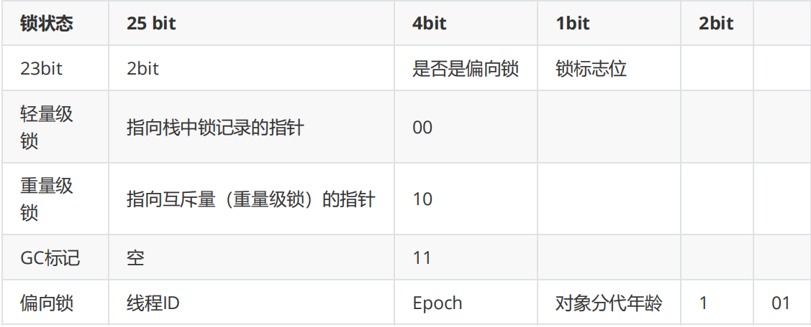
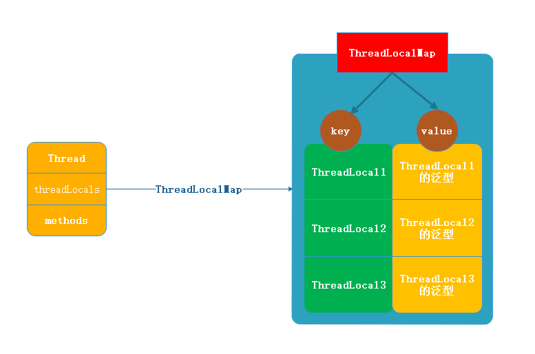
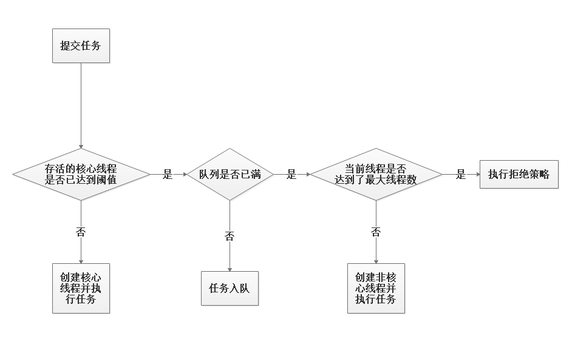

[TOC]

> author：编程界的小学生、CaiKun
>
> date：2021/03/04

# 一、线程基础

## 1、线程的状态/线程的生命周期


## 2、多线程一定比单线程快吗？

不一定，因为线程切换是有开销的，需要消耗性能。若CPU是单核，那你开多个线程可能会使程序变慢，而单线程则会很快。

## 3、多线程的优缺点

### 3.1、优点

- 资源利用率更好

> 比如：下载文件。我们的流程是这样的：
>
> 1、将下载任务放到队列。
>
> 2、从队列里取出下载链接去下载。
>
> 若是单线程的话，那费老劲了，一个一个的下载，CPU大部分时间是空闲的，若是多线程呢？同时下载一批任务，岂不是更爽快？让CPU忙起来吧！

- 提高系统的吞吐率

> 多线程编程使得一个进程中可以有多个并发(即同时进行)的操作。例如，当一个线程因为I/O操作而处于等待时，其他线程任然可以执行其操作。

- 响应速度快

> 还是下载文件的案例，若我们请求一个下载接口，要等下载完才返回成功，那岂不是需要等太久了，如果我们业务逻辑都没问题直接返回成功岂不是更好？然后下载任务交由其他线程去处理。

### 3.2、多线程风险（缺点）

- 线程切换是有开销的，这会在一定情况下导致程序运行变慢。
- 多线程程序必须非常小心的同步代码，否则会引起死锁或数据不准确。
- 多线程程序极难调试，并且一些bug非常隐蔽，可能你99次都是对的，但是有1次是错的，不像单线程程序那么容易暴露问题。

## 4、线程和进程的区别

- 进程是资源分配的基本单位。
- 线程是处理器（CPU）调度的基本单位。
- 进程是操作系统级别的，线程是进程级别的。
- 一个进程包含多个线程。（我们可以打开一个IDEA/Eclipse，然后JConsole去看线程数，会发现一个IDEA/Eclipse进程启动了N多个线程。）

## 5、用Runnable还是Thread？

这个问题很容易回答，如果你知道Java不支持类的多重继承，但允许你实现多个接口。所以如果你要继承其他类，当然是调用Runnable接口好了。也是一直大家所说的：面向接口编程。

## 6、Thread 类中的start()和 run()方法有什么区别？

真正启动线程的是start()方法而不是run()，run()和普通的成员方法一样，可以重复使用，但不能启动一个新线程。start()方法才会启动新线程。

## 7、sleep()和wait()的区别？

- sleep为Thread的方法，而wait为Object的方法。

- 最大本质的区别是：sleep不释放锁，wait释放锁。

- 用法上的不同：sleep(milliseconds)可以用时间指定来使他自动醒过来，如果时间不到你只能调用interreput()来终止线程；wait()可以用notify()/notifyAll()直接唤起。
- wait在使用前必须要获取锁（synchronized块包起来），而sleep可以在任何地方使用。

## 8、阻塞与等待的区别？

阻塞：当一个线程试图获取对象锁（非java.util.concurrent库中的锁，即synchronized），而该锁被其他线程持有，则该线程进入阻塞状态。它的特点是**使用简单，由JVM调度器来决定唤醒自己，而不需要由另一个线程来显式唤醒自己，不响应中断**。
等待：当一个线程等待另一个线程通知调度器一个条件时，该线程进入等待状态。它的特点是**需要等待另一个线程显式地唤醒自己，实现灵活，语义更丰富，可响应中断**。例如调用：Object.wait()、Thread.join()以及等待Lock或Condition。

## 9、线程有哪几种创建方式？

- 继承Thread类
- 实现Runnable接口
- 匿名内部类（直接Thread/实现Runnable接口 ）
- 带返回值的方式（FutureTask）
- 线程池的方式

## 10、为什么wait和notify方法要在同步块中调用？

因为只有走进同步块，才说明该线程有对资源的持有权，而只要对资源有持有权，才有资格去进行释放锁和通知其他没有获取到锁的线程。否则就无法保证代码的原子性。

## 11、同步锁与死锁 

- 同步锁 

>  当多个线程同时访问同一个数据时，很容易出现问题。为了避免这种情况出现，我们要保证线程同步互斥，就是指并发执行的多个线程，在同一时间内只允许一个线程访问共享数据。 Java 中可以使用 synchronized 关键字来取得一个对象的同步锁。

- 死锁 

>  何为死锁，就是多个线程同时被阻塞，它们中的一个或者全部都在等待某个资源被释放。 

## 12、笔试题

代码

```java
public class Demo5 {
    public static void main(String[] args) {
        new Thread(new Runnable() {
            @Override
            public void run() {
                System.out.println("runnable...");
            }
        }) {
            @Override
            public void run() {
                System.out.println("thread...");
            }
        }.start();
    }

}
```

> PS：为Thread类写个子类（匿名内部类），同时为这个线程增加一个任务（Runnable），然后启动线程，看执行的是Thread子类还是Runnable的实现类。

输出结果

```java
thread...
```

结果分析

（Thread源码）

```java
public class Thread implements Runnable {
    @Override
    public void run() {
        if (target != null) {
            target.run();
        }
    }
}
```

（Runnable源码）

```java
@FunctionalInterface
public interface Runnable {
    public abstract void run();
}
```

这尼玛。。。懂了。Thread是Runnable的实现类，所以子类重写了父类的方法，一定会走子类而不是父类。Java基础了解一下。

# 二、volatile

## 1、聊聊volatile？

被volatile修饰的共享变量，就具有了以下两点特性：

- 保证了多线程对该变量操作的内存可见性
- 禁止指令重排序

但是并不保证原子性。

## 2、什么是可见性？

每个线程都有独立的工作内存，所以线程对变量进行修改的时候会先将值修改到工作内存，其他线程是不可见的，可见性是指当一个线程修改了共享变量的值，其他线程能够立即得知这个修改。加上volatile可以保证可见性，volatile变量保证修改的新值能够立马同步到主存，其他线程使用时也会感知到这个共享变量已经有新值了，让自己的工作内存值失效，立即从主存重新获取 ，这就保证了多线程操作时变量的可见性。

## 3、指令重排是什么意思？

JVM会对编译后的class进行优化，重排序也是JVM优化的手段之一，也就是A、B两行代码的顺序编译后 可能变成B、A，这就是重新排序了。有时候可能会造成一些问题，比如状态标记量、双重检查锁的单例写法。

比如双重检查锁的单例（这个解决方案需要JDK5或更高版本）：

```java
public class SafeDoubleCheckedLocking {
    // volatile
    private volatile static Instance instance;

    public static Instance getInstance() {
        // 1
        if (null == instance) {
            // 2
            synchronized (SafeDoubleCheckedLocking.class) {
                //  3
                if (null == instance) {
                    // 4
                    instance = new Instance();
                }
            }
        }
        return instance;
    }
}
```

若不加volatile的话这就是一个线程不安全的单例写法。在线程执行到第1处，代码读取到instance不为null时，instance引用的对象有可能发生了指令重排给分配了内存空间，但是还没有完成初始化！所以业务系统获取到的instance实例可能是null。

问题的根源如下：

前面的双重检查锁定实例代码的第4处`instance = new Instance();`创建了一个对象。这一行代码可以分解为如下的3行伪代码。

```cpp
// 1.分配对象的内存空间
memory = allocate();
// 2.初始化对象
ctorInstance(memory);
// 3.设置instance指向刚分配的内存地址
instance = memory;
```

上面3行伪代码中的2和3之间可能会被重排序，2和3之间重排序之后的执行时序如下：

```cpp
// 1.分配对象的内存空间
memory = allocate();
// 3.设置instance指向刚分配的内存地址，注意，此时对象还没有被初始化！
instance = memory;
// 2.初始化对象                      
ctorInstance(memory);
```

## 4、volatile怎么保证原子性的？

这是个坑，因为**volatile无法保证原子性。**

比如：x++操作分为如下三步骤：

- 读取x的值
- x进行加1操作
- x写入新的值。

面试官：volatile不是会使缓存行无效的吗？为啥不保证原子性？

答案：比如x++这里线程A读取之后并没有修改x值，线程B读取时依旧是0，线程B将x+1的结果写回主存，会把线程A的缓存行设为无效，但是只有在做读取操作时，发现自己缓存行无效，才会去读主存的值，而线程A的读取操作在线程B写入之前已经做过了，所以这里线程A只能继续做自增了。所以线程A和B两次++的结果最后还是1。

所以要想保证原子性，还是需要锁或者atomic原子类来实现。

## 5、volatile和synchronized有啥区别？

- volatile仅仅作用在变量上，synchronized可以作用在变量上也可以方法上，还支持代码块。
- volatile能保证可见性和防止重排序，不能保证原子性。synchronized能保证原子性和可见性和防止指令重排序。
- volatile不会造成线程阻塞，synchronized会造成线程阻塞。
- **其实全是围绕这句话来说的：volatile不是锁，synchronized是把可重入排他锁。**

## 6、volatile用在什么地方？

- 线程安全的单例：双重锁检查无法保证线程安全性，需要volatile防止重排序来保证。
- 状态标记量：一个状共享态变量需要多个线程读写的时候，可以用volatile保证可见性。

## 7、volatile是如何保证可见性和指令重排的？

**（也是volatile的 实现原理）**

加入volatile关键字时，会多出一个lock前缀指令，lock前缀指令实际上相当于一个内存屏障，这个内存屏障包含如下三个功能：

- 它确保指令重排序时不会把其后面的指令排到内存屏障之前的位置，也不会把前面的指令排到内存屏障的后面；即在执行到内存屏障这句指令时，在它前面的操作已经全部完成。
- 他会强制将对缓存的修改操作立即写入主存。
- 如果是写操作，他会导致其他CPU中对应的缓存行失效。

# 三、synchronized

## 1、什么时候需要用Synchronized？

**synchronized是一把可重入的排他锁。锁有个专门的名字：对象监视器（Object Monitor）**

在多个线程操作共享数据的时候，保证对共享数据访问的线程安全性。在JDK1.6之前，它是一个重量级锁的角色，但是在JDK1.6之后对synchronized做了优化，有了锁升级的过程。**偏向锁->轻量级锁->OS重量级锁。**。

## 2、 使用Synchronized关键字需要注意什么？

- Synchronized使用时需要注意的地方锁对象不能为空。

  > 锁对象的信息是保留在对象头中的，如果对象为空，则锁的信息也就不存在了。

- 作用域不宜过大

  >  synchronized代码块的代码量不宜过多，如果把过多的代码放在其中，程序的运行会变为串行，速度会下降。各个线程并行可以提高效率，我们应该仅把那些影响线程安全的代码，放入synchronized代码块中，串行执行；不需要考虑线程安全的代码，并行执行，达到效率最高。

- 避免死锁

  >  避免让线程对锁持有并等待的情况出现

## 3、synchronized能用在哪些地方？

- 当synchronized作用在实例方法时，监视器锁（monitor）便是对象实例（this）；

- 当synchronized作用在静态方法时，监视器锁（monitor）便是对象的Class实例，因为Class数据存在于永久代，因此静态方法锁相当于该类的一个全局锁；

- 当synchronized作用在某一个对象实例时，监视器锁（monitor）便是括号括起来的对象实例；

## 4、Sychornized是否是公平锁？

不是公平锁

## 5、聊聊synchronized加锁流程

由于HotSpot的作者经过研究发现，大多数情况下，锁不仅不存在多线程竞争，而且总是由同一线程多次获得，为了让线程获得锁的代价更低从而引入偏向锁。偏向锁在获取资源的时候会在锁对象头上记录当前线程ID，偏向锁并不会主动释放，这样每次偏向锁进入的时候都会判断锁对象头中线程ID是否为自己，如果是当前线程重入，直接进入同步操作，不需要额外的操作。默认在开启偏向锁和轻量锁的情况下，当线程进来时，首先会加上偏向锁，其实这里只是用一个状态来控制，会记录加锁的线程，如果是线程重入，则不会进行锁升级。

**获取偏向锁流程：**

1. 判断是否为可偏向状态--MarkWord中锁标志是否为‘01’，是否偏向锁是否为‘1’

2. 如果是可偏向状态，则查看线程ID是否为当前线程，如果是，则进入步骤 '5'，否则进入步骤‘3’

3. 通过CAS操作竞争锁，如果竞争成功，则将MarkWord中线程ID设置为当前线程ID，然后执行‘5’；竞争失败，则执行‘4’

4. CAS获取偏向锁失败表示有竞争。当达到safepoint时获得偏向锁的线程被挂起，偏向锁升级为轻量级锁，然后被阻塞在安全点的线程继续往下执行同步代码块

5. 执行同步代码


轻量级锁是相对于重量级锁需要阻塞/唤醒涉及上下文切换而言，主要针对多个线程在不同时间请求同一把锁的场景。

**轻量级锁获取过程：**

1. 进行加锁操作时，jvm会判断是否已经是重量级锁，如果不是，则会在当前线程栈帧中划出一块空间，作为该锁的锁记录，并且将锁对象MarkWord复制到该锁记录中

2. 复制成功之后，jvm使用CAS操作将对象头MarkWord更新为指向锁记录的指针，并将锁记录里的owner指针指向对象头的MarkWord。如果成功，则执行‘3’，否则执行‘4’

3. 更新成功，则当前线程持有该对象锁，并且对象MarkWord锁标志设置为‘00’，即表示此对象处于轻量级锁状态

4. 更新失败，jvm先检查对象MarkWord是否指向当前线程栈帧中的锁记录，如果是则执行‘5’，否则执行‘6’

5. 表示锁重入；然后当前线程栈帧中增加一个锁记录第一部分（Displaced Mark Word）为null，并指向Mark Word的锁对象，起到一个重入计数器的作用

6. 表示该锁对象已经被其他线程抢占，则进行自旋等待（默认10次），等待次数达到阈值仍未获取到锁，则升级为重量级锁


当有多个锁竞争轻量级锁则会升级为重量级锁，重量级锁正常会进入一个cxq的队列，在调用wait方法之后，则会进入一个waitSet的队列park等待，而当调用notify方法唤醒之后，则有可能进入EntryList。

**重量级锁加锁过程:** 

1. 分配一个ObjectMonitor对象，把Mark Word锁标志置为‘10’，然后Mark Word存储指向ObjectMonitor对象的指针。ObjectMonitor对象有两个队列和一个指针，每个需要获取锁的线程都包装成ObjectWaiter对象

2. 多个线程同时执行同一段同步代码时，ObjectWaiter先进入EntryList队列，当某个线程获取到对象的monitor以后进入Owner区域，并把monitor中的owner变量设置为当前线程同时monitor中的计数器count+1；

## 6、锁升级过程知道吗？

以下是32位对象头描述



**synchronized锁的膨胀过程：** 

当线程访问同步代码块。首先查看当前锁状态是否是偏向锁(可偏向状态) 

- 如果是偏向锁： 

1、检查当前mark word中记录是否是当前线程id，如果是当前线程id，则获得偏向锁执行同步代码块。 

2、如果不是当前线程id，cas操作替换线程id，替换成功获得偏向锁(线程复用)，替换失败锁撤销升级轻量锁(同一类对象多次撤销升级达到阈值20，则批量重偏向,这个点可以稍微提一下,详见下面的注意) 

- 升级轻量锁

升级轻量锁对于当前线程，分配栈帧锁记录lock_record(包含mark word和object-指向锁记录首地址)，对象头mark word复制到线程栈帧的锁记录 mark word存储的是无锁的hashcode(里面有重入次数 

问题)。 

- 重量级锁(纯理论可结合源码) 

CAS自旋达到一定次数升级为重量级锁(多个线程同时竞争锁时)存储在ObjectMonitor对象，里面有很多属性`ContentionList、EntryList 、WaitSet、 owner`。当一个线程尝试获取锁时，如果该锁已经被占用，则该线程封装成ObjectWaiter对象插到ContentionList队列的对首，然后调用park挂起。该线程锁时方式会从ContentionList或EntryList挑 一个唤醒。线程获得锁后调用Object的wait方法，则会加入到WaitSet集合中(当前锁或膨胀为重量级锁) 

**注意:** 

- 1.偏向锁在JDK1.6以上默认开启，开启后程序启动几秒后才会被激活 

- 2.偏向锁撤销是需要在safe_point,也就是安全点的时候进行,这个时候是stop the word的,所以说偏向锁的撤销是开销很大的,如果明确了项目里的竞争情况比较多,那么关闭偏向锁可以减少一些偏向锁撤销的开销

- 3.以class为单位，为每个class维护一个偏向锁撤销计数器。每一次该class的对象发生偏向撤销操作时(这个时候进入轻量级锁)，该计数器+1，当这个值达到重偏向阈值(默认20,也就是说前19次进行加锁的时候, 都是假的轻量级锁,当第20次加锁的时候,就会走批量冲偏向的逻辑)时，JVM就认为该class的偏向锁有问题，因此会进行批量重偏向。每个class对象也会有一个对应的epoch字段，每个处于偏向锁状态对象的markword中也有该字段，其初始值为创建该对象时，class中的epoch值。每次发生批量重偏向时，就将该值+1， 同时遍历JVM中所有线程的站，找到该class所有正处于加锁状态的偏向锁，将其epoch字段改为新值。下次 获取锁时，发现当前对象的epoch值和class不相等，那就算当前已经偏向了其他线程，也不会执行撤销操作，而是直接通过CAS操作将其mark word的Thread Id改为当前线程ID

# 四、CAS

## 1、CAS流程是怎样的？

CAS机制中使用了3个基本操作数：内存地址V，旧的预期值A，要修改的新值B。当且仅当旧的预期值A和内存地址V对应的值相同时，才将内存值修改为B，否则什么都不做，最后返回现在的V值。

简单理解为这句话：我认为V的值应该是A，如果是A的话我就把他改成B，如果不是A的话（那就证明被别人修改过了），那我就不修改了，避免多人同时修改导致数据出错。换句话说：要想修改成功，必须保证A和V中的值是一样的，修改前有个对比的过程。

## 2、CAS有哪些缺点？

- 高并发情况下CPU开销大。因为每次对比发现被改了后就会获取新值，重复进行此过程。
- ABA问题。可以采取atomic包下的`AtomicStampedReference<E>`，它通过包装[E,Integer]的元组来对对象标记版本戳stamp，从而避免ABA问题。
- 不能保证代码块的原子性，只能保证单个变量的原子性。

## 3、CAS的ABA问题了解吗？

例如有个单向链表实现的栈，栈顶为A（如：A->B，也就是A.next=B）这时候线程T1希望用CAS将栈顶换为B。`head.compareAndSet(A,B);`

在线程T1执行CAS之前，线程T2将A、B节点都出栈，且追加了三个新节点：A->C->D，此时A位于栈顶，B已经不在栈中。

此时线程T1继续执行CAS操作，发现栈顶是A，与预期旧值一样，所以CAS成功，栈顶变成B，但实际上此时B与当前栈中元素D、C没有关系，B.next为null，因为A和B已经被线程T2给出栈了，成为了游离态，所以此时的情况变为：C->D、B->NULL。导致了其中堆栈中只有B一个元素，C和D组成的链表不再存在于堆栈中，平白无故就把C、D丢掉了。

## 4、CAS能保证原子性吗？

CAS只能保证单个变量的原子性，不能保证代码块或者多个变量共同进行原子性的更新。这时候就需要锁的支持了，比如synchronized、Lock接口。

## 5、CAS和Synchronized啥区别？

- 从思想上来讲，Synchronized属于悲观锁，悲观的认为程序中的并发情况严重，所以严防死守，高并发情况下效率低下。而CAS属于乐观锁，乐观的认为程序中的并发情况不那么严重，所以让线程不断去重试更新。但实际上Synchronized已经改造了，带有锁升级的功能。效率不亚于cas。

- CAS是个思想，具体实现在atomic下有很多工具类。而synchronized是个关键字，可以直接拿来用。
- CAS只能保证单个变量更新的原子性，synchronized能保证一段代码块的原子性。

# 五、ThreadLocal

## 1、ThreadLocal类关系图

每个`Thread`对象中都持有一个`ThreadLocalMap`的成员变量。每个`ThreadLocalMap`内部又维护了N个`Entry`节点，也就是`Entry`数组，每个`Entry`代表一个完整的对象，key是`ThreadLocal`本身，value是`ThreadLocal`的泛型值。



## 2、ThreadLocal有什么用？应用场景？

- 数据库连接
- 存储用户对象信息到ThreadLocal
- APO记录日志的时候可以将链路ID放到ThreadLocal进行线程共享

## 3、ThreadLocal和synchronized啥区别？

- ThreadLocal不是锁，synchronized是把可重入排他锁。
- synchronized能保证代码块的原子性，ThreadLocal无法保证。
- ThreadLocal是将变量线程私有化，synchronized保证的是多线程同时操作共享变量并且能正确的输出结果。

## 4、ThreadLocal存储在JVM哪个区域？

虽然ThreadLocal是线程私有，但是ThreadLocal对象也是在堆里，只是JVM通过一些技巧将其可见性变成了只有线程可见。

## 5、ThreadLocal为什么采取Entry数组而不是Entry对象？

因为一个线程能new好多个ThreadLocal对象，各自存储各自的内容。但是一个线程里ThreadLocalMap是同一个（因为这个是在Thread的里的一个引用），所以这个ThreadLocalMap只能采取Entry数组来存储一个线程里你new出来的多个`ThreadLocal`对象。

## 6、你学习的开源框架哪些用到了ThreadLocal？

- Spring的事务管理，用ThreadLocal存储Connection
- Spring的`DateTimeContextHolder`
- Spring的`RequestContextHolder`
- 等等

## 7、ThreadLocal里的对象一定是线程安全的吗？

不一定，如果在每个线程中`ThreadLocal.set()`进去的东西本来就是多线程共享的同一个对象，比如static对象，那么多个线程`ThreadLocal.get()`的时候获取的还是这个共享对象本身，还是有并发访问线程不安全的问题。

## 8、ThreadLocal会内存泄露吗？会OOM吗？

答：分析一下：

- 1、`ThreadLocalMap.Entry`的key会内存泄漏吗？
- 2、`ThreadLocalMap.Entry`的value会内存泄漏吗？

先看下key-value的核心源码

```java
static class Entry extends WeakReference<ThreadLocal<?>> {
    Object value;
    Entry(ThreadLocal<?> k, Object v) {
        super(k);
        value = v;
    }
}
```

先看继承关系，发现是继承了弱引用，而且key直接是交给了父类处理`super(key)`，父类是个弱引用，所以**key完全不存在内存泄漏**问题，因为他不是强引用，它可以被GC回收的。

> 弱引用的特点：如果这个对象只被弱引用关联，没有任何强引用关联，那么这个对象就可以被GC回收掉。弱引用不会阻止GC回收。这是jvm知识。

再看value，发现value是个强引用，但是想了下也没问题的呀，因为线程终止了，我管你强引用还是弱引用，都会被GC掉的，因为引用链断了（jvm用的可达性分析法，线程终止了，根节点就断了，下面的都会被回收）。

这么分析一点毛病都没有，但是忘了一个主要的角色，那就是**线程池**，线程池的存在**核心线程**是不会销毁的，只要创建出来他会反复利用，生命周期不会结束掉，但是key是弱引用会被GC回收掉，value强引用不会回收，所以形成了如下场面：

`Thread->ThreadLocalMap->Entry(key为null)->value`

由于value和Thread还存在链路关系，还是可达的，所以不会被回收，这样越来越多的垃圾对象产生却无法回收，造成内存泄漏，时间久了必定OOM。

解决方案`ThreadLocal`已经为我们想好了，提供了`remove()`方法，这个方法是将value移出去的。所以用完后记得`remove()`。

## 9、ThreadLocal的一道笔试题

问：下面这段程序会输出什么？为什么？

```java
public class TestThreadLocalNpe {
    private static ThreadLocal<Long> threadLocal = new ThreadLocal();

    public static void set() {
        threadLocal.set(1L);
    }

    public static long get() {
        return threadLocal.get();
    }

    public static void main(String[] args) throws InterruptedException {
        new Thread(() -> {
            set();
            System.out.println(get());
        }).start();
        // 目的就是为了让子线程先运行完
        Thread.sleep(100);
        System.out.println(get());
    }
}
```

答：

```java
1
Exception in thread "main" java.lang.NullPointerException
	at com.chentongwei.study.thread.TestThreadLocalNpe.get(TestThreadLocalNpe.java:16)
	at com.chentongwei.study.thread.TestThreadLocalNpe.main(TestThreadLocalNpe.java:26)
```

为什么？

为什么输出个1，然后空指针了？

首先输出1是没任何问题的，其次主线程空指针是为什么？

如果你这里回答

```
1
1
```

那我恭喜你，你连`ThreadLocal`都不知道是啥，这明显两个线程，子线程和主线程。子线程设置1，主线程肯定拿不到啊，`ThreadLocal`和线程是嘻嘻相关的。这个不多费口舌。

说说为什么是空指针？

因为你get方法用的long而不是Long，那也应该返回null啊，大哥，long是基本类型，默认值是0，没有null这一说法。`ThreadLocal`里的泛型是Long，get却是基本类型，这需要拆箱操作的，也就是会执行`null.longValue()`的操作，这绝逼空指针了。

> 看似一道Javase的基础题目，实则隐藏了很多知识。

# 六、ThreadPool

## 1、为什么要用线程池?

**线程复用**，避免每次请求进来和结束都要创建线程和销毁线程，创建线程需要一定的开销，高并发下频繁创建销毁线程对性能影响很大。

## 2、说说线程池的原理？工作过程？

- 线程池刚启动的时候核心线程数为0。
- 丢任务给线程池的时候线程池会开启线程来执行这个任务。
- 若线程数小于`corePoolSize`的话，即使工作线程处于空闲状态，也会创建一个新线程来执行任务。
- 若线程数大于等于`corePoolSize`的话，则会将任务放到`workQueue`，也就是任务队列。
- 若任务队列满了，且线程数小于`maximumPoolSize`，则会创建一个新线程来运行任务。
- 若任务队列满了，且线程数大于等于`maximumPoolSize`，则会直接采取拒绝策略。



## 3、线程池的核心参数有哪些？

```java
public ThreadPoolExecutor(int corePoolSize,
                          int maximumPoolSize,
                          long keepAliveTime,
                          TimeUnit unit,
                          BlockingQueue<Runnable> workQueue,
                          ThreadFactory threadFactory,
                          RejectedExecutionHandler handler) {}
```

- `corePoolSize`：核心线程数

> 线程池在完成初始化之后，默认情况下，线程池中不会有任何线程，线程池会等有任务来的时候再去创建线程，核心线程创建出来后即使超出了线程保持的存活时间配置也不会销毁，核心线程只要创建了就永驻了，就等着新任务来进行处理。

- `maximumPoolSize`：最大线程数

> 核心线程忙不过来且任务队列都满了的情况下，还有新任务继续提交进来的话就会新开辟线程，但是也不会任意的开辟线程数量，线程数(包含核心线程数)阈值是`maximumPoolSize`，达到阈值后还在提交任务的话就走拒绝策略。

- `keepAliveTime`：非核心线程保持存活的时间

> 如果线程池当前的线程数多于`corePoolSize`，那么如果多余的线程空闲之间超出`keepAliveTime`的话，则这些线程就会被回收。

- `unit`：非核心线程保持存活的时间单位

> 比如：`TimeUnit.MILLISECONDS`、`TimeUnit.SECONDS`

- `workQueue`：任务存储队列

> 核心线程数满了后还在继续提交任务到线程池的话，就先进入`workQueue`，`workQueue`通常有以下几种选择：
>
> `LinkedBlockingQueue`：无界队列，默认长度限制是int的最大值。也可以自定义大小。
>
> `ArrayBlockingQueue`：有界队列，可以自定义大小。
>
> `SynchronousQueue`：`Executors.newCachedThreadPool();`默认使用的队列。也不算是个队列，他不没有存储元素的能力。
>
> 一般我都采取`LinkedBlockingQueue`，因为他也可以设置大小，可以取代`ArrayBlockingQueue`有界队列。

- `threadFactory`：当线程池需要新的线程时，会用`threadFactory`来生成新的线程。

> 默认采用的是`DefaultThreadFactory`，主要负责创建线程。`newThread()`方法。创建出来的线程都在同一个线程组里且优先级是一样的。

- `handler`：拒绝策略。任务超出线程池的配置限制后或执行shutdown后还在继续提交任务的话，会执行`handler`里的逻辑。

> 默认采取的是`AbortPolicy`拒绝策略。也就是直接抛出`RejectedExecutionException`异常。

## 4、线程池有哪几种状态？

- `RUNNING`：接受新任务并处理排队任务。
- `SHUTDOWN`：不接受新任务，但是会处理排队任务。
- `STOP`：不接受新任务，也不会处理排队任务，并中断正在进行的任务。
- `TIDYING`：所有任务都已经完事，工作线程为0的时候，线程会进入这个状态并执行`terminate()`钩子方法。
- `TERMINATE`：`terminate()`钩子方法运行完成。

## 5、创建线程池有哪几种方式？

- 通过`Executors`这个工具类创建，不推荐，因为都有致命问题。

> 比如：
>
> `Executors.newFixedThreadPool(n);`：这默认是个无界队列，容易OOM。
>
> `Executors.newSingleThreadExecutor();`：这默认是个无界队列，容易OOM。
>
> `Executors.newCachedThreadPool();`：问题就在于他的最大线程数是int的最大值，因为他内部采取的队列是`SynchronousQueue`，这个队列没有容纳元素的能力，这将意味着只要来请求我就开启线程去工作。恐怖如斯。
>
> `Executors.newScheduledThreadPool(n);`：带调度的线程池，RocketMQ内部大量采取了此种方式，问题和上面一样，在于他的最大线程数是int的最大值。

- 自己`new ThreadPoolExecutor()`的方式。推荐。因为各种参数都是自定义配置。

## 6、线程池有哪几种？

- `Executors.newFixedThreadPool(n);`：永不超时（0ms），无界队列（`LinkedBlockingQueue`），会OOM。

- `Executors.newSingleThreadExecutor();`：永不超时（0ms），无界队列（`LinkedBlockingQueue`），会OOM。

- `Executors.newCachedThreadPool();`：核心线程数是0，最大线程数是int的最大值，1min超时（60s），`SynchronousQueue`队列，会出现线程爆炸，因为这个不带容量的，有任务来就开线程，线程能开到int最大值的个数。

- `Executors.newScheduledThreadPool(n);`：带调度的线程池，核心线程数手动传进来，最大线程数是`Integer.MAX_VALUE`，永不超时（0ns），带延迟功能的队列（`DelayedWorkQueue`），会出现线程爆炸。

## 7、线程池都有哪几种工作队列？

- `LinkedBlockingQueue`：基于链表的无界队列，默认长度int最大值，也可以自定义长度。
- `ArrayBlockingQueue`：基于数组的有界队列，长度自定义。
- `SynchronousQueue`：无缓冲的等待队列。

## 8、使用无界队列的线程池会导致内存飙升吗？

会，因为一直再往队列里追加任务，而队列是在jvm堆内存的，所以可能出现OOM问题。

## 9、线程池的四种拒绝策略？

- `AbortPolicy`：抛出一个异常，默认的

- `DiscardPolicy`：直接丢弃任务
- `DiscardOldestPolicy`：丢弃队列里最老的任务，将当前这个任务继续提交给线程池
- `CallerRunsPolicy`：交给线程池调用所在的线程进行处理

## 10、如何实现让非核心线程延迟死亡？

通过阻塞队列`poll()`方法让线程阻塞等待一段时间，如果没有取到任务，则线程死亡。

`workQueue.poll(keepAliveTime, TimeUnit.NANOSECONDS)`

## 11、线程池为什么能维持线程不释放，随时运行各种任务的？

获取任务的时候通过阻塞队列take()，让线程一直等待，直到获取到任务。

```java
// java.util.concurrent.ThreadPoolExecutor#getTask
private Runnable getTask() {
    for (;;) {
        try {
            // 工作线程数大于核心线程就是true。也就是有非核心线程。
            boolean timed = allowCoreThreadTimeOut || wc > corePoolSize;
            
            if ((wc > maximumPoolSize || (timed && timedOut))
                && (wc > 1 || workQueue.isEmpty())) {
                if (compareAndDecrementWorkerCount(c))
                    return null;
                continue;
            }
            
            Runnable r = timed ?
                // 非核心线程会阻塞超时自动结束掉。
                workQueue.poll(keepAliveTime, TimeUnit.NANOSECONDS) :
            	// 核心线程会一直阻塞等待任务的到来。
            	workQueue.take();
            if (r != null)
                return r;
        } catch (InterruptedException retry) {
            //
        }
    }
}
```

在死循环中工作队列workQueue会一直去拿任务:

- 核心线程的会一直卡在`workQueue.take()`方法，让线程一直等待，直到获取到任务，然后返回。
- 非核心线程会`workQueue.poll(keepAliveTime, TimeUnit.NANOSECONDS)`，如果超时还没有拿到，下一次循环判断`compareAndDecrementWorkerCount`就会返回null，Worker对象的run()方法循环体的判断为null，任务结束，然后线程被系统回收。

## 12、非核心线程能成为核心线程吗？

线程池不区分核心线程于非核心线程，只是根据当前线程池容量状态做不同的处理来进行调整，因此看起来像是有核心线程于非核心线程，实际上是满足线程池期望达到的并发状态。

## 13、线程数你们一般设置多少？

### 13.1、高并发、任务执行时间短的业务怎样使用线程池？

线程池线程数可以设置为CPU核数+1，减少线程上下文的切换

### 13.2、并发不高、任务执行时间长的业务怎样使用线程池？

这个需要判断执行时间是耗在哪个地方

- 假如是业务时间长集中在IO操作上，也就是IO密集型的任务，因为IO操作并不占用CPU，所以不要让所有的CPU闲下来，可以适当加大线程池中的线程数目（2 * CPU核数），让CPU处理更多的业务。
- 假如是业务时间长集中在计算操作上，也就是CPU密集型任务，和（1）CPU核数+1 一样吧，线程池中的线程数设置得少一些，减少线程上下文的切换

# 七、Lock

## 1、经典题目：Lock和Synchroinzed啥区别？

- synchronized没有Lock灵活，Lock想在哪加就在哪加。比较灵活。
- Lock需要手动释放锁（unlock）一定要放到finally去执行，因为不管你程序正常结束还是异常结束，都需要释放锁，免得造成锁无法释放，最终死锁。synchronized会自动释放锁。

- synchronized是关键字，Lock是接口。接口就意味着我们能随意发挥，创建自己想要的锁。
- Lock可以配合Condition条件完成更多的强大自定义功能。

## 2、如何采取Lock接口自己实现一个锁？

### 2.1、思路如下

- 搞个volatile状态变量代表锁重入次数
- 然后CAS自旋这个状态变量进行++操作
- 几次获取锁就要几次释放锁，否则死锁
- 可重入的实现思路就是每次来的时候都判断请求线程是不是当前持有锁的线程，是的话cas+volatile变量进行自增。不是的话wait阻塞。

## 2.2、代码示例

```java
/**
 * @author TongWei.Chen 2018-11-10 18:11:22
 */
public class MyLock implements Lock {
    /**
     * 内部原理是 CAS算法自旋一个volatile变量。保证了原子性。
     */
    private AtomicInteger lockedCount = new AtomicInteger();

    // 被谁锁定了
    private Thread lockBy;

    /**
     * 为嘛还用synchronized？
     * 别误会，是因为wait和notify使用起来必须要加synchronized，否则运行报错，这是wait和notify的语法。必须要带的。
     * 而jdk内置的锁不会这么蠢，比如AQS，他内部是一个FIFO队列，用他来维护谁等待，谁执行，是否是公平竞争等，后面都会讲。
     */
    @Override
    public synchronized void lock() {
        // 获取当前线程
        Thread currentThread = Thread.currentThread();
        // 如更被锁定了，并且锁定者不是自己，那么阻塞
        // 亮点：currentThread != lockBy 就是一个模拟锁重入的特性，如果是自己，则不阻塞，继续执行。我不管你lockedCount是几
        while (lockedCount.get() != 0 && currentThread != lockBy) {
            try {
                // 阻塞
                wait();
            } catch (InterruptedException e) {
                e.printStackTrace();
            }
        }
        // 持有锁数+1
        lockedCount.incrementAndGet();
        // 锁定线程设置为当前线程
        lockBy = currentThread;
    }

    @Override
    public synchronized void unlock() {
        // 解铃还须系铃人的道理，谁上的锁谁才有资格解锁。
        // 比如你把资源锁定了，老王非法手段撬开了，这不扯淡呢吗？所以JVM还是很严格的，不允许这么做。
        if (lockBy == Thread.currentThread()) {
            // 持有锁数
            lockedCount.decrementAndGet();
            // 若没人持有锁了，则唤醒阻塞状态的那些线程
            if (lockedCount.get() == 0) {
                 notify();
            }
        }
    }
}
```

# 八、AQS

## 1、谈谈你对AQS的理解？

AQS是一个锁的基础框架，巧妙的采取了模板方法设计模式，比如`ReentrantLock、ReentrantReadWriteLock、Semaphore、CountDownLatch`等这些子类都是继承这个模板框架来实现自己的上锁和释放锁的核心逻辑。他的原理就是cas一个volatile的state变量（加锁状态的变量）来结合FIFO来实现的。

## 2、AQS用到了哪种设计模式？

模板方法设计模式，比如：`tryAcquire、tryRelease`和`tryAcquireShared、tryReleaseShared`都是直接抛出异常，具体实现交由子类。

## 3、AQS如何实现的独占锁和共享锁？

- Exclusive：独占锁

> 当锁被头节点获取后，只有头节点获取锁，其余节点的线程继续沉睡，等待锁被释放后，才会唤醒下一个节点的线程。

- Shared：共享锁

> 只要头节点获取锁成功，就在唤醒自身节点对应的线程的同时，继续唤醒AQS队列中的下一个节点的线程，每个节点在唤醒自身的同时还会唤醒下一个节点对应的线程，以实现共享状态的“向后传播”，从而实现共享功能。

## 4、AQS如何实现的锁重入？

AQS不负责维护锁重入，提供了tryAccquire模板方法交由子类自己实现。

## 5、AQS如何实现的公平锁和非公平锁？

AQS不负责实现是否公平，提供了tryAccquire模板方法交由子类自己实现。

## 6、说说AQS的加锁流程以及解锁流程

**独占锁加锁流程**

- 1、调用自定义同步器的tryAcquire()尝试直接去获取资源，若成功则直接返回。

- 2、没成功，则addWaiter()将该线程加入等待队列的尾部，并标记为独占模式。
- 3、然后执行acquireQueued()使线程在等待队列中休息，有机会时（会被unpark()唤醒）会去尝试获取资源。获取到资源后才返回，若在整个等待过程中被中断过，则返回true，否则返回false。
- 4、若线程在等待过程中被中断过，他是不响应的。只是获取资源后才再进行自我中断selfInterrupt()，将中断补上。

> 如果没看过AQS源码，看不懂上面的话，可以如下原理话术忽悠面试官哈：
>
> - 线程A获取锁，state将0置为1，线程A占用
> -  在A没有释放锁期间，线程B也来获取锁，线程B获取state为1，表示线程被占用，线程B创建Node节点放入队尾(tail)，并且阻塞线程B
> -  同理线程C获取state为1，表示线程被占用，线程C创建Node节点，放入队尾，且阻塞线程

**独占锁解锁流程**

- 1、用unpark()唤醒等待队列中**最前边**的那个未放弃线程，这里我们也用s来表示吧。
- 2、此时，再和acquireQueued()联系起来，s被唤醒后，进入if (p == head && tryAcquire(arg))的判断（即使p!=head也没关系，它会再进入shouldParkAfterFailedAcquire()寻找一个安全点。
- 3、这里既然s已经是等待队列中最前边的那个未放弃线程了，那么通过shouldParkAfterFailedAcquire()的调整，s也必然会跑到head的next结点，下一次自旋p==head就成立啦），然后s把自己设置成head标杆结点，表示自己已经获取到资源了，acquire()也返回了。

> 如果没看过AQS源码，看不懂上面的话，可以如下原理话术忽悠面试官哈：
>
> -  线程A执行完，将state从1置为0
> -  唤醒下一个Node B线程节点，然后再删除线程A节点
> -  线程B占用，获取state状态位，执行完后唤醒下一个节点 Node C,再删除线程B节点

**共享锁的流程和独占锁的区别在于**

**共享锁获取锁成功的话，还会去唤醒自己的后续节点，一起来获得该锁。而独占锁只能一个一个的，每次都只是第二个节点有机会获取资源，其余的都在排队。**

# 九、ReentrantLock原理

## 1、ReentrantLock和AQS的关系


## 2、ReentrantLock加锁和释放锁的底层原理


## 3、ReentrantLock如何实现公平锁和非公平锁的？


# 十、ReentrantReadWriteLock原理


# 十一、CountDownLatch


# 十二、CyclicBarrier


# 十三、Semaphore

