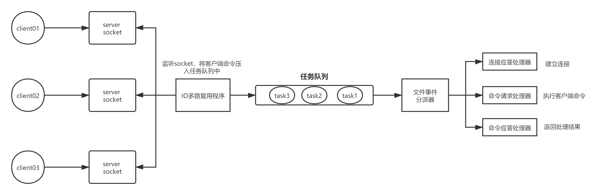
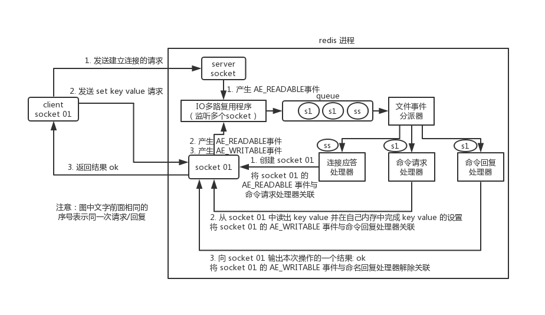
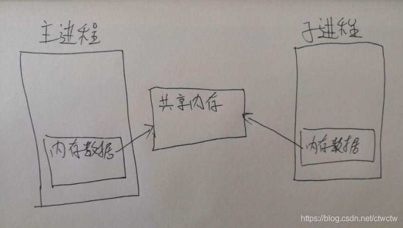
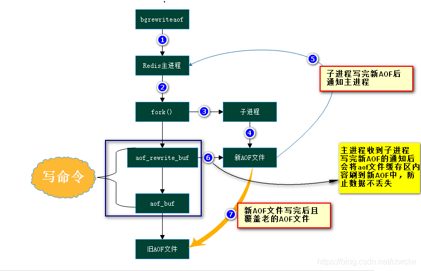
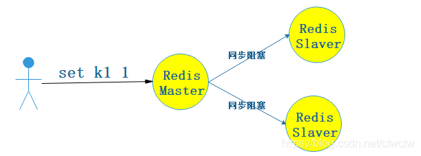
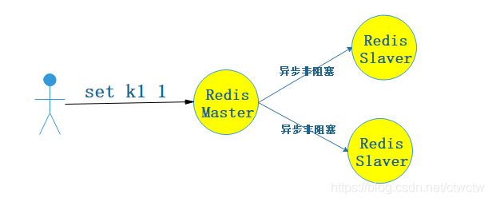
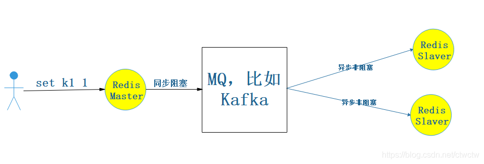
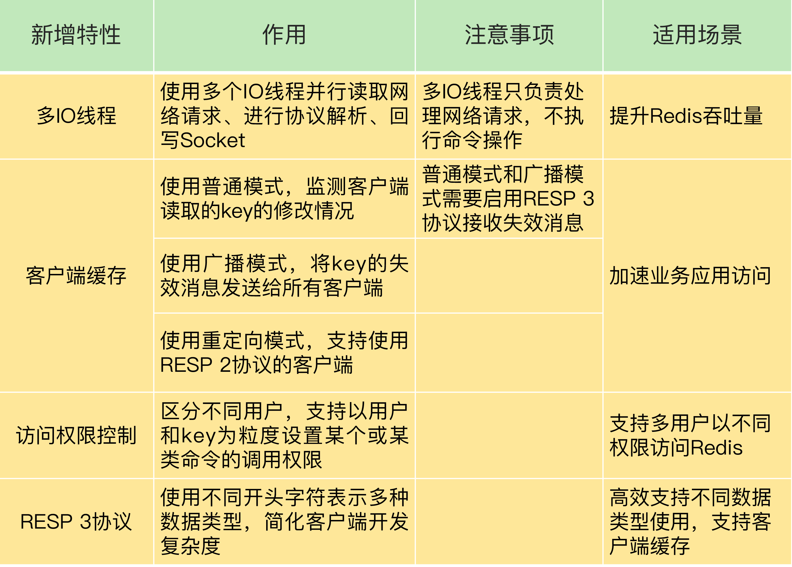

[TOC]

> author：编程界的小学生
>
> date：2021/02/21
>

# 一、基础

## 1、简单介绍下Redis

C写的开源高性能非关系型键值对数据库。底层采取epoll读写速度非常快，大多用于缓存，也提供了事务、持久化、集群以及多种数据类型的功能。

## 2、你认为Redis有哪些优缺点？

优点：

- 读写速度快
- 支持持久化
- 支持事务
- 数据结构丰富
- 支持主从，数据分片

缺点：

- 不具备自动恢复功能
- 较难支持在线动态扩容

## 3、说说Redis的几种数据类型

- string：字符串、整数或者浮点数
- list：列表可重复
- hash：包含键值对的无序散列表
- set：无序集合不可重复
- zset：有序集合不可重复

## 4、为什么要用Redis而不是guava/静态全局map？

guava/map是基于jvm内存的本地缓存，生命周期会随着jvm的结束而停止，也不存在持久化的特性。Redis是分布式缓存，可以进行持久化。

## 5、列举几个Redis应用场景

- 计数器
- 数据缓存
- 页面缓存
- 消息队列（blpop）
- 分布式锁
- 好友关系（set交并差集）
- 排行榜（zset的score）

## 6、Redis和memcached的区别？

- Redis比memcached数据类型丰富。
- Redis支持批量操作，事务操作，持久化，发布订阅，memcached不支持。

## 7、Redis线程模型知道吗？

redis 内部使用**文件事件处理器 file event handler**，它是单线程的，所以redis才叫做单线程模型。它采用**IO多路复用机制**同时监听多个 socket。多个 socket 可能会并发产生不同的操作，每个操作对应不同的文件事件，但是 IO多路复用程序会监听多个 socket，会将产生事件的 socket 放入队列中排队，事件分派器每次从队列中取出一个 socket，根据 socket 的事件类型交给对应的事件处理器进行处理。



答案来源，如有冒犯请及时联系：[https://www.cnblogs.com/mrmirror/p/13587311.html](https://www.cnblogs.com/mrmirror/p/13587311.html)

## 8、Redis一次客户端与redis的完整通信过程

##### 建立连接

1. 首先，redis 服务端进程初始化的时候，会将 server socket 的 AE_READABLE 事件与连接应答处理器关联。
2. 客户端 socket01 向 redis 进程的 server socket 请求建立连接，此时 server socket 会产生一个 AE_READABLE 事件，IO 多路复用程序监听到 server socket 产生的事件后，将该 socket 压入队列中。
3. 文件事件分派器从队列中获取 socket，交给连接应答处理器。
4. 连接应答处理器会创建一个能与客户端通信的 socket01，并将该 socket01 的 AE_READABLE 事件与命令请求处理器关联。

##### 执行一个set请求

1. 客户端发送了一个 set key value 请求，此时 redis 中的 socket01 会产生 AE_READABLE 事件，IO 多路复用程序将 socket01 压入队列，
2. 此时事件分派器从队列中获取到 socket01 产生的 AE_READABLE 事件，由于前面 socket01 的 AE_READABLE 事件已经与命令请求处理器关联，
3. 因此事件分派器将事件交给命令请求处理器来处理。命令请求处理器读取 socket01 的 key value 并在自己内存中完成 key value 的设置。
4. 操作完成后，它会将 socket01 的 AE_WRITABLE 事件与命令回复处理器关联。
5. 如果此时客户端准备好接收返回结果了，那么 redis 中的 socket01 会产生一个 AE_WRITABLE 事件，同样压入队列中，
6. 事件分派器找到相关联的命令回复处理器，由命令回复处理器对 socket01 输入本次操作的一个结果，比如 ok，之后解除 socket01 的 AE_WRITABLE 事件与命令回复处理器的关联。



答案来源，如有冒犯请及时联系：[https://www.cnblogs.com/mrmirror/p/13587311.html](https://www.cnblogs.com/mrmirror/p/13587311.html)

# 二、持久化

## 1、什么是持久化？Redis为什么需要持久化？

持久化就是把内存的数据写到磁盘中去，防止服务宕机了内存数据丢失。

## 2、Redis有哪几种持久化方式？优缺点是什么？

rdb（默认） 和aof两种。

rdb优点：

- 二进制存储节省空间，只有一个dump.rdb文件。
- 灾难恢复较快。
- 性能最大化（主进程处理命令的效率，而不是持久化的效率），采取的是fork()+copyonwrite技术。

rdb缺点：

- 安全性相对较低，因为rdb是每隔一段时间进行持久化，数据丢失率较高。
- 持久化速度相对aof较低，因为aof直接append追加，rdb是全量。

aof优点：

- 数据安全，可以配置always，也就是每进行一次命令操作就记录到aof文件中一次。
- 持久化速度较快，每次都只是追加一个语句到文件。
- 带rewrite机制。

aof缺点：

- AOF 文件比 RDB 文件大，所以灾难性恢复速度慢。
- 会对主进程对外提供请求的效率造成影响，**接收请求、处理请求、写aof文件这三步是串行**原子执行的。而非异步多线程执行的。Redis单线程！

## 3、两种持久化方式如何做选择？

- 如果数据非常敏感，尽量做到不丢失，那么选择aof，反之rdb。
- 如果追求容灾恢复速度，那么建议rdb，因为他是二进制的，文件很小，恢复速度快。
- 如果追求读写速度，那么建议rdb，因为他是fork出来子进程配合copyonwrite技术来持久化，不会影响主进程的读写。
- Redis4.0后支持混合持久化，也就是rdb+aof，建议开启。

## 4、RDB持久化的原理是怎样的？

fork子进程+copyonwrite技术。

### 4.1、什么是fork？

fork()是unix和linux这种操作系统的一个api，而不是Redis的api。fork()用于创建一个子进程，注意是子进程，不是子线程。fork()出来的进程共享其父类的内存数据。仅仅是共享fork()出子进程的那一刻的内存数据，后期主进程修改数据对子进程不可见，同理，子进程修改的数据对主进程也不可见。比如：A进程fork()了一个子进程B，那么A进程就称之为主进程，这时候主进程A和子进程B所指向的内存空间是同一个，所以他们的数据一致。但是A修改了内存上的一条数据，这时候B是看不到的，A新增一条数据，删除一条数据，B都是看不到的。而且子进程B出问题了，对我主进程A完全没影响，我依然可以对外提供服务，但是主进程挂了，子进程也必须跟随一起挂。这一点有点像守护线程的概念。Redis正是巧妙的运用了fork()这个牛逼的api来完成RDB的持久化操作。

#### 4.1.1、Redis中的fork()

Redis巧妙的运用了fork()。当bgsave执行时，Redis主进程会判断当前是否有fork()出来的子进程，若有则忽略，若没有则会fork()出一个子进程来执行rdb文件持久化的工作，子进程与Redis主进程共享同一份内存空间，所以子进程可以搞他的rdb文件持久化工作，主进程又能继续他的对外提供服务，二者互不影响。我们说了他们之后的修改内存数据对彼此不可见，但是明明指向的都是同一块内存空间，这是咋搞得？肯定不可能是fork()出来子进程后顺带复制了一份数据出来，如果是这样的话比如我有4g内存，那么其实最大有限空间是2g，我要给rdb留出一半空间来，扯淡一样！那他咋做的？采取了copyonwrite技术。

### 4.2、什么是copyonwrite？

主进程fork()子进程之后，内核把主进程中所有的内存页的权限都设为read-only，然后子进程的地址空间指向主进程。这也就是共享了主进程的内存，当其中某个进程写内存时(这里肯定是主进程写，因为子进程只负责rdb文件持久化工作，不参与客户端的请求)，CPU硬件检测到内存页是read-only的，于是触发页异常中断（page-fault），陷入内核的一个中断例程。中断例程中，内核就会把触发的异常的页复制一份（这里仅仅复制异常页，也就是所修改的那个数据页，而不是内存中的全部数据），于是主子进程各自持有独立的一份。

*数据修改之前的样子*



*数据修改之后的样子*


其实就是更改数据的之前进行copy一份更改数据的数据页出来，比如主进程收到了`set k 1`请求(之前k的值是2)，然后这同时又有子进程在rdb持久化，那么主进程就会把k这个key的数据页拷贝一份，并且主进程中k这个指针指向新拷贝出来的数据页地址上，然后进行更改值为1的操作，这个主进程k元素地址引用的新拷贝出来的地址，而子进程引用的内存数据k还是修改之前的。

#### 4.2.1、一句话总结copyonwrite

copyonwritefork()出来的子进程共享主进程的物理空间，当主子进程有内存写入操作时，read-only内存页发生中断，将触发的异常的内存页复制一份(其余的页还是共享主进程的)。

### 4.3、为什么要用copyonwrite？

1.假设是全量复制，那么内存空间直接减半，浪费资源不说，数据量10g，全量复制这10g的时间也够长的。这谁顶得住？

2.如果不全量复制，会是怎样？相当于我一边复制，你一边写数据，看着貌似问题不大，其实不然。比如现在Redis里有k1的值是1，k2的值是2，比如bgsave了，这时候rdb写入了k1的值，在写k2的值之前时，有个客户端请求

```redis
set k1 11 
set k2 22
```

那么持久化进去的是k2 22，但是k1的值还是1，而不是最新的11，所以会造成数据问题，所以采取了copyonwrite技术来保证触发bgsave请求的时候无论你怎么更改，都对我rdb文件的数据持久化不会造成任何影响。

## 5、AOF持久化的原理是怎样的？

就是每次都在aof文件后面追加命令。他与主进程收到请求、**处理请求是串行化的，而非异步并行的**。图示如下：


所以aof的频率高的话绝逼会对Redis带来性能影响，因为每次都是刷盘操作。跟mysql一样了。Redis每次都是先将命令放到缓冲区，然后根据具体策略（每秒/每条指令/缓冲区满）进行刷盘操作。如果配置的always，那么就是典型阻塞，如果是sec，每秒的话，那么会开一个同步线程去每秒进行刷盘操作，对主线程影响稍小。

### 5.1、AOF有哪几种刷盘策略？

其实Redis每次在写入AOF缓冲区之前，他都会调用flushAppendOnlyFile()，判断是否需要将AOF缓冲区的内容写入和同步到AOF文件中。这个决策是由配置文件的三个策略来控制的

- always
- everysec
- no

### 5.2、AOF刷盘之前是如何存储的？


## 6、RDB和AOF哪个快？

**1、分析**

这道题不严谨，因为不知道他问的是持久化过程哪个快还是说Redis主进程对外提供请求哪个快？（也就是说哪个持久化方式会对主进程影响较大）

**2、持久化过程哪个快**

那肯定AOF，因为AOF每次只追加命令，而RDB每次都是全量覆盖。

**3、哪个持久化方式会对主进程影响较大**

那肯定是AOF效率低，因为AOF是串行的，相当于每次处理完命令都要同步的写入磁盘（当然也看具体策略），而bgsave模式的RDB则是开启子进程并行的处理这件事，不影响主进程对外提供请求，即使AOF策略开到最容易丢失数据的那种，那也是不定期磁盘操作，这是毫秒级别的。而RDB持久化即使发生CopyOnWrite也只是寻址操作，纳秒级别的。

## 7、能同时存在几个fork？为什么？

只能同时存在一个，原因如下：

- bgsave命令执行期间，client发送的save/bgsave命令会被服务器拒绝，这么做是因为如果产生多个子进程同时进行rdb持久化的工作的话会产生竞争条件，造成数据问题已经服务器压力也会某些条件下过大。
- bgrewriteaof和bgsave能不能同时执行？

> 不能！
>
> 1.如果bgsave正在执行，那么client发送的bgrewriteaof命令会被推迟到bgsave结束后才得到执行。
> 2.如果bgrewriteaof正在执行，那么client发送的bgsave命令将会被服务器拒绝

## 8、RDB和AOF的文件格式有什么区别？

RDB：

- 以.rdb后缀结尾
- 以REDIS为魔数的二进制

AOF：

- 以.aof后缀结尾
- 记录具体操作的命令
- rewrite后也变成二进制

## 9、聊聊AOF的rewrite机制？

### 9.1、为什么要rewrite？

比如我有业务很简单，就来回delete set 同一个key。就这个业务运行了10年，那么aof文件将记录无数个delete k1， set k1 xxx。其实都是重复的，但是我aof每次都追加，文件变成了1T大小。这时候Redis宕机了，要恢复，你想想1TB大小的aof文件去恢复，累死了。最主要的是1TB大小只记录了两个命令，所以压缩其实就是来处理这件事的。

### 9.2、rewrite后的数据长什么样？

- 4.0版本之前

> Redis4.0之前就是将aof文件中重复的命令给去掉。保留最新的命令。进而减少aof文件大小。

- 4.0版本以及之后

> 4.0之前的做法效率很是低下，需要逐条命令对比。4.0开始的rewrite支持**混合模式**(也是就是rdb和aof一起用)，直接将rdb持久化的方式来操作将二进制内容覆盖到aof文件中（rdb是二进制，所以很小），然后再有写入的话还是继续append追加到文件原始命令，等下次文件过大的时候再次rewrite（还是按照rdb持久化的方式将内容覆盖到aof中）。但是这种模式也是配置的，默认是开，也可以关闭。

### 9.3、什么时候会触发rewrite？

- 手动触发

> 执行bgrewriteaof命令。

- 自动触发

> 通过以下两个配置协作触发
>
> - auto-aof-rewrite-min-size
>
> > AOF文件最小重写大小，只有当AOF文件大小大于该值时候才可能重写,4.0默认配置64mb。
>
> - auto-aof-rewrite-percentage
>
> > 当前AOF文件大小和最后一次重写后的大小之间的比率等于或者等于指定的增长百分比，如100代表当前AOF文件是上次重写的两倍时候才重写。

### 9.4、rewrite原理



- aof_rewrite_buf：rewrite(重写)缓冲区、aof_buf：写命令存放的缓冲区
- 开始bgrewriteaof的时候，判断当前有没有bgsave/bgrewriteaof在执行，若有，则不执行
- 主进程fork()出子进程，在执行fork()这个方法的时候是阻塞的，子进程创建完毕后就不阻塞了
- 主进程fork完子进程后，主进程能继续接收客户端的请求，所有写命令依然是写入AOF文件缓冲区并根据配置文件的策略同步到磁盘的。
- 因为fork的子进程仅仅共享主进程fork()时的内存，后期主进程在更改内存数据，子进程是不可见的。因此**Redis采取重写缓冲区（aof_rewite_buf）保存fork之后的客户端请求。防止新AOF文件生成期间丢失主进程执行的新命令所生成的数据**。所以此时客户端的写请求不仅仅写入原来的aof_buf缓冲区，还写入了重写缓冲区。这就是我为什么用深蓝色的框给他两框到一起的原因。
- 子进程通过**内存快照**的形式，开始生成新的aof文件。
- 新aof文件生成完后，子进程向主进程发信号。
- 主进程收到信号后，会把重写缓冲区(aof_rewite_buf)中的数据写入到新的AOF文件（主要是避免这部分数据丢失）
- 使用新的AOF文件覆盖旧的AOF文件，且标记AOF重写完成。

## 10、聊聊Redis的混合持久化方式？

### 10.1、优点

混合持久化结合了RDB持久化 和 AOF 持久化的优点,采取了rdb的文件小易于灾难恢复，同时结合AOF，增量的数据以AOF方式保存了，数据更少的丢失。

### 10.2、缺点

兼容性差，一旦开启了混合持久化，在4.0之前版本都不识别该aof文件，同时由于前部分是RDB格式，需要专业的工具来阅读，因为是二进制，所以阅读性较差。

### 10.3、总结

Redis4.0以及以后新增的内容，很强大。默认开启，也建议开启。但具体还要看业务，比如业务就允许数据丢失，那直接RDB就完事了，不需要开AOF，这样效率还高。如果一点数据都不允许丢失，那只能RDB+always策略的AOF，换言之，不管怎样，都建议开启RDB，RDB可以应对灾难性快速恢复。混合持久化也不用过于担心文件大小问题，4.0开始的rewrite支持混合模式直接按rdb持久化的方式来操作将二进制内容覆盖到aof文件中（rdb是二进制，所以很小），然后再有写入的话还是继续append追加到文件原始命令，等下次文件过大的时候再次rewrite（还是按照rdb持久化的方式将内容覆盖到aof中），堪称完美！

### 10.4、数据恢复

会优先看是否存在aof文件，若存在则先按照aof文件恢复，因为aof毕竟比rdb全。若aof不存在，则才会查找rdb是否存在。这是默认的机制。毕竟aof文件也rewrite成rdb二进制格式，文件小，易于回复。所以redis会优先采取aof。

## 11、如何手动进行rdb持久化？

- save

> 同步、阻塞。
>
> 致命的问题，持久化的时候redis服务阻塞（准确的说会阻塞当前执行save命令的线程，但是redis是单线程的，所以整个服务会阻塞），不能继对外提供请求，GG！数据量小的话肯定影响不大，数据量大呢？每次复制需要1小时，那就相当于停机一小时。

- bgsave

> 异步、非阻塞。
>
> 采取fork() + copyonwrite的方式，他可以一边进行持久化，一边对外提供读写服务，互不影响，新写的数据对我持久化不会造成数据影响，你持久化的过程中报错或者耗时太久都对我当前对外提供请求的服务不会产生任何影响。持久化完会将新的rdb文件覆盖之前的。

# 三、过期淘汰策略

## 1、Redis的过期key删除策略有哪些？也是expire原理

如果假设你设置一个一批key只能存活1个小时，那么接下来1小时后，redis是怎么对这批key进行删除的？
答案是：定期删除+惰性删除

- 定期删除

> 定期删除，指的是redis默认是每隔100ms就随机抽取一些设置了过期时间的key，检查其是否过期，如果过期就删除。假设redis里放了10万个key，都设置了过期时间，你每隔几百毫秒，就检查10万个key，那redis基本上就死了，cpu负载会很高的，消耗在你的检查过期key上了。注意，这里可不是每隔100ms就遍历所有的设置过期时间的key，那样就是一场性能上的灾难。实际上redis是每隔100ms**随机抽取**一些key来检查和删除的。

- 惰性删除

> 定期删除可能会导致很多过期key到了时间并没有被删除掉，那咋整呢？所以就是惰性删除了。这就是说，在你获取某个key的时候，redis会检查一下 ，这个key如果设置了过期时间那么是否过期了？如果过期了此时就会删除，不会给你返回任何东西。
> 并不是key到时间就被删除掉，而是你查询这个key的时候，redis再懒惰的检查一下

通过上述两种手段结合起来，保证过期的key一定会被干掉

- 总结

> 很简单，就是说，你的过期key，靠定期删除没有被删除掉，还停留在内存里，占用着你的内存呢，除非你的系统去查一下那个key，才会被redis给删除掉

但是实际上这还是有问题的，如果定期删除漏掉了很多过期key，然后你也没及时去查，也就没走惰性删除，此时会怎么样？如果大量过期key堆积在内存里，导致redis内存块耗尽了，咋整？

答案是：走内存淘汰机制。

## 2、Redis淘汰策略有哪些？

如果redis的内存占用过多的时候，此时会进行内存淘汰策略：
假设如下场景：

```
redis里有10000个key，现在已经满了，redis需要触发内存淘汰策略删除key
1个key，最近1min被查了2w次
1个key，最近10min被查了100次
1个key，最近1小时被查了10次
```

- noeviction：当内存不足以写新数据的时候，那么写操作会报错。（一般没人用，毕竟只是缓存，又不是mysql这种ACID的关系型数据库）
- allkeys-lru：当内存不足以写新数据的时候，在key空间中，移除最近最少使用的key（这个是最常用的），如果只移除一个的话，那么最后一个key肯定被移除
- allkeys-random：当内存不足以写新数据的时候，在key空间中，随机移除某个key（一般没人用，万一把我活跃的key移除了咋办）
- volatile-lru：当内存不足以写新数据的时候，在设置了过期时间的key中，移除最近最少使用的key（这个也还凑合，但是也不咋地，都设置过期时间了，你还给我移除干嘛）
- volatile-random：当内存不足以写新数据的时候，在设置了过期时间的键空间中，随机移除某个key（极其不合适，还不如allkeys-random）
- volatile-ttl：当内存不足以写新数据的时候，在设置了过期时间的键空间中，有更早过期时间的key优先移除（也不咋合适，不一定更早过期的就是不活跃key，而且都快过期了你还给我移除干嘛，自生自灭）
- Redis 4.0 引入了 volatile-lfu 和 allkeys-lfu 淘汰策略，LFU 策略通过统计访问频率，将访问频率最少的键值对淘汰。

总结：**Redis的内存淘汰策略的选取并不会影响过期的key的处理，而是用于处理内存不足时需要申请额外空间的数据，过期策略用于处理过期的缓存数据。**

# 四、事务

## 1、Redis的事务概念

Redis的事务并不像Mysql那么灵活，有隔离级别，出问题后还能回滚数据等高级操作。Redis毕竟是非关系型数据库，他目前事务回滚机制是不执行命令，也就是可以采取watch命令模拟乐观锁，进行监听数据，发现数据不是事务开始时候的样子了，那么我这个事务里的命令就不会得到执行。

## 2、Redis事务的相关命令

- MULTI：开始事务。
- EXEC：执行事务，也就是说只有EXEC命令执行的时候，这个事务内的语句才会真正的得到执行。
- WATCH：监听数据变化，在开始事务之前执行。

## 3、Redis事务支持隔离性吗？

Redis是单进程的且它保证在执行事务时不会对事务进行中断，事务可以从运行直到执行完所有事务队列中的命令为止。因此，Redis 的事务是总是带有隔离性的。

## 4、Redis事务保证原子性吗，支持回滚吗？

Redis中，单条命令是原子性执行的，但事务不保证原子性，且没有回滚。他目前事务回滚机制是不执行命令，也就是可以采取watch命令模拟乐观锁，进行监听数据，发现数据不是事务开始时候的样子了，那么我这个事务里的命令就不会得到执行。

## 5、Redis事务的其他实现方式

lua脚本。

## 6、Redis事务的原理

- watch

  每个数据库都维护一个字典watched_keys，key为监听的key，value即为监听的客户端对象。

  所有客户端的修改都会去检查这个字典，如果key一致则会去打开客户端对象的 REDIS_DIRTY_CAS.

- multi 和 exec

  multi命令将客户端标记为“事物状态”，这个客户端后续的普通操作指令都会放入**事务队列**（客户端会保存一个事务队列），直到执行multi、exec、watch（？）、discard。

  exec时会服务端去查当前客户端的REDIS_DIRTY_CAS，如果被打开了，则拒绝客户端提交的事务。没打开则遍历客户端事务队列，挨条执行。

### 7、Pipeline和事务的区别

- pipeline：

  目的是优化request/response模型、降低等待时间和IO调用。一次请求发送多个命令，处理一条命令，就返回一次结果，其中可能会穿插其他命令。客户端缓存命令，达到发送条件或者缓冲慢了一并发出，然后处理应答。

- 事务

  一次发送并执行，事务内不会穿插其他命令。客户端命令会被存储，然后exec发送全部执行。


# 五、主从集群

## 1、Redis如何实现高可用？

采取主从复制，用slave来做从节点，读写分离。主节点挂了的话从节点可以切换为主继续提供工作。哨兵方式的话可以自动故障切换。

## 2、主从复制有哪几种常见的方式？

- 同步阻塞

> 优点：数据强一致性。（但是会破坏可用性，也就是CAP的A）
>
> 缺点：效率低，同步阻塞。
>
> 

- 异步非阻塞（Redis默认采取的此种方式，效率高）

> 优点：效率高，异步非阻塞。
>
> 缺点：会丢失数据，满足了CAP的A，舍弃了CAP的C。
>
> 

- 同步阻塞MQ（大数据hive采取的就是这种方式，他会保证最终一致性。）

> 优点：效率相对较高、能保证数据最终一致性。
>
> 缺点：没发现啥缺点。非要说缺点那就是有可能取到不一致的数据，因为不是强一致性。为什么Redis不采取这个？因为Redis要高效率，不想融入太多组件（MQ）进来。
>
> 

## 3、主从复制的完整过程

- slave启动，这时候仅仅保存了master的信息，比如master的host和ip，复制流程还未开始。
- slave节点内部有个定时任务，每秒检查是否有新的master节点要连接和复制，若有，则跟master节点建立socket网络链接。
- slave发送ping命令给master。
- 进行权限认证，若master设置了密码（requirepass），那么slave节点必须发送masteraut的命令过去进行认证。
- master节点第一次执行全量复制，将所有数据发送给slave节点。
- master后续持续写命令，异步复制给slave。

## 4、主从复制核心原理

- 当启动一个slave节点的时候他会发送 PSYNC命令给master节点
- 如果slave是第一次连接到master，那么会触发一次`full resynchronization`进行全量复制。开始`full resynchronization`的时候，master会启动一个后台线程负责生成rdb文件，与此同时还会将客户端收到的所有写命令缓存到内存中。rdb文件生成完成后，master会将这个rdb发送给slave，slave会先把master传来的rdb写入磁盘然后清空自己的旧数据然后 从本地磁盘load到内存中进行同步数据，然后master会将内存中缓存的写命令发送给slave，slave也会同步这些数据。

- 若slave不是第一次连接到master，而是因为某种原因（比如网络故障）断开了进行重新链接的，那么master仅仅会复制给slave断开这段时间缺少的那部分数据，不会全量复制。这个称为断点续传。

### 4.1、追问：怎么判断Slave和Master是不是第一次链接的？

master节点会在内存中创建一个backlog，然后master和slave都会保存一个replica offset和一个master  run id，offset就是保存在backlog中的。 若master和slave的网络链接断开了，那么slave会让master从上次的replica offset开始继续复制。**若没找到对应的offset，则进行一次全量复制。**

### 4.2、追问：什么是主从复制的断点续传？

redis2.8开始支持的主从复制断点续传，若主从复制过程中出现了网络故障导致网络链接断开了，那么slave重新连接到master的时候可以接着上次复制的地方继续复制下去，而不是从头开始复制。

### 4.3、追问：怎么实现的断点续传？

master节点会在内存中创建一个backlog，然后master和slave都会保存一个replica offset和一个master id，offset就是保存在backlog中的。 若master和slave的网络链接断开了，那么slave会让master从上次的replica offset开始继续复制。若没找到对应的offset，则进行一次全量复制。

### 4.4、追问：什么是backlog？

backlog是一个环形缓冲区，整个master进程中只会存在一个，所有的slave公用，默认大小是1MB，在master给slave复制数据的时候，也会将增量数据在backlog中同步写一份，backlog主要用于做全量复制中断的时候的增量复制的。

### 4.5、追问：replica offset是干嘛的？

master和slave都会维护一个offset，master和slave都会不断累加offset，然后slave每秒都上报自己的offset给master，同时master也会保存每个slave的offset，然后slave上报offset给master的时候，master发现offset不一致就能发现数据不一致的情况了。 

### ~~4.5、repl_backlog_buffer和replication buffer~~（争议未验证）

首先来说一下复制缓冲区。

作用：主节点开始和一个从节点进行全量同步时，会为从节点创建一个输出缓冲区，这个缓冲区就是复制缓冲区。当主节点向从节点发送 RDB 文件时，如果又接收到了写命令操作，就会把它们暂存在复制缓冲区中。等 RDB 文件传输完成，并且在从节点加载完成后，主节点再把复制缓冲区中的写命令发给从节点，进行同步。对主从同步的影响：如果主库传输 RDB 文件以及从库加载 RDB 文件耗时长，同时主库接收的写命令操作较多，就会导致复制缓冲区被写满而溢出。一旦溢出，主库就会关闭和从库的网络连接，重新开始全量同步。所以，我们可以通过调整 client-output-buffer-limit slave 这个配置项，来增加复制缓冲区的大小，以免复制缓冲区溢出。

再来看看复制积压缓冲区。

作用：主节点和从节点进行常规同步时，会把写命令也暂存在复制积压缓冲区中。如果从节点和主节点间发生了网络断连，等从节点再次连接后，可以从复制积压缓冲区中同步尚未复制的命令操作。对主从同步的影响：如果从节点和主节点间的网络断连时间过长，复制积压缓冲区可能被新写入的命令覆盖。此时，从节点就没有办法和主节点进行增量复制了，而是只能进行全量复制。针对这个问题，应对的方法是调大复制积压缓冲区的大小

1. **repl_backlog_buffer** 是主库为了从库断开重连，避免全量复制，找到主从差异而设计的缓冲区

   1. backlog buffer为环形缓冲区，仅有一份
   2. 从库会从自身记录的offset去向主库的backlog buffer发起同步请求，主库将backlog 的 offset之后的内容放到replication buffer，后经过socket发送给从库。
   3. 若从库的offset找不到，只能进行全量复制

2. **replication buffer** 是主库为了等待从库执行命令，降低发送次数，而设计的缓冲区

   存储的内容都是相应时间点master更新的数据，具体时间点为：

   1. bgsave
   2. master发送rdb到slave的网络传输时间
   3. slave load rdb 把数据放入内存的时间

   这个值太小会导致主从断开，进而造成无限重传问题。

   

## 5、主从复制无磁盘化复制

master在内存中直接创建rdb文件然后发送给slave，不会在本地落盘。此种方式不安全，因为没了持久化操作，但效率高，因为减少了一次磁盘IO操作，直接网络传输给slave。配置参数如下：

```properties
# 默认是no，先落盘，再进行网络传输。
repl-diskless-sync no
# 等待一定时长再开始复制，因为要等更多slave重新连接过来
repl-diskless-sync-delay
```

## 6、主从复制过期key处理

首先slave是不会过期key的，只会等master过期key，若master过期了一个key或者lru淘汰了一个key，那么master会模拟一条del命令发送给slave。

## 7、聊聊sentinel哨兵？

有哨兵之前都是手动进行故障转移。sentinel可以将之前纯人工进行故障操作的步骤自动化。哨兵主要包含以下功能：

- 集群监控，负责监控redis的master和slave进程是否正常工作
- 消息通知，若某个redis实例有故障，那么哨兵负责发送消息作为报警通知给管理员
- 故障转移，若master节点挂了，会自动转移到slave节点 上
- 配置中心，若故障转移发生了，会通知客户端新的master地址

哨兵也需要单独部署，但是他不负责读写请求，只是个看门狗，负责监控Redis集群和自动故障转移。

## 8、哨兵之间是怎么发现彼此的 ？

是通过PSUBSCRIBE这个Redis内置的发布订阅命令来实现的，他们共同监听`__sentinel__:hello`这个channel，每隔两秒钟，每个哨兵都会往自己监控的某个master+slaves对应的`__sentinel__:hello channel`里发送一个消息，内容是自己的host、ip和runid还有对这个master的监控配置，每个哨兵也会去监听自己监控的每个master+slaves对应的`__sentinel__:hello channel`，然后去感知到同样在监听这个master+slaves的其他哨兵的存在，每个哨兵还会跟其他哨兵交换对master的监控配置，互相进行监控配置的同步。

## 9、什么是脑裂？如何解决？

脑裂：某个master所在机器突然脱离了正常的网络，跟其他slave机器不能连接，但是实际上master还运行着，此时哨兵可能就会认为master宕机了，然后开启选举，将其他slave切换成了master，这个时候，集群里就会有两个master，也就是所谓的脑裂。

**解决方案**

```properties
# 表示连接到master的最少slave数量
min-replicas-to-write 3
# 表示slave连接到master的最大延迟时间
min-replicas-max-lag 10
```

按照上面的配置，要求至少3个slave节点，且数据复制和同步的延迟不能超过10秒，否则的话master就会拒绝写请求，配置了这两个参数之后，如果发生集群脑裂，原先的master节点接收到客户端的写入请求会拒绝，就可以减少数据同步之后的数据丢失（最多丢失10s）。

## 10、主从会造成数据不一致吗？如何解决？

会造成，如下两个可能：

- 因为master -> slave的复制是异步的，所以可能有部分数据还没复制到slave，master就宕机了，此时这些部分数据就丢失了。
- 脑裂的情况也会造成数据不一致。此时虽然某个slave被切换成了master，但是可能client还没来得及切换到新的master，还继续写向旧master的数据可能也丢失了，因此旧master再次恢复的时候，会被作为一个slave挂到新的master上去，自己的数据会清空，重新从新的master复制数据

**解决方案**

```properties
# 表示连接到master的最少slave数量
min-replicas-to-write 3
# 表示slave连接到master的最大延迟时间
min-replicas-max-lag 10
```

按照上面的配置，要求至少3个slave节点，且数据复制和同步的延迟不能超过10秒，否则的话master就会拒绝写请求，配置了这两个参数之后，如果发生集群脑裂，原先的master节点接收到客户端的写入请求会拒绝，就可以减少数据同步之后的数据丢失（最多丢失10s）。**是的，没有根治，只是减少了丢失量。若要当作db来用，需要零丢失的话，可以引入mq当中间件。**

## 11、什么是主观宕机（sdown）？什么是客观宕机（odown）？

- sdown是主观宕机，就一个哨兵如果自己觉得一个master宕机了，那么就是主观宕机

- odown是客观宕机，如果quorum数量的哨兵都觉得一个master宕机了，那么就是客观宕机

## 12、sentinel是怎么选举新Master的？

**sentinal内部选leader逻辑？**

在 sentinal 操纵下，进行故障转移分为三大步骤。

0. sentinal认为某个节点有问题，内部开始主观下线->客观下线
1. sentinal内部选举一个leader（根据类raft算法和quorum配置）
2. 这个leader 对客观下线的Master进行故障转移（slave提升为master）

细节：

基于raft协议，quorum数一般为`(n/2)+1`，具体流程如下

- sentinel发现master下线，修改其状态为sdown。

- sentinel和其他sentinel确认master是否down掉，超过quorum指定的哨兵进程都认为sdown之后，就变为odown。

- 对我们的当前epoch进行自增， 并尝试在这个epoch中当选，也就是说首先发现master down掉的sentinel有优先权当选为leader。

- 如果当选失败，那么在设定的故障迁移超时时间的两倍之后，重新尝试当选。如果当选成功，那么执行以下步骤。

- 选出一个从服务器，并将它升级为主服务器。

- leader选出一个slave作为master，发送slaveof no one命令（slaveof no one 顾名思义了，就是我不是任何人的slave）。

- 通过发布与订阅功能，将更新后的配置传播给所有其他Sentinel，其他Sentinel对它们自己的配置进行更新。

- 并通过给其他slave发送slaveof master命令告知其他slave新的master。

- 当所有从服务器都已经开始复制新的主服务器时，领头Sentinel终止这次故障迁移操作。

### 12.1、追问：为什么quorum数一般为`(n/2)+1`？

我是这么理解的哈：

- 全部哨兵同意才能升级的话，也就是比如3个Redis、3个Redis哨兵必须保证3个哨兵都同意A节点升级为Master才行的话，那很可能第一台哨兵由于自身网络问题导致连接失败，而其他两个都是正常的，那就不升级了？不公平也不合适，因为那个哨兵明明是自身网络问题。
- 一个哨兵同意就升级的话，也就是比如3个Redis、3个Redis哨兵只要保证又1个哨兵都同意A节点升级为Master就可以的话，那也不靠谱，很可能那节点已经挂了，但是哨兵A可能缓存或者其他问题返回正常，但是其他两个哨兵明显发现问题连接不上了等，少数服从多数是最保险最靠谱的。**最主要的是一个哨兵同意就可以的话会很容易产生脑裂问题。**

## 13、master选举的时候会选择哪个slave？

- 跟master断开连接的时长，如果一个slave跟master断开连接已经超过了`down-after-milliseconds`配置的10倍，那么slave就被认为不适合选举为master
- 按照slave优先级进行排序，slave priority越低，优先级就越高

- 如果slave priority相同，那么看replica offset，哪个slave复制了越多的数据，offset越靠后，优先级就越高

- 如果上面两个条件都相同，那么选择一个run id比较小的那个slave

## 14、Redis集群的数据是怎么分布的？

Redis集群并没有采取hash取模和一致性hash算法，而是采取的槽slot的方式进行分布数据的。Redis一共分为16384个slot，接收到命令后具体流程如下：

- Redis会将这16384个slot平均分配到当前Redis的master实例上，比如一共四个Master，那么每个Master的slot数就是16384/4=4096个。当然slave节点是同步的主节点，也是4096个。
- 接收到请求后，先将key按照CRC16算法得出一个值再 % 16384，这样就找到了这个key是在哪个hash槽上的，也就定位到了redis实例。
- 但Redis并没办法直接去那个Redis实例去执行命令，他会看如果对应的master就是自己当前链接的的话，那么就直接处理掉了。
- 若不是当前自己本地的话，也就是计算出来是hash槽在其他master上，那么就会给客户端返回一个moved error错误，告诉你，你需要到xxx实例上去执行这条命令，然后客户端就精确定位到哪个master的信息去执行了 。

### 14.1、什么是slot？

Redis集群有16384个哈希槽，每个key通过CRC16校验后对16384取模来决定放置哪个槽，集群的每个节点负责一部分hash槽。

### 14.2、Redis集群最大节点个数是多少？

16384个。

## 15、Redis集群是读写分离吗？

cluster默认是不支持slave节点读或者写的，跟我们手动基于哨兵搭建的主从架构不一样的，需要手动带上readonly这个指令，这个时候才能在slave node进行读取。默认的话就是读和写都到master上去执行的，redis cluster模式下就不建议做物理的读写分离了，建议通过master的水平扩容，来横向扩展读写吞吐量，还有支撑更多的海量数据。

## 16、Redis集群如何做高可用的？

Redis集群的高可用并不像哨兵那样需要单独部署哨兵程序，默认也不会像主从复制那样读写分离，Redis集群的slave节点仅仅做数据备份以及高可用，比如现在有5个master，每个master都有1个slave，然后新增了3个slave作为冗余，那么现在有的master就有2个slave了，也就是有的master出现了salve冗余。如果某个master的slave挂了，那么redis cluster会自动迁移一个冗余的slave给那个master，所以集群部署的时候最好多冗余出几个slave做高可用。

或者通过链表方式进行配置：master<-slave<-slave ，这样master废了下一个slave可以顶上，其他slave不需要变动。

## 17、Redis集群如何扩一个节点？如何摘一个节点？

**扩容：**

- 启动新Redis实例当作master节点加入老集群
- reshard一些数据过去，也就是把一部分hash slot从一些node上迁移到这个新节点中，让集群16384个slot重新平均分配
- 启动新Redis实例当作slave节点加入老集群（为了高可用）

**缩容：**

- 先用reshard将数据都移除到其他节点
- 确保清空了一个master的hash slot时，redis cluster就会自动将其slave挂载到其他master上去
- 这个时候就只要删除掉master就可以了。

## 18、Redis集群Slave是如何进行升级为Master的？

和哨兵的类似的流程。

- 判断节点宕机，如果一个节点认为另外一个节点宕机，那么就是pfail（主观宕机），如果多个节点都认为另外一个节点宕机了，那么就是fail（客观宕机），跟哨兵的原理几乎一样，sdown，odown，在cluster-node-timeout内，某个节点一直没有返回pong，那么就被认为pfail，如果一个节点认为某个节点pfail了，那么会在gossip ping消息中，ping给其他节点，如果超过半数的节点都认为pfail了，那么就会变成fail。
- 从节点过滤，对宕机的master node，从其所有的slave node中，选择一个切换成master node，检查每个slave node与master node断开连接的时间，如果超过了`cluster-node-timeout * cluster-slave-validity-factor`，那么就没有资格切换成master，这个也是跟哨兵是一样的，从节点超时过滤的步骤。
- 从节点选举，每个从节点，都根据自己对master复制数据的offset，来设置一个选举时间，**offset越大（复制数据越多）的从节点，选举时间越靠前，优先进行选举**，所有的master node开始slave选举投票，给要进行选举的slave进行投票，如果大部分`master node（N/2 + 1）`都投票给了某个从节点，那么选举通过，那个从节点可以切换成master，从节点执行主备切换，从节点切换为主节点。

## 19、Redis集群搭建方案有哪几种？

- 官方
- 推特的twemproxy
- codis

# 六、场景问题

## 1、如何保证Redis里都是热点数据？

redis内存数据集大小上升到一定大小的时候，就会进行数据淘汰策略，热点数据不会被淘汰掉。

[Redis淘汰策略有哪些？](#2、Redis淘汰策略有哪些？)

## 2、Redis内存快用完了会怎样？

会进行内存淘汰机制，当Redis达到内存上限时会淘汰掉不活跃的数据。如果还是不够，内存还是满了的情况下Redis的写命令会返回错误信息，读命令还可以正常返回。

[Redis淘汰策略有哪些？](#2、Redis淘汰策略有哪些？)

## 3、如何优化Redis内存？

- 选择合适的数据类型
- 大value选择gzip压缩
- 避免使用大key
- 批处理采取Pipeline（小心配置单次pipeline命令总大小，不要撑爆socket缓冲区）

## 4、Redis为什么这么快？

- 纯内存操作，且时间复杂度大多都是O(1)，也有特例，比如zset底层跳表是log(n)，keys*....等！
- 数据结构底层存储的设计比较节省空间
- 采取单线程避免了不必要的上下文切换。
- 采取I/O多路复用，epoll模型，非阻塞IO。

> 什么是epoll？这篇文章解释的淋漓尽致：
>
> [https://blog.csdn.net/ctwctw/article/details/105024324](https://blog.csdn.net/ctwctw/article/details/105024324)

## 5、Redis集群怎么做扩缩容？

[Redis集群如何扩一个节点？如何摘一个节点？](#17、Redis集群如何扩一个节点？如何摘一个节点？)

## 6、如何解决Redis的并发竞争key的问题？

问题描述：多个系统操作一个Key，本来想将这个Key 的 value依次改为 1,2,3,4.

但是因为并发问题造成乱序，1、3、4、2,最终结果变为2.

解决：

- 分布式锁

  主要是用 setnx 的命令，**SET** if **N**ot e**X**ists，如果存在则返回失败。

- MQ串行化

## 7、如何用Redis实现分布式锁？

- setnx

  setnx简单，但要注意：value要设置为线程或者请求的id等作为加锁者的唯一标识，因为setnx为了避免死锁是要设置超时时间的，如果线程A加锁之后，操作时间过长导致锁超时，这时线程B就能上锁了，但是就在这时，线程A工作完成，把锁给删了，这样就等于把线程B的锁删了。

  加唯一标识可以解决这个问题，但这也引出一个问题，就是最后释放删除锁时需要判断唯一标识是否和当前加锁者匹配，但这两步并非原子操作，还是有可能确认匹配之后，锁超时然后线程B上锁，但是线程A又把线程B的锁给干掉了。

- lua

  lua脚本可以解决这个非原子删除解锁的问题。

- Redisson

  是redis的java客户端，它的很多api实现了分布式锁功能，实际原理基本都是对lua脚本的封装。

  比如这里面就可以实现分布式锁的重入。redisson也对redlock有支持。

- RedLock

  主要关注就是主从问题，redis异步复制可能没及时把刚刚set的锁同步到从节点就挂了。

  所以加锁成功的判定是，有n/2+1个节点加锁成功就判定成功，解锁通知全部节点。

  但是锁有时间限制，判定加锁成功也有时间限制，还是会有问题（神仙打架事件）。

  

## 8、Redis集群是前期做还是后期数据量上来了后在做？为什么？

建议提前做好数据量预估然后选择合适的Redis集群数，避免后期在新增服务器的时候还需要重新分片。目前Redis集群无法做到动态自动扩容，需要手动执行命令重新reshard。

## 9、生产环境部署Redis该如何选择用哪种方式？

- 单机直接pass掉，不考虑，单点故障！

- 如果数据量不大，一般来说你的缓存的总量在10G以内就可以，那么建议按照以下架构去部署redis

  redis持久化+备份方案+容灾方案+replication（主从+读写分离）+sentinal（哨兵集群，3个节点，高可用性）

  可以支撑的数据量在10G以内，可以支撑的写QPS在几万左右，可以支撑的读QPS可以上10万以上（随你的需求，水平扩容slave节点就可以），可用性在99.99%。

- 如果你的数据量很大，海量数据，那么选择redis cluster方式部署，多master分布式存储数据，水平扩容，支撑更多的数据量，读写QPS分别都达到几十万都没问题，只要扩容master即可，redis cluster，读写分离，支持不太好，readonly才能去slave上读，支撑99.99%可用性，也没问题，slave -> master的主备切换，冗余slave去进一步提升可用性的方案（每个master挂一个slave，但是整个集群再加个3个slave冗余一下）

## 10、什么是缓存雪崩？如何解决？

**情况一**

大批量热点数据过期后，高并发请求，直接请求到db，引起db压力造成查询阻塞甚至宕机。

**解决方案**

- 简单粗暴，设置热点数据永不过期（具体还看业务是否允许）
- 将缓存失效的时间分散开，比如每个热点key的过期时间是随机的，而不是每个key都一样是固定的。这样不会遇到同时大量热点数据过期的情况，分批过期，将高并发大流量变成一部分一部分的小流量打给数据库，这样就没问题了。

**情况二**

Redis挂了。导致请求都到db了。假设高并发5000个请求，本来缓存再高峰期可以抗住每秒4000个请求，但是Redis挂了，5000个请求直接干到了数据库层，这可能又把数据库给打死了。

**解决方案**

- Redis做高可用，一主多从。

- 加一层本地ehcache缓存。也就是请求进来先查ehcache缓存，ehcache没有的话去查redis，redis也没有再去db。这时候redis挂了，但是我们本地ehcache还有，所以不会打到db层。
- 限流组件，可以设置每秒最大请求数，超过最大请求数的那些请求怎么办？走降级！可以返回一些默认值，或者友情提示啥的。

> 限流的好处是数据库绝对不会死，因为限流组件保证了有多少请求能进来。只要数据库不死，就能对外继续提供请求。虽然有部分用户请求走降级，但不是全部，会有大部分请求得到执行。

## 11、什么是缓存穿透？如何解决？

比如电商网站，有以下商品在redis里和mysql里。**且Redis里只存放热点商品， 而不是全部。**
苹果、香蕉、鸭梨等，但是用户搜了个我这电商网站里没有卖的商品，这时候redis里肯定没有搜的数据，就去请求db了。db也不一定有（有可能有有可能没有），如果没有的话那白白浪费性能了。这就是缓存穿透。量少的话就别说了，量少都没必要redis缓存。大量的话会很恐怖，比如淘宝，他无所不卖，万一真找到一个不卖的东西去搜，然后redis没有，结果都去请求mysql了。那不GG了嘛？

**解决方案**

布隆过滤器。原理就是利用bitmap来解决缓存穿透的一种技术手段。实现步骤如下：

- 容器启动从数据库里读出全部商品，通过hash计算得到一个下标作为bitmap的位，将其置为1。
- 用户搜商品的时候先经过hash计算得到位下标，然后去布隆过滤器里查看这个位下标的值是不是1，是1代表有商品，再去mysql查。若是0则直接返回没商品即可。（位的运算极其的快，性能消耗几乎忽略不计）
- 可能多个商品通过hash计算得到的值一样，这就发生了hash碰撞，这也意味着布隆过滤器不是100%靠谱，可能漏掉某些商品，所以具体应用场景还得看业务需求是否允许。所以即使高并发场景也足够了。减少hash碰撞的方式可以采取不同算法对key进行多次hash。

## 12、什么是缓存击穿？如何解决？

某个 key 非常非常热点，访问非常的频繁，高并发访问的情况下，当这个 key在失效（可能expire过期了，也可能LRU淘汰了）的瞬间，大量的请求进来，这时候就击穿了缓存，直接请求到了数据库，一下子来这么多，数据库肯定受不了，这就叫缓存击穿。某个key突然失效，然后这时候高并发来访问这个key，结果缓存里没有，都跑到db了。和缓存雪崩不同的是，缓存击穿指并发查同一条数据，缓存雪崩是不同数据都过期了，很多数据都查不到从而查数据库。

**解决方案**

- 热点数据永不过期（看业务需求。不过很少有这种场景，一般都是比如搞活动或者大促的时候才会存这些热点数据，活动过后就需要到期，不会设置永不过期。），此方法简单粗暴，不过还看具体需求。
- 分布式锁。来个请求后先锁住，然后去db查，查到后再将数据set到redis里。只有当redis里getKey没拿到数据需要请求db的时候才加锁。不影响Redis里有数据的时候处理高并发请求，也能保证db不会被打垮。

## 13、什么是缓存预热？如何实现？

缓存预热就是系统启动的时候就查询数据库将相关的数据直接缓存到Redis中。这样可以避免用户查询的时候先判断是否有缓存，没的话在查db进行缓存等一系列操作了。

**实现方案**

- 如果数据量不大的话，可以在项目启动的时候进行缓存。
- 如果数据量很大的话可以写个简易的页面，上线时手工点一下进行缓存。

- 定时任务定时刷新缓存。

## 14、什么是缓存降级？如何实现？

就是当缓存出故障的时候，别影响主业务系统，让他可以继续对外提供服务。

**实现方案**

- 很简单，在catch里去查db，而不是抛出异常。
- 利用熔断降级组件返回错误码。

## 15、企业级多级缓存是怎么做的？

一般是三级缓存，redis属于第二层。

- nginx：nginx+lua脚本做第一级缓存
- redis：redis做第二级缓存
- tomcat：基于JVM的内存做第三级缓存

**实现方式**

- 可以代码里同步双写。
- 也可以用canal等类似组件监听db的binlog，然后投递到mq里去异步写。

## 16、什么是热点key？如何安全的缓存热点key？

热点key就是频繁被访问的key，为了防止频繁访问数据库，所以需要将这些数据缓存起来，这些数据就称为热点数据。

一般采取分布式锁来安全的缓存热点key，也就是对查询缓存加锁，即如果key不存在就加锁，然后查数据库set到缓存，然后解锁。其他进程如果发现有锁就等待，然后等解锁后返回数据或者进入DB查询。

## 17、如何保证Redis和数据库的双写数据一致性？

强烈安利一篇文章！评论也很精彩哟！

[https://zhuanlan.zhihu.com/p/59167071](https://zhuanlan.zhihu.com/p/59167071)

总结一下：

> 缓存更新耗精力，不如一删了之爽;
>
> 先删缓存再写库，延迟双删保一致;
>
> 写库之后删缓存，读库有值写缓存;
>
> 并发问题概率小，再出问题找领导。

写库后删除缓存出现缓存和db数据不一致问题的概率就不大了，但是还有可能出现线程A读取数据但是延迟迟迟没有写缓存，线程B改库删缓存之后，线程A才写，那数据还是老的;或者线程B删缓存失败了。

解决可以引入MQ，对缓存的操作可以放在q里进行消费处理。


## 18、遇到过Redis常见性能问题吗？怎么解决的？

- for循环操作redis，几万个。换成Pipeline分批处理。
- key过大，采取缩写。
- value是个大json，用户信息。去除不必要的字段，并且采取gzip压缩成二进制存储。
- 单节点扛不住并发量，采取集群数据分片。
- 用户签到采取的string类型，换成bitmap。
- 禁用一些耗费性能的命令，比如：keys等。

## 19、Redis如何做大数据量插入？

Redis的Pipeline类型，他会将一组命令用一次客户端服务端的请求来完成。

不适用场景：

- 要求可靠性高，每次都需要实时知道这次操作是否成功，数据是否写入redis了等对实时性的这种需求都不适合。

适用场景：

- 对实时性要求不高的
- 批量的将数据写入 redis，允许一定比例的写入失败

> 比如群发短信、邮件这种，失败了我补偿，我不需要及时知道发送结果的，这种用pipeline合适 。

## 20、假如Redis里面有一亿个key，其中10w个key是以某个固定字符串开头的，如何将这10w个key找出来？

- keys命令：不靠谱，因为会阻塞Redis主进程，可能导致Redis短时间内无法读写。
- scan命令：存在重复的概率，客户端做去重就行了。效率高。推荐。
- 网上有别人写好的开源脚本。

## 21、用Redis如何实现mq？

采取list数据类型，rpush生产消息，lpop消费消息，阻塞式的可以用blpop，在没有信息的时候，会一直阻塞，直到信息的到来。

## 22、用Redis如何实现延迟队列？

采取zset数据类型，使用时间戳做score，然后用zadd来生产消息，消费组使用`zrangbyscore`获取x秒之前的数据做轮询处理。

## 23、Redis如何实现类似微博那种互相关注、共同好友？

采取set数据类型的交集`SINTER/SINTERSTORE`

## 24、10万用户一年365天的登录情况如何用redis存储，并快速检索任意时间窗内的活跃用户？

采取Redis的bitmap数据类型来存储，然后用Redis提供的bitmap命令进行位运算计算出连续登录天数，有多少用户活跃等。

不懂的看这篇：[https://blog.csdn.net/ctwctw/article/details/105013817](https://blog.csdn.net/ctwctw/article/details/105013817)

## 25、Redis为什么是key，value的，为什么不是支持SQL的？

选择key-value的原因：key-value简单粗暴，使用方便，效率更佳。
为什么不支持sql：因为redis的内存模型是一个hashtable，不使用表来存储数据，也不会预定义或强制要求用户对redis储存的不同数据进行关联。

## 26、Redis到底是单线程的还是多线程的？

redis中io多路复用器模块是单线程执行，事件处理器也是单线程执行，两个线程不一样。所以实际redis应该是单进程多线程，只是不同的模块都用的单线程实现。
两个维度来举例：
（1）若是client发送命令到server的话，server处理命令是单线程逐条进行的。
（2）server内部可以是多线程的，比如aof持久化，假设策略每秒，那就是再单独开启一个线程去执行aof文件持久化操作，这就是多线程了。

## 27、Redis的持久化开启了RDB和AOF下重启服务是如何加载的？

[数据恢复](#10.4、数据恢复)

## 28、Redis生产环境该如何规划？

参考redis各种部署方式的优缺点来决定。

- 如果希望快速部署，那么可以考虑单节点部署方式。
- 如果只需要考虑可靠性，那么可以考虑主从复制模式。
- 如果想要保证高可用，不需要考虑储存成本可以考虑哨兵模式。
- 如果想提高集群的扩展性和可用性，不要求保证数据的强一致性，且没有批量操作，那么可以考虑集群模式。

## 29、五种数据类型的底层存储原理是什么？

- string：int、raw、embstr
- list：ziplist、linkedlist
- hash：ziplist、hashtable
- set：intset、hashtable
- sorted set：ziplist、skiplist+dict

## 30、100万并发4G数据，10万并发400G数据，如何设计Redis存储方式？

前者用主从+哨兵进行高可用，加快读请求的速度，减轻单节点的压力。

后者用集群来均分这400G数据。 

## 31、Redis如何实现附近的人功能？

可以采取geo命令。3.2版本新增加的命令。主要原理是根据经纬度来计算距离。

## 32、聊聊Redis的慢查询

- slowlog-max-len

> 存放慢查询语句的是一个先进先出的队列，他有固定长度，slowlog-max-len就是控制慢查询语句数量的，存放到内存中的，默认128，超过128的话会舍弃最先进入队列的命令。所以一般可以搞大点，因为他是存放到内存的，重启就没了。

- slowlog-log-slower-than

> 慢查询阈值（单位：微妙，默认是10000，也就是10毫秒）。默认是超过10ms命令没执行完就扔到慢查询队列里（上面参数控制队列大小）。Redis号称QPS万级别，所以建议设置成1000，也就是1ms。

建议：

- slowlog-max-len：不要设置过大，默认10ms，建议设置1ms。
- slowlog-log-slower-than：不要设置过小，建议设置1000左右
- 定期持久化慢查询。因为slowlog-max-len这个队列是放到内存里的，重启就没了，而且有长度限制，所以我们要查的慢命令多的话根本不显示，会丢失命令。所以可以用第三方插件持久化到mysql或者自己写个脚本持久化到mysql或者文件。

## 33、你们生产环境的数据备份和恢复方案是怎样的？

备份方案：

> 我们需要定时备份rdb文件来做冷备，为什么？不是有aof和rbd了吗为什么还要单独写定时任务去备份？因为Redis的aof和rdb是仅仅有一个最新的，比如谁手贱再Redis宕机的时候执行`rm -rf aof/rdb`了，那不就GG了吗？或者rdb/aof文件损坏了等不可预期的情况。所以我们需要单独备份rdb文件以防万一。
>
> 为什么不定时备份aof而是rdb？定时备份aof没意义呀，**定时**本身就是冷备份，不是实时的，rdb文件又小恢复又快，她哪里不香？

- RBD和AOF建议同时打开（Redis4.0之后支持）
- RDB做冷备，AOF做数据恢复（数据更可靠）
- RDB采取默认配置即可，AOF采取everysec每秒策略
- 写crontab定时调度脚本去做数据备份。
- 每小时都copy一份redis的rdb文件到一个其他目录中，这个目录里的rdb文件仅仅保留48小时内的。也就是每小时都做备份，保留2天内的rdb，只保留48个rdb。
- 每天0点0分copy一份redis的rdb文件到一个其他目录中，这个保留一个月的。也就是按天备份。
- 每天半夜找个时间将当前服务上的所有rdb备份都上传到云服务上。

恢复方案：

- 如果仅仅是redis进程挂了，那么直接重启redis进程即可，Redis会按照持久化配置直接基于持久化文件进行恢复数据。
- 如果持久化文件（rdb/aof）损坏了，或者直接丢失了。不慌，我们云上有，download下来然后**重点如下：**

> 问题一：直接把备份的rdb扔到redis持久化目录下然后重启redis不行的原因在于：redis是按照先aof后rdb进行恢复的，所以都是开启aof的，redis启动后会重新生成新的aof文件，里面是空的。所以不会进行任何数据恢复，也就是说虽然你把rdb丢给redis了，但是redis会按照aof来恢复，而aof是redis启动的时候新生成的空文件，所以不会有任何数据进行恢复。
>
> 问题二：那么我们把rdb文件丢给redis后，先将redis的aof关闭再启动redis进程不就能按照rdb来进行恢复了吗？是这样的，没毛病！但是新的问题来了，我们aof肯定要开的，aof对数据保障更可靠。那什么我们按照rdb文件恢复完后再修改redis配置文件开启aof然后重启redis进程不就得了嘛？大哥…你打开aof然后重启redis，这时候redis又会生成一个空的aof文件，这时候恢复的时候又是啥数据都没了。因为数据是存到内存里，你重启后肯定没了，需要持久化文件来恢复。这时候aof是空的，我恢复个鸡毛啊。
>
> **具体方案：**
>
> 我不管你是持久化文件丢了还是坏了，我都先`rm -rf *` 给他删了。
>
> - 停止redis进程
> - 删除坏掉的rdb和aof持久化文件。
> - 修改配置文件关闭redis的aof持久化。
> - 找到最新备份的rdb文件扔到redis的持久化目录里。（这里最新的肯定是按照小时备份的最后一个）
> - 启动Redis进程
> - 执行`set appendonly yes`动态打开aof持久化。
>
> > 也就是说打开aof的操作不是修改配置文件然后重启，而是先热修改让他生成aof，这次生成肯定是会带着内存中完整的数据的。然后再修改配置文件重启。
>
> - 等aof文件生成后再修改redis配置文件打开aof。
> - 重启redis进程。
> - 完美收官。

## 34、我往Redis里写的数据怎么没了？偶尔会丢失部分数据

[Redis淘汰策略有哪些？](#2、Redis淘汰策略有哪些？)

## 35、我的数据明明都过期了，怎么还占用着内存？

[1、Redis的过期key删除策略有哪些？也是expire原理](#1、Redis的过期key删除策略有哪些？也是expire原理)

## xx、聊聊Redis6.0的多线程



# 七、劝退Redis文章目录

[https://blog.csdn.net/ctwctw/article/details/105265689](https://blog.csdn.net/ctwctw/article/details/105265689)