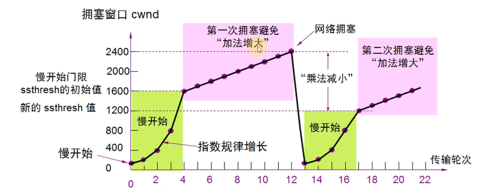

[TOC]

> author：编程界的小学生
>
> date：2021/02/23

# 一、网络基础

## 1、请简单说一下你了解的端口及对应的服务？

- 21：FTP
- 22：SSH
- 23：Telnet
- 53：DNS域名服务器
- 80：HTTP
- 443：HTTPS

## 2、IP地址分为哪几类，请简单说下各个分类？

## 3、请简单说下ARP协议的工作过程

- 每个主机都会有自己的ARP缓存区中建立一个ARP列表，以表示IP地址和MAC地址之间的对应关系
- 当源主机要发送数据时，首先检测ARP列表中是否对应IP地址的目的主机的MAC地址，如果有，则直接发送数据，如果没有，就向本网段的所有主机发送ARP数据包，内容：我是IP地址，mac地址，谁是目标IP地址，目标mac？
- 当本网络的所有主机收到该ARP数据包时，首先检查数据包中的IP地址是否是自己的IP地址，如果不是，则忽略该数据包，如果是，则首先从数据包中取出源主机的IP和mac地址写入到ARP列表中，如果以存在，则覆盖，然后将自己的mac地址写入arp响应包中，告诉源主机自己是它想要找的mac地址
- 源主机收到ARP响应包后，将目的主机的IP和mac地址写入arp列表，并利用此信息发送数据，如果源主机一直没有收到arp响应数据包，表示arp查询失败。

## 4、OSI七层模型知道吗？

- 应用层（数据）：确定进程之间通信的性质以满足用户需要以及提供网络与用户应用
- 表示层（数据）：主要解决拥护信息的语法表示问题，如加密解密
- 会话层（数据）：提供包括访问验证和会话管理在内的建立和维护应用之间通信的机制，如服务器验证用户登录便是由会话层完成的
- 运输层（段）：实现网络不同主机上用户进程之间的数据通信，可靠与不可靠的传输，传输层的错误检测，流量控制等
- 网络层（包）：提供逻辑地址（IP）、选路，数据从源端到目的端的传输
- 数据链路层（帧）：也称MAC层，将上层数据封装成帧，用MAC地址访问媒介，错误检测与修正
- 物理层（比特流）：设备之间比特流的传输，物理接口，电气特性等

## 5、URL和URI的区别是什么？

- URI(Uniform Resource Identifier)：统一资源标志符，主要作用是唯一标识一个资源。
- URL(Uniform Resource Location)：统一资源定位符，主要作用是提供资源的路径。

有个经典的比喻是URI像是身份证，可以唯一标识一个人，而URL更像一个住址，可以通过URL找到这个人。

## 6、有了IP地址，为什么还要用MAC地址？

因为mac地址不具有定位功能，确切的说定位范围太小，只能在同网段被定位到，他能标志出唯一的一台物理机，但是想要找到他还需要ip来支持，一旦跨子网，就需要ip来进行通信找到具体子网，然后再根据mac定位到这个子网里的某台机器。

### 6.1、追问：为什么需要IP呢？直接MAC地址不就够了吗？

因为对于同一个子网上的设备，IP地址的前缀都是一样的，这样路由器通过IP地址的前缀就知道设备在在哪个子网上了，而只用MAC地址的话，路由器则需要记住每个MAC地址在哪个子网，这需要路由器有极大的存储空间，是无法实现的。

IP地址可以比作为门牌号，MAC地址为收件人的身份证，在一次通信过程中，两者是缺一不可的。

## 7、什么是mac地址？

MAC地址是数据链路层和物理层使用的地址是**硬件地址**，IP地址网络层和以上各层使用的地址，是一种**逻辑地址**。在发送数据时，数据从高层到低层，然后才到通信链路上传输。使用IP地址的IP数据报一旦交给了数据链路层，就被封装成了MAC帧。**MAC帧在传送时使用的源地址和目的地址都是硬件地址。**

## 8、说一下ping的过程

在主机 A 上运行`ping 192.168.1.10`后,

1. ping命令会构建一个**ICMP协议**的数据包，交到网络层的IP协议中。IP层协议将目的地址和源地址打包后，形成IP数据包。
2. 获取192.168.1.10的MAC地址，如果是跨网段的话那么从源IP网关获取所在网关mac然后又替换为目标IP所在网段网关的mac最后是目标IP的mac地址。
3. 交到数据链路层，添加一些控制信息，构建数据帧。
4. 交到物理层，通过以太网访问。

主机B收到后，

1. 检查目的MAC地址，不相符就丢弃。
2. 将IP数据包提取后送入网络层的IP层协议，IP层检查后将有用的信息提取后送入ICMP协议。
3. ICMP协议马上构建一个ICMP应答包以之前的相同方式发送给主机。

## 9、集线器、交换机和路由器的区别？

- 集线器：属于物理层，是个傻子，来请求后他会广播全部与他相连的主机，响应的时候也是广播全部。不带记忆功能。
- 交换机：属于数据链路层，他能识别MAC地址并根据MAC地址转发数据帧，带学习功能。首次广播全部，广播完成后就知道大家的mac地址了，就自己学习到转发表（有过期时间的）里了。下次再来的时候就不用广播全部了。
- 路由器：属于网络层，识别IP地址并根据IP地址转发数据包，维护数据表并基于数据表进行选择最佳路径。一般上外网都需要走路由器，多个路由器之间进行下一跳的方式寻找。

## 10、DHCP动态分配IP原理是怎样的？

当一台新机器加入到一个网络的时候，他被分配IP的过程如下：

- 新机器会携带自己的MAC地址用IP地址`0.0.0.0`发送一个广播包，目的地址是`255.255.255.255`，广播包封装了UDP，UDP封装了BOOTP（DHCP是BOOTP的增强版）。
- DHCP收到广播后，会给这个新机器分配一批IP地址（因为MAC地址是唯一的，所以DHCP知道你这个是新机器还是老机器）。
- 新机器收到DHCP的回复后会选择其中一个IP地址（一般是选最先达到的那个），且会向网络发送一个DHCP Request广播数据包，包含MAC地址、分配的IP地址、DHCP服务器地址等。注意这时候回复DHCP还是用`0.0.0.0`进行回复的，因为在未收到DHCP Server的最后确认前，客户端不能用私自选择的IP进行广播。
- DHCP收到回复后会将新机器未选中作为IP的那些地址撤销，以便提供给下一个新机器用 。且会给新机器一个ack消息包。

- 这时候新机器就真正拥有了自己的IP地址，可以和同网段的其他机器进行通信。

- 以上分配的IP是租的，不是永久的，所以新机器会在租期过去 50% 的时候直接向为其提供 IP 地址的 DHCP Server 发送 DHCP request 消息包。客户机接收到该服务器回应的 DHCP ACK 消息包，会根据包中所提供的新的租期以及其他已经更新的 TCP/IP 参数，更新自己的配置。这样，IP 租用更新就完成了。

- 如果不租了，那么就会被DHCP回收。以便给其他机器使用。

## 11、在跨网段调用中，是如何获取目标IP的mac地址的？

全程通过arp协议来吼。

- 从源IP网关获取所在网关mac
- 然后又替换为目标IP所在网段网关的mac
- 最后是目标IP的mac地址

## 12、你了解 MAC 头和 IP 头的细节吗？

# 二、UDP/TCP/SOCKET

## 13、UDP的包头是什么样的 ？

## 14、TCP和UDP什么区别？

TCP 是面向连接的，UDP 是面向无连接的。在互通之前，面向连接的协议会先建立连接。例如，TCP 会三次握手，而 UDP 不会。

## 15、TCP的包头是什么样的？

- TCP 报文怎么没有源 IP 和目标 IP 呢？这是因为在 IP 层就已经处理了 IP 。TCP 只需要记录两者的端口即可。
- 序列号：占四个字节，在传输过程的每一个字节都会有一个编号，在建立连接后，序号就代表这一次传给对方的TCP数据部分的第一个字节的编号。
- 确认号：占四个字节，在建立链接后，确认号就代表期望对方**下一次**传过来的TCP数据部分的第一个字节的编号。

- 窗口：占两个字节，这个字段有流量控制功能，用以告诉对方下一次允许发送数据大小（字节为单位）。

## 16、聊聊TCP的三次握手四次挥手？

### 16.1、三次握手

- 第一次握手：Client将SYN置1，随机产生一个初始序列号seq发送给Server，进入SYN_SENT状态；
- 第二次握手：Server收到Client的SYN=1之后，知道客户端请求建立连接，将自己的SYN置1，ACK置1，产生一个acknowledge number=sequence number+1，并随机产生一个自己的初始序列号，发送给客户端；进入SYN_RCVD状态；
- 第三次握手：客户端检查acknowledge number是否为序列号+1，ACK是否为1，检查正确之后将自己的ACK置为1，产生一个acknowledge number=服务器发的序列号+1，发送给服务器；进入ESTABLISHED状态；服务器检查ACK为1和acknowledge number为序列号+1之后，也进入ESTABLISHED状态；完成三次握手，连接建立。

- 简单来说就是 ：
  1. 客户端向服务端发送SYN
  2. 服务端返回SYN,ACK
  3. 客户端发送ACK

#### 16.1.1、追问：为什么不是两次握手？

主要目的：**防止server端一直等待，浪费资源。**

如果建立连接只需要2次握手，可能会出现的情况：

假设client发出的第一个连接请求报文段，因为网络延迟，在连接释放以后的某个时间才到达server，本来这是一个早已失效的连接请求，但server收到此失效的请求后，误认为是client再次发出的一个新的连接请求，于是server就向client发出确认报文段，同意建立连接，如果不采用“3次握手”，那么只要server发出确认，新的连接就建立了，由于现在client并没有真正想连接服务器的意愿，因此不会理睬server的确认，也不会向server发送数据，但server却以为新的连接已经建立，并一直等待client发来数据，这样，server的很多资源就白白浪费掉了，采用 “三次握手” 的办法可以防止上述现象发生。例如上述情况，client没有向【server的确认】发出确认，server由于收不到确认，就知道client并没有要求建立连接。

#### 16.1.2、追问：为什么不是四次握手？

四次也行 ，就是没必要，要是一直这样下去一百次都行，大于等于三次就行，浪费资源。

#### 16.1.3、追问：如果第3次握手失败了，会怎么处理？

- 此时server的状态为 `SYN-RCVD`，若等不到client的 ACK，server会重新发送 SYN+ACK 包
- 如果server多次重发 SYN+ACK 都等不到client的 ACK，就会发送 **RST包**，**强制关闭连接**

#### 16.1.4、追问：如果已经建立了连接，但客户端出现了故障怎么办？

服务器每收到一次客户端的请求后都会重新复位一个计时器，时间通常是设置为2小时，若两小时还没有收到客户端的任何数据，服务器就会发送一个探测报文段，以后每隔75秒钟发送一次。若一连发送10个探测报文仍然没反应，服务器就认为客户端出了故障，接着就关闭连接。

### 16.2、四次挥手

- 第一次挥手：Client将FIN置为1，发送一个序列号seq给Server；进入FIN_WAIT_1状态；

- 第二次挥手：Server收到FIN之后，发送一个ACK=1，acknowledge number=收到的序列号+1；进入CLOSE_WAIT状态。此时客户端已经没有要发送的数据了，但仍可以接受服务器发来的数据。

- 第三次挥手：Server将FIN置1，发送一个序列号给Client；进入LAST_ACK状态；

- 第四次挥手：Client收到服务器的FIN后，进入TIME_WAIT状态；接着将ACK置1，发送一个acknowledge number=序列号+1给服务器；服务器收到后，确认acknowledge number后，变为CLOSED状态，不再向客户端发送数据。客户端等待2*MSL（报文段最长寿命）时间后，也进入CLOSED状态。完成四次挥手。

#### 16.2.1、追问：为什么要四次握手？

TCP是全双工模式，每两次挥手都是一对的，第一二次是主机1的发送与被应答，第三四次是主机2的发送与被应答。

- 第1次挥手：当主机1发出FIN报文段时，表示主机1告诉主机2，主机1已经没有数据要发送了，但是，此时主机1还是可以接受来自主机2的数据

- 第2次挥手：当主机2返回ACK报文段时，表示主机2已经知道主机1没有数据发送了，但是主机2还是可以发送数据到主机1的

- 第3次挥手：当主机2也发送了FIN报文段时，表示主机2告诉主机1，主机2已经没有数据要发送了

- 第4次挥手：当主机1返回ACK报文段时，表示主机1已经知道主机2没有数据发送了。随后正式断开整个TCP连接

#### 16.2.2、如果第二次挥手时服务器的ACK没有送达客户端，会怎样？

客户端没有收到ACK确认，会重新发送FIN请求。

## 17、TCP是如何保证可靠性传输的？

- 面向连接传输，三次握手四次挥手
- 发现失败丢包情况会自动重传

### 17.1、追问：聊聊三次握手四次挥手？

[聊聊TCP的三次握手四次挥手？](# 16、聊聊TCP的三次握手四次挥手？)

### 17.2、追问：聊聊自动重传机制？

主要采取的ARQ自动重传请求机制。 

- 正常情况：一切正常

- 超时重传：B发现有报文有问题则会丢弃，然后A发现迟迟没有B的回复就超时了，超时后会重新发送该报文给B

- 确认丢失：B发现报文没问题则进行确认消息回复给A，但是在回复的过程中出了问题，A没有收到B的确认回复，那么A在等待超时后会重新发送该报文给B，这时候消息不就重复了吗？是的，但是B会自动丢弃重复的消息，再次进行回复确认消息给A。

- 确认迟到：在A等待B的确认消息超时后会重新发送消息给B，这一步骤和确认丢失是一致的，和确认丢失不同的是当A再次发消息给B后，B又回复了一个确认消息给A，这时B之前发确认消息给A的那条又被A收到了，A这端其实就收到了两条确认消息，但是A只会处理一条，重复的确认消息会忽略。

**但是上述的ARQ协议称之为停止等待协议，太慢了！！！一个一个的发送确认，排队执行。所以有了连续ARQ协议+滑动窗口协议。**

### 17.3、追问：什么是连续ARQ协议+滑动窗口协议？

**连续ARQ协议：**

一次连续发送多段过去，不一个一个的发，一组一组的发，发多少合适呢？B会告诉你自己的滑动窗口是支持多大字节，然后A就不超过那么大字节就行了。

### 17.4、追问：连续ARQ协议中某组的某个数据包丢失了怎么办？（SACK技术）

在TCP通信过程中，若发送序列中间某个数据包丢失了，比如1，2，3，4，5中的3丢失了，怎么办？

TCP会通过重传最后确认的分组后续的分组，比如确认丢失的是3，最后确认收到的数据包是2，那么会重传3，4，5。这样一来原来的4和5数据包就已经正确传输了，这次又要重传一次，没意义，降低了TCP性能。

为改善 上述情况，就出现了SACK，选择性确认技术。SACK可以明确告诉发送方丢失的3数据包， 只需要传3就行了，4和5别给我传了。

### 17.5、一段话总结TCP是如何保证可靠性传输的

TCP是面向连接传输，三次握手四次挥手，且TCP发现失败丢包情况会自动重传，他会选择连续ARQ协议+滑动窗口协议+SACK技术来TCP传输提升性能。

## 18、为什么要在传输层将数据拆分包分成多个段而不是在网络层？

因为可以提高重传的性能，具体如下：

传输层TCP具有自动重传的功能，它可以明确知道丢失的哪个数据段，然后只需要重传哪一小段就行了。

- 如果在传输层不分段，那么一旦出现数据丢失，整个传输层的数据都得重传。
- 如果在传输层分了段，一旦出现数据丢失，只需要重传丢失的那些段即可。

比如TCP传输一组数据到网络层，网络层给他拆分成1，2，3，4，5五个数据包发送给数据链路层，这期间数据是会丢失的，因为只有TCP带重传功能，那么数据包在往回返的时候，传输层发现数据包3丢失了，那么TCP才不知道数据包是哪个呢，因为TCP没做分层，是个整体，就会把1，2，3，4，5这一组数据包重新传给网络层。

## 19、TCP是如何做到流量控制的？

### 19.1、为什么要流量控制？

如果接收方的缓存区满了，发送方还在一直发送数据，那么接收方只能把收到的数据包丢掉了，不仅造成了大量数据包丢失还浪费了网络资源。所以要进行流量控制。

### 19.2、TCP怎么做到的流量控制？

- 通过确认报文中窗口字段来控制发送方的发送速率
- 发送方的发送窗口大小不能超过接收方给出的窗口大小

- 当发送方收到接收方窗口大小为0时，发送方就会停止发送数据，从而保证了流量控制。

*但是有一种特殊情况：*

一开始接收方给发送方发送了窗口大小为0的报文，这时候发送方肯定不会给接收方继续发消息了，一段时间后接收方空余了一些存储空间，给发送方发送的非0窗口报文段丢失了，那么发送方一直认为接收方的窗口大小为0，双方陷入了僵局。

*解决方案：*

- 当发送方收到窗口大小为0的报文段时，发送方会停止发送报文。
- 并且同时开启一个 定时器，每隔一段时间就发个测试报文去询问接收方最新的窗口大小，若大小还是0，则继续不发消息且再次启动定时器，若大小不是0了，则正常发送报文过去。

## 20、TCP是如何做到拥塞控制的？

### 20.1、为什么要拥塞控制？

因为带宽是有限的，比如带宽是100MB，但是网络请求早就大于100MB了，这时候就会造成拥塞，所以需要做拥塞控制来保证防止过多的数据注入到网络中造成丢包或网络链路过载。

### 20.2、TCP怎么做到的拥塞控制？

有如下四种方案：

- 慢启动
- 拥塞避免
- 快速重传
- 快速恢复

#### 20.2.1、先了解一些概念

- MSS：每个数据段最大大小，在建立连接时确定。
- cwnd：拥塞窗口，是指目前自己还能传输数据量的大小。 
- rwnd：接收窗口大小。
- swnd：发送窗口大小。swnd=min(cwnd, rwnd)

#### 20.2.2、慢启动

刚开始进入传输数据的时候，会发送1个MSS大小的包，然后下一次发送是2个，在下一次发送是4个，逐步递增，最终大小不会超过cwnd，这么做避免一上来就发包太猛造成疯狂丢包网络雪崩的问题。

**慢启动的原理如下：**

- 首先三次握手，双方告诉自己所接收的窗口大小，然后双方初始化自己的cwnd大小。
- 发送端每收到一个 ACK，cwnd 翻倍。如果说初始窗口为100，那么第一轮报文传完且发送端收到 ACK 后，cwnd 变为200，第二轮过后变为400，第三轮过后变为800，依次类推。但是大小不会超过rwnd定义的3000。

> 一般初始启动会按照MSS值去发，也就是最大支持的数据段大小。然后发两个MSS段，然后四个，然后八个，以此类推，阈值为3000，也就是30个。

#### 20.2.3、拥塞避免

慢启动的问题：只要慢启动cwnd达到阈值后，就不会继续增加cwnd大小了，相当于已经拥塞了 ，需要处理，所以需要拥塞避免这个手段来解决。具体流程如下图：

当达到阈值后会重新慢开始然后继续走慢启动的流程，cwnd翻倍增长。

**所以拥塞避免和慢启动是配合使用的，二者为一体。**

#### 20.2.4、快速重传

在 TCP 传输的过程中，如果发生了丢包，即接收端发现数据段不是按序到达的时候，接收端的处理是重复发送之前的 ACK。

比如M3包丢了，即使M4、M5包到达的接收端，接收端也一律返回第M2个包的 ACK。当发送端收到3个重复的 ACK 时，意识到丢包了，于是马上进行重传M3，不用等到一个RTO的时间到了才重传。

这就是**快速重传**，它解决的是**是否需要重传**的问题。

#### 20.2.5、快速恢复

发送端收到三次重复 ACK 之后，发现丢包，他会觉得现在的网络已经有些拥塞了，自己会进入**快速恢复**阶段。

在这个阶段，发送端如下改变：

- 拥塞阈值降低为 cwnd 的一半（是一半，拥塞避免手段是直接降低到慢启动的初始值。）
- cwnd 的大小变为拥塞阈值
- cwnd 线性增加

快速重传配合快速恢复的图示如下：

## 21、什么是长连接什么是短链接？

短连接就是一次TCP请求得到结果后连接马上结束。

长连接并不马上断开，而一直保持着,直到长连接TIMEOUT，长连接可以避免不断的进行TCP三次握手和四次挥手。

长连接(keepalive)是需要靠双方不断的发送探测包来维持的,keepalive期间服务端和客户端的TCP连接状态是ESTABLISHED。

## 22、什么是Socket？

**socket连接是长连接。**网络上的两个程序通过一个双向的通讯连接实现数据的交换，这个双向链路的一端称为一个Socket。Socket通常用来实现客户方和服务方的连接。Socket是TCP/IP协议的一个十分流行的编程界面，一个Socket由一个IP地址和一个端口号唯一确定。

## 23、聊聊Socket的通讯过程

基于TCP：服务器端先初始化Socket，然后与端口绑定(bind)，对端口进行监听(listen)，调用accept阻塞，等待客户端连接。在这时如果有个客户端初始化一个Socket，然后连接服务器(connect)，如果连接成功，这时客户端与服务器端的连接就建立了。客户端发送数据请求，服务器端接收请求并处理请求，然后把回应数据发送给客户端，客户端读取数据，最后关闭连接，一次交互结束。

基于UDP：UDP 协议是用户数据报协议的简称，也用于网络数据的传输。虽然 UDP 协议是一种不太可靠的协议，但有时在需要较快地接收数据并且可以忍受较小错误的情况下，UDP 就会表现出更大的优势。我客户端只需要发送，服务端能不能接收的到我不管。

# 三、DNS/CDN/HTTP/HTTPS

## 24、DNS是干嘛的？聊聊域名解析的过程

DNS用于将域名解析成IP。用的是UDP协议，端口53。是个树形结构，分为如下三层：

- 根 DNS 服务器 ：返回顶级域 DNS 服务器的 IP 地址
- 顶级域 DNS 服务器：返回权威 DNS 服务器的 IP 地址
- 权威 DNS 服务器 ：返回相应主机的 IP 地址

**解析过程**

- DNS查询时优先考虑本机hosts文件
- 然后查看本地的dns解析器是否有缓存映射
- 如果没有缓存映射则找dns根服务器，dns根服务器会告诉此次请求应该找哪个DNS顶层服务器，DNS顶层服务器会最终告诉此次请求的域名IP应该去找哪个DN权威方服务器。
- 权威 DNS 服务器查询后将对应的 IP 地址 X.X.X.X 告诉本地 DNS。
- 本地 DNS 再将 IP 地址返回客户端，客户端和目标建立连接。

## 25、CDN是什么？有什么用？

CDN的核心是就近访问，降低网络拥塞，提高用户访问速度。比较适合存储静态资源（比如css js 静态html等）来加速。

## 26、HTTP常见的状态码有哪些？

## 27、什么是HTTP长连接和短连接

- 短连接：客户端和服务器每进行一次HTTP操作就建立一次连接，一次请求结束后就中断连接。

- 长连接：客户端和服务器之间用于传输HTTP数据的TCP连接不会关闭，客户端再次访问这个服务器时，会继续使用这一条已经建立的连接，有一个保持时间。

## 28、聊聊HTTP请求报文和响应报文的格式

### 28.1、请求报文

- 请求行：请求方法字段、URL字段、HTTP协议版本字段。它们用空格分隔。例如，GET /index.html HTTP/1.1。
- 请求头部：请求头部由关键字/值对组成，每行一对，关键字和值用英文冒号“:”分隔
- 空行
- 请求体：post put等请求携带的数据，GET不在这，GET直接在url后面拼接的。

### 28.2、响应报文

- 响应行：由协议版本，状态码和状态码的原因短语组成，例如`HTTP/1.1 200 OK`。
- 响应头：响应部首组成
- 空行
- 响应体：服务器响应的数据

## 29、常用的HTTP方法有哪些？

- GET：用于请求访问已经被URI（统一资源标识符）识别的资源，可以通过URL传参给服务器
- POST：用于传输信息给服务器，主要功能与GET方法类似，但一般推荐使用POST方式。
- PUT：传输文件，报文主体中包含文件内容，保存到对应URI位置。
- HEAD：获得报文首部，与GET方法类似，只是不返回报文主体，一般用于验证URI是否有效。
- DELETE：删除文件，与PUT方法相反，删除对应URI位置的文件。
- OPTIONS：查询相应URI支持的HTTP方法。

## 30、说说HTTP中GET和POST的区别

- 大多情况下GET用于获取资源，所以是具有幂等性的，POST用于修改资源，不具有幂等性
- GET将参数放到url后面拼接，POST将请求参数放到body中
- GET请求参数有大小限制，最多2048字节，POST没限制

- GET请求不安全，因为参数暴露到url后面了，POST相对安全

## 31、Cookie和Session有什么区别？

- Cookie数据存在客户端上，相对不安全，Session将数据存储在服务器上，安全性更高。
- Cookie有长度限制，单个Cookie保存的数据不能超过4K，Session无限制。
- Session因为存储在服务器上，所以海量的话会占用服务器内存，导致服务器性能下降，Cookie存在用户浏览器，对服务器无压力。

## 33、一次完整的HTTP请求所经历的步骤

1. DNS解析(通过访问的域名找出其IP地址，递归搜索)
2. HTTP请求，当输入一个请求时，建立一个Socket连接发起TCP的3次握手
3. 客户端向服务器发送请求命令（一般是GET或POST请求）
4. 客户端发送请求头信息
5. 服务器发送应答头信息
6. 服务器向客户端发送数据
7. 服务器关闭TCP连接（4次挥手）
8. 客户端根据返回的HTML，CSS，JS进行渲染

## 34、什么是对称加密与非对称加密？

- 对称加密：对称加密指加密和解密使用同一密钥，优点是运算速度快，缺点是如何安全将密钥传输给另一方。常见的对称加密算法有DES、AES等等。

- 非对称加密：非对称加密指的是加密和解密使用不同的密钥，一把公开的公钥，一把私有的私钥。公钥加密的信息只有私钥才能解密，私钥加密的信息只有公钥才能解密。优点解决了对称加密中存在的问题。缺点是运算速度较慢。常见的非对称加密算法有RSA、DSA、ECC等等。

- 非对称加密的工作流程：A生成一对非堆成密钥，将公钥向所有人公开，B拿到A的公钥后使用A的公钥对信息加密后发送给A，经过加密的信息只有A手中的私钥能解密。这样B可以通过这种方式将自己的公钥加密后发送给A，两方建立起通信，可以通过对方的公钥加密要发送的信息，接收方用自己的私钥解密信息。

## 35、HTTP 与 HTTPS 的区别

|              |        HTTP        |                  HTTPS                  |
| :----------: | :----------------: | :-------------------------------------: |
|     端口     |         80         |                   443                   |
|    安全性    | 无加密，安全性较差 |         有加密机制，安全性较高          |
|   资源消耗   |        较少        |       由于加密处理，资源消耗更多        |
| 是否需要证书 |       不需要       |                  需要                   |
|     协议     | 运行在TCP协议之上  | 运行在SSL协议之上，SSL运行在TCP协议之上 |

## 36、聊聊HTTPS的加密过程

HTTPS使用的对称加密和非对称加密的混合加密算法。具体做法就是使用非对称加密来传输对称密钥来保证安全性，使用对称加密来保证通信的效率。

**HTTPS的加密过程：**

1. 客户端向服务端发起第一次握手请求，告诉服务端客户端所支持的SSL的指定版本、加密算法及密钥长度等信息。
2. 服务端将自己的公钥发给数字证书认证机构，数字证书认证机构利用自己的私钥对服务器的公钥进行数字签名，并给服务器颁发公钥证书。
3. 服务端将证书发给客服端。
4. 客服端利用数字认证机构的公钥，向数字证书认证机构验证公钥证书上的数字签名，确认服务器公开密钥的真实性。
5. 客服端使用服务端的公开密钥加密自己生成的对称密钥，发给服务端。
6. 服务端收到后利用私钥解密信息，获得客户端发来的对称密钥。
7. 通信双方可用对称密钥来加密解密信息。

## 37、知道HTTP1.0、 HTTP1.1、HTTP2.0的区别吗？

**HTTP 1.0和HTTP 1.1的区别**

- HTTP 1.1支持长连接，HTTP 1.0默认使用短连接。
- 在HTTP 1.1新增了24个错误状态响应码
- 在HTTP 1.0 中认为每台服务器都会绑定唯一的IP地址，所以，请求中的URL并没有传递主机名。但后来一台服务器上可能存在多个虚拟机，它们共享一个IP地址，所以HTTP 1.1中请求消息和响应消息都应该支持Host域。

- HTTP1.1 支持只发送 header 而不发送 body。原因是先用 header 判断能否成功，再发数据，节约带宽，事实上，post 请求默认就是这样做的。

**HTTP2.0 的主要变化**

- HTTP2.0 支持多路复用，同一个连接可以并发处理多个请求，方法是把 HTTP数据包拆为多个帧，并发有序的发送，根据序号在另一端进行重组，而不需要一个个 HTTP请求顺序到达；

- HTTP2.0 支持服务端推送，就是服务端在 HTTP 请求到达后，除了返回数据之外，还推送了额外的内容给客户端；

- HTTP2.0 压缩了请求头，同时基本单位是二进制帧流，这样的数据占用空间更少；

- HTTP2.0 适用于 HTTPS 场景，因为其在 HTTP和 TCP 中间加了一层 SSL 层。